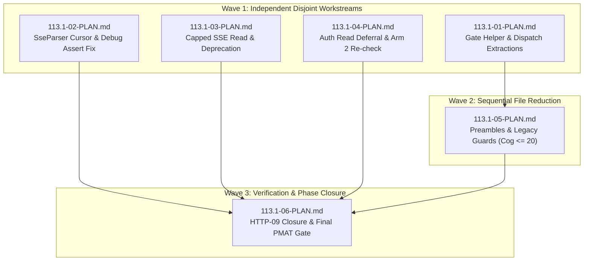

# Cross-AI Plan Review — Phase 113.1

## Gemini Review

# Plan Review: Phase 113.1 — Merge Unblock

## Executive Summary & Verdict

**Verdict:** **APPROVED (EXCELLENT QUALITY)**

The implementation plan suite for **Phase 113.1: Merge Unblock** ([113.1-01-PLAN.md](file:///Users/guy/Development/mcp/sdk/rust-mcp-sdk/.planning/phases/113.1-merge-unblock/113.1-01-PLAN.md) through [113.1-06-PLAN.md](file:///Users/guy/Development/mcp/sdk/rust-mcp-sdk/.planning/phases/113.1-merge-unblock/113.1-06-PLAN.md)) is exceptionally detailed, mathematically grounded, and rigorously structured. It directly targets the three merge-blocking defects (**D-113-U**, **D-113-R**, **D-113-Q**) holding the `fix/mcp-publisher-oidc-audience` branch from merging and preventing requirement **HTTP-09** from being met on the merits.

The plan suite is split across 3 dependency waves, includes falsifiable negative controls, enforces exact tool invocations, de-risks feature-flag compilation hazards, and strictly avoids scope creep.

---

## Key Quality Highlights

1. **Empirically Sized Refactoring (D-113-U):**
   - Plan 01 ([113.1-01-PLAN.md](file:///Users/guy/Development/mcp/sdk/rust-mcp-sdk/.planning/phases/113.1-merge-unblock/113.1-01-PLAN.md)) implements the core extractions (`resolve_v2_gate` / `resolve_v2_gate_with_error_hook` and `dispatch_message_fast`), which reduce cognitive complexity from 30/31 down to 26/28.
   - Plan 05 ([113.1-05-PLAN.md](file:///Users/guy/Development/mcp/sdk/rust-mcp-sdk/.planning/phases/113.1-merge-unblock/113.1-05-PLAN.md)) extracts the read/classify preambles (`FastIngress` / `MwIngress`) and legacy-version guard helpers, landing both entrypoints at cognitive complexity $\le 20$ (target $\le 20$ provides headroom below PMAT's threshold of 25).
2. **Atomic Fix & Falsifiable Guards (D-113-R):**
   - Plan 02 ([113.1-02-PLAN.md](file:///Users/guy/Development/mcp/sdk/rust-mcp-sdk/.planning/phases/113.1-merge-unblock/113.1-02-PLAN.md)) couples the scan-window cursor fix with the removal of `debug_assert!(!self.buffer.contains('\n'))` into a single atomic edit, preventing debug builds from remaining $O(n^2)$.
   - Introduces 4 falsifiable tests (absolute time budget, ratio test, proptest chunking-invariance, and newline-free retained buffer pin) which must be demonstrated RED before the fix lands.
3. **Sound Memory Bounding & Feature-Flag Safety (D-113-Q):**
   - Plan 03 ([113.1-03-PLAN.md](file:///Users/guy/Development/mcp/sdk/rust-mcp-sdk/.planning/phases/113.1-merge-unblock/113.1-03-PLAN.md)) relocates `DEFAULT_HTTP_SSE_BUFFERED_BYTES` (16 MiB) into `http_constants.rs` so that `sse_optimized.rs` can consume it under `--features sse` without requiring the `http` feature flag.
   - Uses `reqwest::Response::chunk()` for stream accumulation, avoiding additional feature dependencies (`bytes_stream`), deprecates `OptimizedSseTransport`, and drives `WHOLE_BODY_ALLOWLIST` to 0.
4. **Clean Scope & Record-Only Obligations:**
   - Plan 04 ([113.1-04-PLAN.md](file:///Users/guy/Development/mcp/sdk/rust-mcp-sdk/.planning/phases/113.1-merge-unblock/113.1-04-PLAN.md)) enumerates the 18 auth-surface reads and assigns ownership to **Phase 116** based on the IdP vs peer trust-boundary distinction. Executes Arm 2 of the rolled-forward spec re-verification against upstream HEAD without blocking merge.
5. **Rigorous Closure Gate:**
   - Plan 06 ([113.1-06-PLAN.md](file:///Users/guy/Development/mcp/sdk/rust-mcp-sdk/.planning/phases/113.1-merge-unblock/113.1-06-PLAN.md)) flips **HTTP-09** to `[x]` on the merits, updates `ROADMAP.md` warning blocks, and executes the complete verification suite including explicit `pmat quality-gate` invocations.

---

## Detailed Wave Breakdown & Dependency Structure

### Wave 1 (Parallel Execution)
- [113.1-01-PLAN.md](file:///Users/guy/Development/mcp/sdk/rust-mcp-sdk/.planning/phases/113.1-merge-unblock/113.1-01-PLAN.md): Touches `src/server/streamable_http_server.rs`.
- [113.1-02-PLAN.md](file:///Users/guy/Development/mcp/sdk/rust-mcp-sdk/.planning/phases/113.1-merge-unblock/113.1-02-PLAN.md): Touches `src/shared/sse_parser.rs` and `113-FUZZ-EVIDENCE.md`.
- [113.1-03-PLAN.md](file:///Users/guy/Development/mcp/sdk/rust-mcp-sdk/.planning/phases/113.1-merge-unblock/113.1-03-PLAN.md): Touches `http_constants.rs`, `http.rs`, `sse_optimized.rs`, `mod.rs`, `v2_bounded_reads_tripwire.rs`, and examples.
- [113.1-04-PLAN.md](file:///Users/guy/Development/mcp/sdk/rust-mcp-sdk/.planning/phases/113.1-merge-unblock/113.1-04-PLAN.md): Touches `deferred-items.md` and `113-SPEC-RECHECK.md`.

### Wave 2 (Blocked on Plan 01)
- [113.1-05-PLAN.md](file:///Users/guy/Development/mcp/sdk/rust-mcp-sdk/.planning/phases/113.1-merge-unblock/113.1-05-PLAN.md): Continuation in `src/server/streamable_http_server.rs`.

### Wave 3 (Blocked on Wave 1 & Wave 2)
- [113.1-06-PLAN.md](file:///Users/guy/Development/mcp/sdk/rust-mcp-sdk/.planning/phases/113.1-merge-unblock/113.1-06-PLAN.md): Flips `REQUIREMENTS.md`, updates `ROADMAP.md`, runs aggregate quality gate.

---

## Risk Analysis & Assessment

| Risk Description | Severity | Plan Mitigation | Reviewer Assessment |
| :--- | :--- | :--- | :--- |
| **Ordering Sensitivity in `streamable_http_server.rs`** (v2 gate must resolve before session resolution and protocol validation) | **High** | Plan 01 Task 3 requires executing and recording three negative controls to prove ordering constraints are load-bearing. | **Solid.** The plan explicitly documents the exact negative control edits and requires recording test failures before reverting. |
| **Quadratic assertion overhead in Debug builds** (`debug_assert` scanning whole buffer) | **Medium** | Plan 02 Task 2 combines `scan_start` cursor fix and `debug_assert` removal into ONE atomic edit. | **Crucial.** Separate edits would leave TDD performance tests RED in debug profile (`cargo test`). |
| **Feature flag compilation breakage** (`DEFAULT_HTTP_SSE_BUFFERED_BYTES` un-gated) | **Medium** | Plan 03 Task 1 relocates constant definition to `http_constants.rs` and re-exports in `http.rs`. | **Well-engineered.** Directly verified against `--no-default-features --features sse`. |
| **PMAT tool invocation disparity** (`pmat analyze --file` vs project-root gate) | **Low** | Plan 01, 05, and 06 explicitly mandate using `pmat quality-gate --fail-on-violation --checks complexity` from repo root. | **Prevents false greens.** `make quality-gate` does not invoke PMAT; requiring explicit PMAT execution avoids premature PR submission. |

---

## Actionable Recommendations for Execution

1. **Strict Plan Sequencing:** Execute Wave 1 plans in parallel or sequence, but ensure [113.1-01-PLAN.md](file:///Users/guy/Development/mcp/sdk/rust-mcp-sdk/.planning/phases/113.1-merge-unblock/113.1-01-PLAN.md) completes before starting [113.1-05-PLAN.md](file:///Users/guy/Development/mcp/sdk/rust-mcp-sdk/.planning/phases/113.1-merge-unblock/113.1-05-PLAN.md).
2. **Mandatory PMAT Execution:** Always run `pmat quality-gate --fail-on-violation --checks complexity` from the workspace root rather than relying on `make quality-gate`.
3. **Record Negative Controls:** Ensure output summaries for [113.1-01-PLAN.md](file:///Users/guy/Development/mcp/sdk/rust-mcp-sdk/.planning/phases/113.1-merge-unblock/113.1-01-PLAN.md), [113.1-02-PLAN.md](file:///Users/guy/Development/mcp/sdk/rust-mcp-sdk/.planning/phases/113.1-merge-unblock/113.1-02-PLAN.md), and [113.1-03-PLAN.md](file:///Users/guy/Development/mcp/sdk/rust-mcp-sdk/.planning/phases/113.1-merge-unblock/113.1-03-PLAN.md) record literal terminal output for failed negative control / RED test steps before applying fixes.

The plan suite is ready for execution.

---

## Codex Review

# Cross-AI Plan Review — Phase 113.1

## Overall assessment

The technical fixes are well researched and generally correct, especially the parser cursor, bounded `reqwest::chunk()` read, and complexity-extraction strategy. However, the plans are not execution-ready. Several process and closure contradictions could leave the phase claiming success without satisfying its own roadmap criteria. Overall risk is **HIGH** until the cross-plan blockers below are corrected.

### Cross-plan blockers

- **HIGH — Remote CI success is impossible under the stated boundary.** ROADMAP SC-1 requires the org `gate` status to be green on the branch ([ROADMAP.md:2393](/Users/guy/Development/mcp/sdk/rust-mcp-sdk/.planning/ROADMAP.md:2393)), while plan 06 expressly forbids pushing or updating PR #299. Local PMAT success cannot prove the remote status. Either revise SC-1 to define a locally mergeable tree or add a human post-push checkpoint before declaring the phase complete.

- **HIGH — Wave 1 is unsafe in a shared worktree.** Plans 01–04 are called parallel, but plan 03 modifies `tests/`, while plans 01 and 04 assert global `git diff/status` cleanliness for `tests/` and `src/`. Concurrent `make quality-gate` and PMAT runs also write shared caches. Serialize the plans or execute them in isolated worktrees; otherwise use commit-scoped diffs instead of global cleanliness checks.

- **HIGH — Binding repository workflow is not operationalized.** None of the plans invokes the mandatory PMAT quality proxy, PDMT todo generation, or the contract-first pre/post sequence required by [AGENTS.md](/Users/guy/Development/mcp/sdk/rust-mcp-sdk/AGENTS.md). `make quality-gate` runs compliance eventually, but it does not satisfy “contract first.” Add an explicit common execution preamble or record an approved exception.

- **HIGH — RED-first task boundaries conflict with mandatory green commits.** Plan 02 Task 1 intentionally ends with two failing tests. If the execution workflow commits after each task, the pre-commit gate must reject that task. Keep the RED run as an uncommitted intermediate state and commit the tests together with the fix.

- **MEDIUM — Plan 01 intentionally leaves PMAT red at 26/28.** Combined with strict quality-proxy enforcement, this may prevent the intermediate change from landing. Plans 01 and 05 should preferably be one execution/commit unit even if their evidence remains in separate summaries.

---

## Plan 01 — POST entrypoint extractions

### Summary

[113.1-01-PLAN.md](/Users/guy/Development/mcp/sdk/rust-mcp-sdk/.planning/phases/113.1-merge-unblock/113.1-01-PLAN.md) follows the local sibling-helper conventions well and carefully preserves the fast/middleware differences. Its main weaknesses are an underspecified ordering mutant, security assertions aimed at textual match-arm order rather than pipeline order, and acceptance of negative controls that may prove nothing.

### Strengths

- Uses the established plain helper plus `*_with_error_hook` pattern.
- Explicitly preserves D-08’s asymmetric legacy guards.
- Keeps the public behavior refactor-only and runs relevant transport suites.
- Uses the exact PMAT gate rather than the known-bad single-file command.
- Records and reverts negative controls instead of leaving mutations behind.

### Concerns

- **HIGH — Control A is not executable as described.** `era`, `sessions_on`, and `is_v2_request` all derive from the gate output. Moving the gate after session and legacy validation while “keeping everything else identical” creates dependency problems. The mutant must specify what values are used before the gate.
- **MEDIUM — A GREEN control is allowed, but later prose treats controls as proof.** A green result is a coverage finding, not evidence that ordering or the middleware hook is constrained.
- **MEDIUM — Match-arm order is not an authentication guarantee.** `SubscriptionsListen` being textually last inside `dispatch_message_fast` does not put it after auth. The security property is that the dispatch helper is invoked only after auth succeeds.
- **LOW — The required “before and after” PMAT output lacks a pre-edit command.** The plan only explicitly measures after Task 2.

### Suggestions

- Define Control A as a precise compilable mutation, such as resolving the session with `era = None` before running the gate.
- Change the security assertion to verify that `dispatch_message_fast` is called after `extract_and_validate_auth`, with the resulting `auth_context`.
- If a negative control remains green, record the corresponding property as untested residual risk; do not cite the control as preservation evidence.
- Capture the baseline 30/31 PMAT output before Task 1.

### Risk assessment

**MEDIUM.** The production refactor is sound, but its evidentiary controls and intermediate-gate handling need tightening.

---

## Plan 02 — SSE parser linearity

### Summary

[113.1-02-PLAN.md](/Users/guy/Development/mcp/sdk/rust-mcp-sdk/.planning/phases/113.1-merge-unblock/113.1-02-PLAN.md) contains the strongest technical design of the six plans. Treating the scan cursor and debug assertion removal atomically is correct, and the absolute, ratio, property, and fuzz guards cover distinct risks. The execution sequence and one impossible test case require correction.

### Strengths

- Correctly recognizes that retaining the debug assertion preserves quadratic behavior in debug builds.
- Gives the performance tests large measured RED/GREEN margins.
- Preserves `consumed = 0`, the byte-index CRLF check, and the `> consumed` guard.
- Tests emitted events and retained tail, not performance alone.
- Reuses the existing fuzz target and timing infrastructure.
- Keeps the older 4 KiB test while accurately narrowing what it proves.

### Concerns

- **HIGH — Task 1 ends in a deliberately failing state.** This conflicts with task-level commits and mandatory pre-commit gates.
- **HIGH — Missing fuzz evidence is permitted at closure.** D-13 explicitly requires the campaign, yet both this plan and plan 06 allow “MISSING EVIDENCE” while still declaring success. The current environment does have nightly and `cargo-fuzz`, but the plan should still define failure semantics correctly.
- **MEDIUM — Splitting a multi-byte character across two calls to `feed(&str)` is impossible.** Each `&str` must be valid UTF-8. Byte-fragment behavior belongs in `take_utf8_prefix`; `feed` can only be split at character boundaries.
- **LOW — “Arbitrary byte stream” is inaccurate.** The property generates Unicode text, which is appropriate for `feed`, but not arbitrary bytes.

### Suggestions

- Combine Tasks 1 and 2 into one commit: add tests, record their RED output locally, implement the fix, then commit only the green state.
- Make the fuzz run a hard completion condition. If unavailable, the plan is incomplete rather than mergeable.
- Replace “multi-byte character straddling a split” with a multi-byte character adjacent to a split; retain byte-fragment testing in `take_utf8_prefix`.
- Rename the property claim to arbitrary text under arbitrary character-boundary chunking.

### Risk assessment

**HIGH until sequencing is fixed; LOW technical risk afterward.**

---

## Plan 03 — bounded optimized SSE read

### Summary

[113.1-03-PLAN.md](/Users/guy/Development/mcp/sdk/rust-mcp-sdk/.planning/phases/113.1-merge-unblock/113.1-03-PLAN.md) correctly addresses both tripwire populations and catches the feature-gating issue around the shared 16 MiB constant. The cap implementation is appropriate, but a likely lint failure, a rustdoc relocation hazard, and insufficient integration coverage remain.

### Strengths

- Uses `Response::chunk()` without adding reqwest features.
- Treats `Content-Length` only as an early optimization.
- Tests exactly-at-cap and one-byte-over behavior.
- Updates the accumulation allowlist in the same change as the new accumulator.
- Drives `WHOLE_BODY_ALLOWLIST` to zero.
- Preserves both public exports and validates the `sse`-only feature configuration.
- Deprecates only the transport, not the configuration struct.

### Concerns

- **MEDIUM — The outer `let response` should not become mutable.** The helper owns the response and can declare its parameter `mut response`. Changing the caller binding to `let mut response` will likely trigger `unused_mut`.
- **MEDIUM — Moving the rustdoc verbatim may create an unresolved link.** The current documentation references `HttpTransport::with_sse_buffered_bytes` while that type is in scope in `http.rs`; it is not in scope in `http_constants.rs`. Use a fully qualified link.
- **MEDIUM — Tests exercise the collector, not `connect_sse` wiring.** They prove the helper’s cap but not that an admitted body is still parsed and sent through `recv_tx` by `connect_sse`.
- **MEDIUM — The declared-`Content-Length` branch is a stated truth but only optionally tested.**
- **LOW — A helper accepting arbitrary test caps should describe the configured cap, not imply every invocation uses the default constant.**

### Suggestions

- Keep the caller’s response binding immutable; declare the helper parameter mutable.
- Update rustdoc links when relocating the constant and run the repository’s rustdoc zero-warning check.
- Add an under-cap direct `connect_sse` test that verifies a parsed message reaches the channel.
- Make a small declared-over-cap test mandatory; a `513`-byte declared length is enough and does not require transferring 16 MiB.
- Use `checked_add` or compare `chunk.len() > max_bytes - accumulated.len()` before appending.

### Risk assessment

**MEDIUM.** The security mechanism is correct, but the plan as written is likely to hit lint/docs failures and does not fully prove integration behavior.

---

## Plan 04 — deferrals and conformance recheck

### Summary

[113.1-04-PLAN.md](/Users/guy/Development/mcp/sdk/rust-mcp-sdk/.planning/phases/113.1-merge-unblock/113.1-04-PLAN.md) handles the trust-boundary distinction and upstream recheck carefully. It should not create the proposed second PMAT-recipe deferral because that defect already exists, and its conditional drift path contradicts its acceptance criteria.

### Strengths

- Assigns the auth reads to Phase 116 instead of leaving them unowned.
- Keeps the HTTP-09 scope fence unchanged.
- Fetches upstream HEAD rather than comparing the pin to itself.
- Preserves the machine-parsed B.6.3 table shape.
- Separates line movement from semantic disjunct-set drift.
- Keeps the publication verdict and `[~]` requirements untouched.

### Concerns

- **HIGH — The PMAT recipe defect is already D-113-J.** The existing entry at [deferred-items.md:509](/Users/guy/Development/mcp/sdk/rust-mcp-sdk/.planning/phases/113-stateless-http-multi-round-trip-elicitation/deferred-items.md:509) already records the broken command, JSON shape, correct command, and ownership gap. Creating another entry duplicates the ledger.
- **MEDIUM — The drift path is internally inconsistent.** The plan says drift is non-blocking, but also requires `v2_conformance_pin` to exit zero. A real new disjunct may deliberately make that test fail.
- **MEDIUM — “A later phase” is not a concrete owner.** Phase 118 is the natural owner for conformance-predicate drift and should be named.
- **MEDIUM — Raw needle counts are not automatically unbounded-read counts.** Each match should be inspected for a local bound rather than counted solely by syntax.
- **LOW — Recording the already-known PMAT defect is scope creep in a three-blocker merge-unblock phase.**

### Suggestions

- Update D-113-J’s owner/status if useful; do not create a duplicate entry.
- Define conditional acceptance for drift: record the expected pin-test failure and transfer it to Phase 118 without treating the test as a phase failure.
- Assign any conformance drift explicitly to Phase 118.
- Record both raw matches and the reviewed-unbounded subset for the 18 auth reads.

### Risk assessment

**MEDIUM.** The normal no-drift path is safe, but ledger duplication and the unhandled drift branch should be corrected.

---

## Plan 05 — complexity closure

### Summary

[113.1-05-PLAN.md](/Users/guy/Development/mcp/sdk/rust-mcp-sdk/.planning/phases/113.1-merge-unblock/113.1-05-PLAN.md) is well targeted and correctly refuses to settle for a barely green complexity score. Its main risk is the breadth of hot-path restructuring and reliance on comments and inherited tests for ordering.

### Strengths

- Targets `<= 20`, not merely PMAT’s `<= 25`.
- Uses measured nesting reductions rather than statement-count intuition.
- Keeps fast and middleware preambles separate.
- Preserves the deliberate legacy-guard asymmetry with two helpers.
- Provides a fallback extraction if the measured sketch does not reproduce.
- Runs the exact PMAT gate, full tests, lint, quality gate, and semver checks.
- Does not use a cognitive-complexity allow.

### Concerns

- **MEDIUM — This is a broad refactor of both universal POST entrypoints.** The full suite helps, but the plan adds no permanent stage-order assertion.
- **MEDIUM — Ordering remains mostly documentary.** The handler call sequence, not helper rustdoc, is the enforceable behavior.
- **LOW — `FastIngress` is described as carrying five values but lists six.**
- **LOW — Predicted 16/16 remains a scratch-tree estimate.** The plan handles this correctly, but completion must use measured results only.

### Suggestions

- Add structural acceptance checks for the handler stage sequence: classify → v2 gate → session → legacy guard → auth → dispatch.
- Ensure the middleware preamble preserves context creation before request middleware and the error hook after header validation.
- Correct the field-count description and spell out both result structs’ exact fields.
- Prefer executing plans 01 and 05 as one unpushed change set so no intermediate PMAT-red commit is created.

### Risk assessment

**MEDIUM.** The extraction strategy is strong, but the code sits on the highest-blast-radius request path.

---

## Plan 06 — closure

### Summary

[113.1-06-PLAN.md](/Users/guy/Development/mcp/sdk/rust-mcp-sdk/.planning/phases/113.1-merge-unblock/113.1-06-PLAN.md) is appropriately evidence-first and protects the publication hold, but it currently cannot prove all five roadmap criteria and would leave parts of ROADMAP stale. Its task ordering also prevents its own plan checkbox from being marked complete.

### Strengths

- Verifies all three HTTP-09 clauses before changing the checkbox.
- Protects the requirement text from narrowing.
- Preserves all `[~]` publication-held requirements.
- Runs PMAT explicitly in addition to `make quality-gate`.
- Rechecks tripwires, semver, the example, feature configuration, and fuzzing.
- Requires real commit SHAs for resolved deferred items.
- Records what remains open rather than presenting the milestone as fully closed.

### Concerns

- **HIGH — SC-1 cannot be discharged locally.** The org-required branch status cannot become green without pushing, which this plan forbids.
- **HIGH — Missing fuzz evidence is still accepted.** That contradicts D-13 and the repository’s mandatory fuzz policy.
- **MEDIUM — ROADMAP update ordering is wrong.** Task 2 ticks plans whose summaries already exist, but the 113.1-06 summary is only created in Task 3. The final roadmap therefore remains 5/6 unless revisited.
- **MEDIUM — The progress table remains `113.1 Merge Unblock | 0/TBD | Not started` at [ROADMAP.md:2502](/Users/guy/Development/mcp/sdk/rust-mcp-sdk/.planning/ROADMAP.md:2502).
- **MEDIUM — The top-level Phase 113.1 bullet remains unchecked and describes all blockers as open at [ROADMAP.md:2220](/Users/guy/Development/mcp/sdk/rust-mcp-sdk/.planning/ROADMAP.md:2220).
- **LOW — `git log` cannot prove no push occurred.** Push state is not represented in commit history.
- **LOW — Re-running the full suite separately after `make quality-gate` is redundant, though defensible for explicit evidence.**

### Suggestions

- Resolve the SC-1/D-20 conflict before execution:
  - either redefine completion as “local exact gate passes; remote gate pending human push,” or
  - add a human checkpoint after push and require the remote `gate` result before final closure.
- Make fuzz evidence mandatory for a successful closure.
- Write the summary first, then perform a final roadmap/status task that ticks plan 06 and updates:
  - the top-level Phase 113.1 bullet,
  - the detailed six-plan list,
  - the progress table to `6/6`,
  - the completion date/status.
- Replace the impossible “git log shows no push” assertion with a simple recorded statement that no push/PR mutation command was invoked.

### Risk assessment

**HIGH.** This plan controls the truthfulness of the project record, and its current closure logic overclaims what the local run can prove.

---

## Final risk assessment

**Overall risk: HIGH.**

The implementation designs themselves are mostly sound and likely to fix D-113-Q, D-113-R, and D-113-U. The high risk comes from execution and closure mechanics: unsafe parallelism, a deliberately red task boundary, missing mandatory workflow steps, duplicated deferral records, optional fuzz evidence, stale roadmap state, and an unsatisfiable remote-CI success criterion.

**Recommendation:** revise plans 01, 02, 04, and 06 before execution; also add one shared compliance section covering PMAT proxy, PDMT, and contract-first checks.

---

## Consensus Summary

The two reviewers agree the *technical designs* are sound and disagree sharply on *execution readiness*. Gemini approves the suite outright ("EXCELLENT QUALITY — ready for execution"); Codex rates overall risk HIGH, driven not by the fixes themselves but by execution and closure mechanics (commit sequencing, parallelism safety, closure overclaiming). Read Codex's cross-plan blockers as the actionable delta: every one of them targets process wiring, not the defect fixes.

### Agreed Strengths

- **The complexity-extraction strategy is empirically sized, not guessed** — both reviewers single out the measured PMAT menu, the 26/28 intermediate honesty, and the ≤ 20 target with headroom (Gemini highlight 1; Codex plan-05 strengths).
- **Plan 02's atomic D-12+D-15 coupling is correct and necessary** — both call out that separating the cursor fix from the `debug_assert` removal would leave debug builds quadratic (Gemini highlight 2 / risk table; Codex: "strongest technical design of the six plans").
- **The falsifiable-guard discipline (RED-first budgets, ratio test, chunking-invariance property, negative controls) covers distinct risks** and both reviewers want the RED evidence *recorded as literal output*, not asserted (Gemini recommendation 3; Codex plan-01/02 suggestions).
- **Plan 03's feature-gating catch** (`DEFAULT_HTTP_SSE_BUFFERED_BYTES` relocation to `http_constants.rs`) is praised by both as well-engineered de-risking; `chunk()` without new reqwest features is endorsed by both.
- **Explicit PMAT invocation discipline** (repo-root gate command, never `make quality-gate` alone, never the broken `--file`/`jq` recipes) is called out approvingly by both.
- **Plan 04's trust-boundary honesty** (semi-trusted IdP vs arbitrary peer; Phase 116 ownership; scope fence unchanged) is endorsed by both.

### Agreed Concerns

*(Direct 2-reviewer overlap is thin because Gemini raised no blocking concerns; the overlap that exists:)*

- **Evidence capture must be literal and complete** — Gemini requires recorded terminal output for every RED/negative-control step; Codex additionally requires the *baseline* 30/31 PMAT output captured before plan 01 Task 1 begins. Both treat unrecorded evidence as no evidence.
- **Plans 01+05 are one logical unit in commit terms** — Gemini enforces strict 01→05 sequencing; Codex goes further: prefer executing them as one unpushed change set so no intermediate PMAT-red commit lands.

### Divergent Views (worth investigating — these are Codex-only findings Gemini did not surface)

1. **HIGH — SC-1 vs the no-push boundary (plan 06):** the org `gate` status cannot turn green without pushing, which plan 06 forbids. Resolution needed: define completion as "local exact gate green; remote gate pending human push," or add a human post-push checkpoint.
2. **HIGH — Wave 1 parallelism is unsafe in a shared worktree:** plans 01/04 assert *global* `git diff/status` cleanliness while plan 03 concurrently edits `tests/`; shared PMAT/quality-gate caches compound it. Serialize, isolate in worktrees, or switch to commit-scoped diffs.
3. **HIGH — RED-first task boundaries vs mandatory-green commits:** plan 02 Task 1 ends with two failing tests; a per-task commit would be rejected by the pre-commit gate. Keep RED as an uncommitted intermediate; commit tests+fix together.
4. **HIGH — Fuzz evidence is optional at closure** in plans 02/06 despite D-13 and the repo's mandatory-fuzz policy — make it a hard completion condition.
5. **HIGH — Plan 04 would duplicate an existing ledger entry:** the broken PMAT recipe is already recorded as D-113-J (`deferred-items.md:509`); update its owner/status instead of minting a new entry.
6. **MEDIUM — Plan 06's roadmap bookkeeping is self-inconsistent:** it ticks plan checkboxes before its own summary exists (leaving 5/6), and misses the progress table row and the top-level Phase 113.1 bullet.
7. **MEDIUM — Negative-control specifics:** Control A as written is not a compilable mutation (gate outputs feed session resolution); the `SubscriptionsListen`-last match-arm assertion checks textual order, not auth-before-dispatch.
8. **MEDIUM — Plan 02's "multi-byte character straddling a chunk split" case is impossible** through `feed(&str)` (each `&str` is valid UTF-8) — move byte-fragment coverage to `take_utf8_prefix` and split only at character boundaries.
9. **MEDIUM — Plan 03 lint/docs hazards:** `let mut response` at the caller likely trips `unused_mut` (make the helper parameter `mut` instead); the relocated rustdoc's `HttpTransport::with_sse_buffered_bytes` link resolves only with a fully qualified path; integration coverage should include one under-cap `connect_sse`→channel test and a mandatory small declared-over-cap test.
10. **Codex also flags** that none of the plans operationalize AGENTS.md's PMAT quality-proxy / PDMT / contract-first sequence — add a shared compliance preamble or record an approved exception.

**Net recommendation:** incorporate Codex's blockers via `/gsd:plan-phase 113.1 --reviews` (they are plan-text fixes, not design changes), keeping the technical designs both reviewers endorse unchanged.
