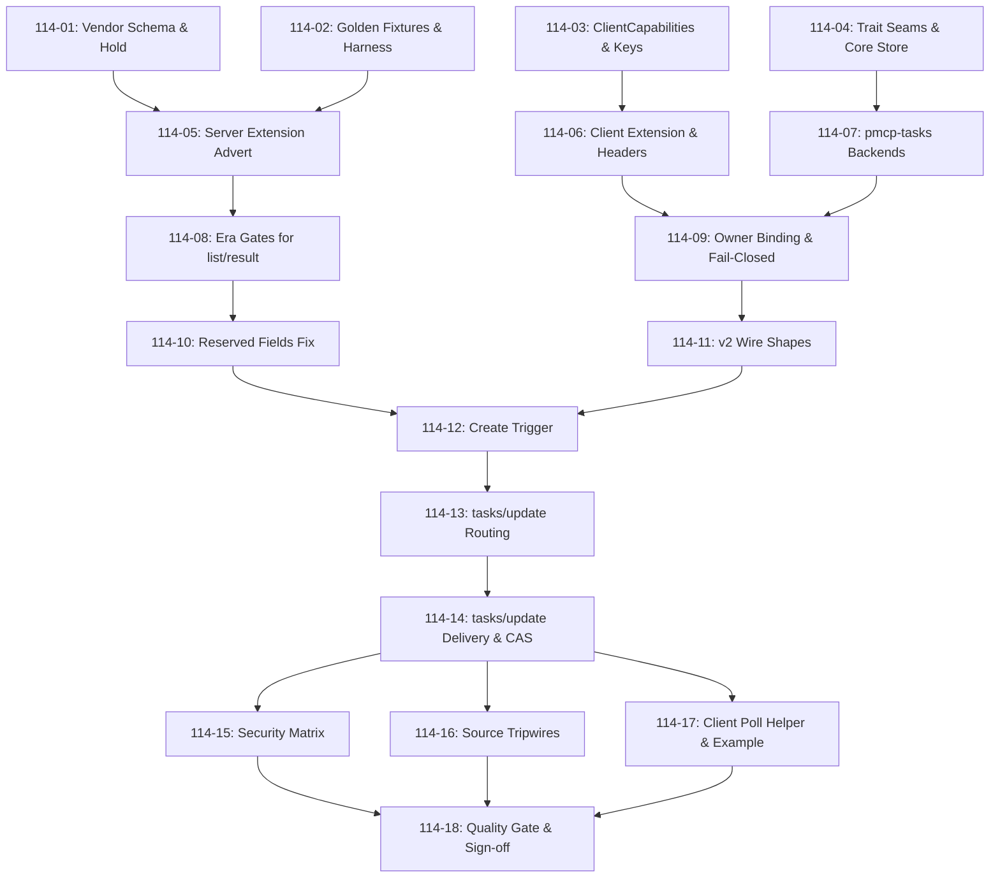

# Cross-AI Plan Review — Phase 114 (Tasks Extension Migration)

Two independent reviewers, same prompt (435 KB: project context, roadmap section,
CONTEXT, abridged RESEARCH, VALIDATION, all 18 plans). Codex additionally had
repository access and explored the source tree before reviewing; Gemini reviewed
from the supplied artifacts alone. That asymmetry matters when weighing the
divergence in §Consensus.

---

## Gemini Review

**Verdict: APPROVED WITH MINOR OBSERVATIONS**

### Executive Summary

Phase 114 presents a **rigorous, exceptionally well-grounded implementation plan** for
migrating MCP Tasks to a v2 extension (`io.modelcontextprotocol/tasks`) while preserving
v1 backwards compatibility and storage backend investments.

The architecture leverages the existing `serde_json::Value` `TaskRouter` boundary to
isolate protocol wire changes entirely above the storage layer (`task_dispatch.rs`),
ensuring zero rewrites for `pmcp-tasks` backends (DynamoDB, Redis, InMemory). The 18-plan
roadmap demonstrates high Nyquist sampling frequency, clear separation of concerns across
11 waves, and explicit threat modeling per plan.

### 1. Key Architectural & Technical Strengths

| Area | Decision / Pattern | Architectural Value |
|------|--------------------|---------------------|
| **Seam Isolation** | **D-11 / TASK-06** | Keeping `TaskStore` and storage backends untouched by placing the v2 wire reshape above the `serde_json::Value` seam in `task_dispatch.rs` preserves 197 existing `pmcp-tasks` tests and cloud storage investments. |
| **Input Security** | **D-17 / D-113-O** | Reusing Phase 113's kind-directed `decode_for` against server-recorded `inputRequests` on the task record eliminates untagged "first-fit" decoding bugs and prevents payload type confusion. |
| **Header Decoupling** | **DQ4 / Plan 114-06** | Establishing a dedicated name-key lookup table for `Mcp-Name: params.taskId` avoids adding `tasks/update` to `MRTR_METHODS`, preventing `splice_mrtr_params` from stripping `inputResponses`. |
| **Reserved Fields** | **DQ2 / Plan 114-10** | Extending `own_reserved_result_fields` to retain top-level `inputRequests` for `tasks/get` on `input_required` tasks eliminates a silent schema-invalidation defect. |
| **Golden Byte Baseline** | **D-14 / Plan 114-02** | Capturing v1 `tasks/*` raw byte fixtures in Wave 1 ensures that wire adjustments in later waves do not inadvertently alter v1 responses. |
| **Security Verification** | **D-09 / Plan 114-15** | Live-socket multi-principal testing across `tasks/get`, `tasks/update`, and `tasks/cancel` (confirming `NotFound` responses to prevent side-channel leaks) ensures security boundaries are verified at the transport layer. |

### 2. Critical Edge Cases & Risk Analysis

#### ⚠️ Risk 1: `ANONYMOUS_PRINCIPAL` Default Collision in `pmcp-tasks` (F11 vs D-07)
- **Context:** Decision D-07 specifies that unauthenticated v2 requests on a server without
  an auth provider map to `ANONYMOUS_PRINCIPAL` (`""`). However, Research Finding F11
  highlights that `pmcp-tasks`' `TaskSecurityConfig` defaults to `allow_anonymous: false`.
- **Impact:** Unauthenticated local dev and stdio servers running on `pmcp-tasks` backends
  would fail task creation with security errors unless `allow_anonymous` is explicitly set
  or overridden.
- **Recommendation:** In Plan 114-09 / 114-14, ensure `TaskDispatch` initializes or
  configures `TaskSecurityConfig` with `allow_anonymous: true` when operating in
  unauthenticated v2 mode, or document the required security config posture.

#### ⚠️ Risk 2: Partial Input Delivery State Persistence vs CAS Atomic Transition (D-16 vs D-12/D-13)
- **Context:** D-16 defines `tasks/update` as an atomic CAS transition
  (`InputRequired` -> `Working`). However, D-13 and Plan 114-04 note that a server MAY
  accept a partial input set, leaving the task in `InputRequired`.
- **Concurrency Risk:** If partial inputs are delivered across multiple HTTP requests,
  concurrent writes could race or overwrite partial `input_responses` if not properly merged.
- **Recommendation:** Ensure `deliver_task_inputs` performs an atomic read-modify-write
  (or CAS update) that appends/upserts new responses into `record.input_responses` while
  holding the record lock, only executing the state machine transition to `Working` when
  `TaskInputDelivery.is_complete` is `true`.

#### ⚠️ Risk 3: Result Disposition Differentiation for `tasks/get` vs Tool Results (TASK-04)
- **Context:** TASK-04 specifies that task-augmented tool call results must carry
  `resultType: "task"` with a flat `CreateTaskResult`. `tasks/get` responses also return
  task details.
- **Validation:** Verify in `inject_v2_result_envelope` and Plan 114-11 that
  `ResponseDisposition::Task` is applied strictly to tool call returns originating from
  task-augmented tool invocations, and NOT to direct `tasks/get` RPC responses (which
  return `GetTaskResult` / `Task` as standard JSON-RPC `result`).

#### ⚠️ Risk 4: Scope Hold Bookkeeping (`[~]` Pending Schema Directory)
- **Context:** Decision D-18 and DQ6 lock all six requirements (`TASK-01`..`TASK-06`) into
  `[~]` (*implemented; pending final schema*) until a versioned schema directory exists in
  BOTH upstream repositories (`modelcontextprotocol/modelcontextprotocol` AND
  `modelcontextprotocol/ext-tasks`).
- **Management:** Ensure `114-SPEC-RECHECK.md` (Plan 114-01) is treated as a living
  inventory. Reviewers should verify that all wire format assumptions are isolated to
  vendored fixture diffs.

### 3. Plan Completeness & Wave Dependency Evaluation

The 11-wave execution sequence is logically ordered and minimizes blocking dependencies:

### 4. Verdict & Recommendations

**Final Verdict: APPROVED WITH MINOR OBSERVATIONS.** The plan is exceptionally robust,
highly detailed, and Nyquist-compliant across all 18 sub-plans.

Actionable recommendations for implementation:

1. **Explicitly handle `allow_anonymous` in `TaskSecurityConfig`** during Plan 114-09
   testing to prevent `ANONYMOUS_PRINCIPAL` rejection on unauthenticated dev servers.
2. **Verify atomic payload merge in `GenericTaskStore<B>`** during Plan 114-07 to guarantee
   clean handling of multi-round-trip partial input deliveries.
3. **Execute `make test-feature-flags` and `cargo semver-checks`** after Wave 2 to confirm
   zero feature-unification false positives across `dynamodb` and `redis` feature flags.

---

## Codex Review

**Verdict: HIGH RISK — resolve architectural blockers before executing the 18-plan sequence**

### Summary

The plans are unusually rigorous on provenance, negative controls, security testing, and v1
preservation, but they are not yet executable end to end. Several core assumptions do not
match the current SDK: the client cannot decode the proposed v2 task responses, dispatch
cannot obtain persisted server-recorded input kinds, and the example lacks a viable
create–pause–resume lifecycle. There is also a direct mismatch between TASK-05's fail-closed
wording and the deliberately shared anonymous bucket. These are architectural blockers rather
than ordinary implementation details.

### Strengths

- The schema-provenance and final-schema hold discipline in **114-01** is excellent. It makes
  provisional wire values reviewable and re-verifiable.
- The design correctly keeps v2 projection above the `TaskRouter` `serde_json::Value` boundary
  instead of rewriting DynamoDB, Redis, and in-memory storage.
- Avoiding a new variant on the public exhaustive `ClientRequest` enum in **114-13** is the
  right compatibility instinct.
- Security testing is strong in intent: authentication before parameter parsing, owner-scoped
  lookups, oracle-resistant errors, raw-frame decoding tests, per-method live-socket coverage,
  and explicit negative controls.
- The plans correctly identify `inputResponses`, status-conditional detailed task shapes, flat
  create responses, and server-directed task creation from the extension draft.
- Separating the task-name header table from MRTR eligibility avoids the particularly dangerous
  case where MRTR removes the entire `tasks/update` payload.
- The quality matrix is broad: full gate, feature combinations, wasm, semver, public API,
  fuzzing, property tests, PMAT, examples, and documentation.
- The paired server/agent example is the right acceptance-test shape. The current plan simply
  needs additional implementation work to make it possible.

### Concerns

- **[HIGH] The client half cannot consume the planned v2 wire shapes — 114-11, 114-12, 114-17.**
  Existing client methods deserialize nested v1 `CreateTaskResult`, `GetTaskResult`, and
  `CancelTaskResult` shapes. The plans change the server to flat create/get responses and empty
  cancel/update acknowledgements, but **114-17** only adds `tasks_update()` and a polling helper.
  It does not add era-aware decoding for:
  - flat `CreateTaskResult`;
  - `resultType:"task"` returned by an ordinary `tools/call`;
  - flat `DetailedTask` from `tasks/get`;
  - inline terminal `result`/`error`;
  - empty v2 cancellation acknowledgement.

  Moreover, the current polling helper calls the v1-only `tasks/result` on completion. The
  extension requires a declaring client to handle either a normal result or a task result from
  supported requests, so DQ1 makes this client work mandatory, not optional. See the
  [ext-tasks draft specification](https://raw.githubusercontent.com/modelcontextprotocol/ext-tasks/main/specification/draft/tasks.md).

- **[HIGH] There is no coherent persisted-input lifecycle — 114-04, 114-07, 114-12, 114-14, 114-17.**
  Dispatch is supposed to decode responses against server-recorded `inputRequests`, but the core
  `TaskStore::get` exposes only `Task`; its internal record is private. The router path returns an
  opaque `Value`, and the plans do not define a normalized snapshot API exposing outstanding request
  IDs and kinds. They also do not explain how the example handler records input requests against the
  task ID that the server mints after the tool handler returns.

- **[HIGH] The proposed server-directed create flow is incomplete — 114-12 and 114-17.**
  The existing create interception recognizes a task-shaped tool value and then creates a different
  stored task. That does not provide a mechanism to:
  1. create the durable task before returning its handle;
  2. associate input requests with the minted ID;
  3. pause execution;
  4. resume or complete execution after `tasks/update`.

  The example's "handler creates a task, records an input request, and completes once input arrives"
  cannot be implemented from the described seams.

- **[HIGH] `InternalClientRequest::TasksUpdate` does not fit the existing classifier — 114-13.**
  The classifier currently receives method and params, while the request ID is returned separately by
  the outer parser. The proposed internal variant redundantly carries an original ID that the
  classifier cannot supply. More importantly, `parse_request_or_internal` is currently a
  Streamable-HTTP-oriented path; shared transport parsing still understands only public requests. The
  claim that this design supports "any transport, including stdio" is therefore unsupported, and
  v2-over-stdio is currently documented as out of scope.

- **[HIGH] TASK-05 is contradicted by the accepted anonymous behavior — 114-09 and 114-15.**
  TASK-05 says owner binding requires OAuth `sub` or stable per-request identity and fails closed when
  absent. **114-15** intentionally proves that two v2 callers on a no-auth server share a bucket and
  can see each other's tasks. That may be an acceptable development-mode policy, but it is not the
  literal stated requirement or the roadmap's "no-session cross-caller-leak guard." No stable non-OAuth
  per-request identity is implemented; it is deferred.

- **[HIGH] The "byte-identical" v1 evidence is not byte identity — 114-02.**
  Parsing responses as JSON, removing dynamic fields, or comparing structural values cannot detect
  field ordering, whitespace, omission-vs-null, or serializer changes. The plan currently proves
  normalized wire-shape identity. True byte identity needs deterministic IDs and clocks, or exact
  raw-byte comparison after fixed-width token substitution. The golden suite should also cover the
  router-backed `pmcp-tasks` path, not only the in-crate store.

- **[HIGH] The current extension error code conflicts with DQ3 — 114-09.**
  The current ext-tasks draft uses `-32003` for a missing required client capability, while the plan
  assigns `-32021` and reserves `-32003` for authentication. Recording the disagreement is good, but
  implementing the contradictory value while claiming draft alignment is likely to fail extension
  conformance. The current text is visible in the
  [extension specification](https://raw.githubusercontent.com/modelcontextprotocol/ext-tasks/main/specification/draft/tasks.md).

- **[HIGH] The plans conflict with the repository's mandatory contract-first workflow — 114-18.**
  AGENTS.md requires contract YAML before implementation and PMAT compliance before and after.
  **114-18** explicitly decides not to author a contract because the sibling repository is absent,
  after seventeen implementation plans have run. A missing mandatory contract location is a blocker
  requiring an explicit owner waiver or restoration of the dependency, not an implicit exemption. The
  execution plans also do not incorporate the mandated PMAT quality proxy and PDMT todo generation.

- **[MEDIUM] Bounds-first decoding is not implementable as described — 114-14.**
  `check_input_response_bounds` is currently private, and deserializing directly into `InputResponses`
  invokes the untagged decoder before explicit kind-directed validation. The route needs a raw
  `BTreeMap<String, Value>` boundary, a shared `pub(crate)` bounds function, and only then `decode_for`.
  The plan also repeatedly says "five input-response bounds," although only four input-response bounds
  apply; the request-state size limit is separate.

- **[MEDIUM] Wave ordering contains hidden dependencies — 114-10 and 114-11.**
  **114-10** removes the dead-code allowance from `ResponseDisposition::Task`, but production
  construction is not added until **114-11/12**, risking an intervening lint failure. Its runtime
  reserved-field reproduction also depends on a v2 task shape that **114-11** has not created yet.
  Meanwhile **114-11** should explicitly depend on **114-04/07** if its detailed task projection
  requires persisted input/result data.

- **[MEDIUM] Failed-task wire output lacks a storage model — 114-11.**
  The plans require failed tasks to include a JSON-RPC `error`, but existing records primarily hold
  task status, status text, and successful tool result. No error persistence method, atomic failure
  completion operation, or router normalization rule is specified.

- **[MEDIUM] Production-backend correctness is under-tested — 114-07, 114-11, 114-14.**
  A compile-only feature matrix and `GenericTaskStore<InMemoryBackend>` tests do not prove the
  extension requirement that a returned handle is immediately resolvable on an eventually consistent
  backend. The "always-conflict" test double also proves conflict propagation, not "first writer wins."

- **[MEDIUM] Input payload limits may exceed DynamoDB's practical record budget — 114-07 and 114-14.**
  A 256 KiB response set plus task metadata, variables, input requests, results, and serialization
  overhead approaches the DynamoDB 400 KiB item limit. Repeated partial updates also rewrite a growing
  record and can produce quadratic total I/O. No backend-specific item-budget or write-amplification
  test is planned.

- **[MEDIUM] Adding fields to the public `pmcp-tasks::TaskRecord` remains a source-compatibility risk — 114-07.**
  `serde(default)` preserves persisted-data compatibility but does not preserve downstream Rust struct
  literals. Root-crate semver checks do not cover this unpublished crate.

- **[MEDIUM] Explicitly preserving a nonempty tasks capability conflicts with the schema — 114-05.**
  The typed capability is intentionally `{}`, yet the plan tests that a user-provided nonempty object
  remains advertised. Either validate `{}` for this known extension or clearly classify the override as
  a nonconformant escape hatch.

- **[MEDIUM] Expired-task and absent-task errors are over-collapsed — 114-11.**
  Wrong-owner and genuinely absent IDs should be indistinguishable. The current draft, however, gives
  expired tasks a distinct error message. Hiding expiry from the owning caller sacrifices useful
  lifecycle information without improving cross-owner privacy.

- **[MEDIUM] Security defects discovered in 114-15 cannot merely be deferred.**
  The plan says to stop and record any production defect without fixing it. That is correct for
  preserving review clarity, but **114-18 must then be blocked** and a security-fix plan inserted.
  Otherwise TASK-05 could still be booked as implemented.

- **[LOW] The source-tripwire surface is over-engineered — 114-13 and 114-16.**
  Several comment/literal-stripping scanners, line-sensitive allowlists, and manual mutation controls
  will be brittle under refactors. They should protect only invariants that cannot be expressed through
  typed or behavioral tests.

- **[LOW] UUID version 4 is stricter than the protocol contract — 114-15.**
  The specification requires sufficiently unguessable identifiers, not UUIDv4 specifically. Locking v4
  unnecessarily prevents future cryptographically random formats.

- **[LOW] Fixed counts such as `223/223`, three PMAT violations, and expected test counts will age
  during an 18-plan phase — 114-18.** Capture a phase-base manifest and assert deltas rather than
  hard-coding repository-wide totals.

### Suggestions

- Add a blocking design plan before implementation that defines the complete dual-surface contract:
  - era-aware client response union for ordinary vs task tool results;
  - flat v2 create/get types;
  - empty cancel/update acknowledgements;
  - terminal polling from inline `tasks/get`, never `tasks/result`;
  - initialization/discovery sequencing.

- Introduce an explicit durable task-intent lifecycle instead of recognizing arbitrary task-shaped tool
  JSON. The server should mint and persist the task before returning its handle, and the handler needs
  a supported way to record outstanding inputs and resume after delivery.

- Redesign the input seam around a normalized, owner-scoped snapshot:
  - outstanding request ID and kind;
  - raw delivered `Value`s;
  - shared bounds validation;
  - atomic partial/complete delivery;
  - explicit successful, failed, and cancelled completion data.

- Correct **114-13** to carry only raw params in the internal variant and obtain the ID from the outer
  parsed request. Either scope it honestly to Streamable HTTP or add and test the missing
  shared-transport and batch routing.

- Decide TASK-05 explicitly:
  - either refuse v2 tasks whenever no stable identity exists;
  - implement a trusted stable identity source;
  - or amend TASK-05 and the roadmap to say fail-closed applies only to auth-configured deployments.

- Replace normalized v1 fixtures with deterministic raw-byte fixtures. Capture both store-backed and
  `TaskRouterImpl`-backed responses.

- Pin **114-01** to the exact audited ext-tasks commit rather than resolving whatever `main` contains
  during execution. A separate re-vendor check can report newer upstream drift.

- Treat the `-32003`/`-32021` disagreement as a blocking provisional-wire decision. Drive the
  implemented value from the pinned extension schema or isolate it behind one table that can be flipped
  mechanically at the final-schema gate.

- Add backend-contract tests for:
  - immediate readability after creation;
  - genuine two-writer CAS behavior using a barrier-backed fake;
  - DynamoDB item-size headroom;
  - partial-update write amplification.

- Move the `ResponseDisposition::Task` dead-code cleanup into the same plan that first constructs it in
  production. Add explicit dependencies from **114-11** to the input-persistence work.

- Insert a pre-implementation contract/workflow plan satisfying AGENTS.md: contract YAML or explicit
  waiver, `pmat comply check`, PDMT task generation, and quality-proxy usage.

- Reduce source scanners to a small set of durable invariants. Prefer exhaustive typed matches,
  schema-driven tests, live behavioral tests, and compile-fail fixtures.

### Risk Assessment

**Overall risk: HIGH.**

The testing and review discipline is strong, but four phase-critical paths are currently missing or
contradictory: v2 client decoding, durable create/pause/resume lifecycle, server-recorded input-kind
access, and TASK-05's identity guarantee. Those gaps prevent the paired example from working and
prevent TASK-02, TASK-04, and TASK-05 from being truthfully completed. Resolve those architectural
issues before executing the 18-plan sequence; otherwise later waves will discover them after
substantial code and test scaffolding has already accumulated.

---

## Consensus Summary

The two reviewers agree almost completely on **what the plan set does well** and disagree
sharply on **whether it is ready to execute**. Gemini, reading the artifacts alone, saw a
coherent and unusually disciplined design. Codex, which explored the actual source tree,
found four places where the plans assume seams that do not exist in the code today. The
divergence is therefore not a difference of taste — it tracks the difference in evidence
available to each reviewer, which argues for weighting Codex's blockers heavily and
verifying them against the source before execution.

### Agreed Strengths

Raised by both reviewers:

- **Seam isolation above the `serde_json::Value` `TaskRouter` boundary** (D-11 / TASK-06).
  Both call this the load-bearing architectural decision: it keeps all three production
  backends and their tests untouched while the wire reshape happens in `task_dispatch.rs`.
- **Decoupling the `Mcp-Name` task-name header table from `MRTR_METHODS`** (DQ4 / 114-06).
  Both independently identified that adding `tasks/update` to `MRTR_METHODS` would let
  `splice_mrtr_params` strip the entire `inputResponses` payload — and both credit the plan
  for avoiding it.
- **Schema-provenance discipline and the final-schema hold** (114-01, D-18/DQ6). Gemini frames
  it as a bookkeeping strength; Codex calls it "excellent" and singles it out as what makes
  provisional wire values reviewable.
- **Kind-directed `decode_for` against server-recorded `inputRequests`** (D-17 / D-113-O) as the
  correct defense against untagged first-fit payload confusion.
- **Security-testing intent** — live-socket multi-principal coverage, owner-scoped lookups,
  oracle-resistant `NotFound`, explicit negative controls (114-15).
- **The paired server/agent example as the acceptance-test shape** (114-17). Gemini treats it as
  delivered; Codex agrees it is the right shape but says more implementation is required to make
  it possible.

### Agreed Concerns

Raised by both reviewers — highest priority:

1. **The unauthenticated / anonymous-owner path is the phase's weakest seam** (114-09, 114-15;
   D-07 vs F11). Gemini frames it operationally: `pmcp-tasks`' `TaskSecurityConfig` defaults to
   `allow_anonymous: false`, so `ANONYMOUS_PRINCIPAL` (`""`) requests will be rejected on
   no-auth dev/stdio servers unless the posture is set explicitly. Codex frames it as a
   requirements contradiction: TASK-05 says owner binding *fails closed* without a stable
   identity, yet 114-15 deliberately proves two anonymous callers **share** a bucket. Both point
   at the same unresolved question — *what is the contract when there is no auth provider?* —
   and it currently has two incompatible answers in the same phase. **This needs an explicit
   owner decision, not a test.**

2. **Partial input delivery lacks a specified atomic merge** (114-04, 114-07, 114-14; D-16 vs
   D-12/D-13). Gemini: concurrent multi-round-trip deliveries can race or clobber
   `record.input_responses` unless `deliver_task_inputs` does an atomic read-modify-write and
   only transitions `InputRequired → Working` when the set is complete. Codex reaches the same
   place from the other end: there is no normalized, owner-scoped snapshot API exposing
   outstanding request IDs and kinds, so the merge has nothing well-defined to merge *into*.

3. **Production-backend correctness is proven only by proxy** (114-07, 114-11, 114-14). Gemini
   asks for `make test-feature-flags` + `cargo semver-checks` after Wave 2 to catch
   feature-unification false positives. Codex goes further: a compile-only feature matrix plus
   `GenericTaskStore<InMemoryBackend>` does not prove immediate read-after-create on an
   eventually consistent backend, and the always-conflict double proves conflict propagation
   rather than first-writer-wins.

4. **`resultType:"task"` disposition must not leak onto `tasks/get`** (114-10, 114-11). Gemini
   raises this directly as Risk 3. Codex arrives adjacent via the client-decoding blocker: the
   client needs an era-aware union that distinguishes an ordinary tool result, a task-augmented
   tool result, and a `tasks/get` response. Same boundary, two directions.

### Divergent Views

Worth investigating — these are where the reviewers actively disagree:

| Topic | Gemini | Codex | Note |
|-------|--------|-------|------|
| **Overall readiness** | Approved with minor observations | HIGH risk; insert a blocking design plan before Wave 1 | The core split. Codex had source access; Gemini did not. |
| **Client half (114-17)** | Not raised | **HIGH blocker** — client still deserializes nested v1 shapes; polling helper calls v1-only `tasks/result`; no decoding for flat create/get, `resultType:"task"`, inline terminal result/error, or empty cancel ack | Directly testable against `src/client/mod.rs`. If true, it defeats the locked dual-surface steer in CONTEXT ("server and client halves land together"). **Verify first.** |
| **Wave ordering** | "Logically ordered and minimizes blocking dependencies" | **MEDIUM** — 114-10 removes the `ResponseDisposition::Task` dead-code allowance before 114-11/12 constructs it in production (intervening `make lint` failure); 114-11 has an undeclared dependency on 114-04/07 | Cheap to check: read 114-10's `files_modified` against 114-11/12. A `dead_code` lint break mid-wave is exactly the class of failure `make lint` catches late. |
| **`-32021` vs `-32003`** | Not raised | **HIGH** — current ext-tasks draft uses `-32003` for missing client capability; the plan assigns `-32021` and reserves `-32003` for auth | 114-01 pins a vendored schema precisely so this is checkable offline. Resolve against the pinned artifact, not against `main`. |
| **Contract-first / AGENTS.md** | Not raised | **HIGH** — 114-18 declines to author the contract because the sibling `provable-contracts` repo is absent, after 17 plans have already run | Note: `AGENTS.md` is currently untracked in this working tree, and CLAUDE.md carries the same contract-first rule. Either way this is an owner-waiver decision, not something a plan can grant itself. |
| **v1 "byte-identical" evidence** | Listed as a strength (golden byte fixtures) | **HIGH** — normalized JSON comparison cannot detect field ordering, whitespace, or omission-vs-null; needs deterministic IDs/clocks or fixed-width token substitution, and should cover the router-backed path too | Both agree the *fixture* is the right idea; they disagree on whether the planned comparison delivers what TASK-06 claims. |
| **Source tripwires (114-16)** | Implicitly endorsed as rigor | **LOW** — over-engineered; comment-stripping scanners and line-sensitive allowlists are brittle under refactor | Taste-level; lowest priority of the divergences. |

### Recommended Next Step

Codex's four architectural blockers (v2 client decoding, durable create/pause/resume lifecycle,
server-recorded input-kind access, TASK-05 identity guarantee) are all falsifiable against the
current source in minutes. Verify them before deciding between:

- **If confirmed** — insert a Wave 0 design plan resolving the dual-surface contract and the
  TASK-05 anonymous-owner decision, then replan: `/gsd:plan-phase 114 --reviews`
- **If overstated** — fold the agreed concerns (anonymous posture, atomic input merge, backend
  contract tests, `resultType` boundary) into the existing plans and proceed.

The TASK-05 anonymous-owner contradiction needs an owner decision either way — it is the one
item neither reviewer can settle and no test can resolve.
