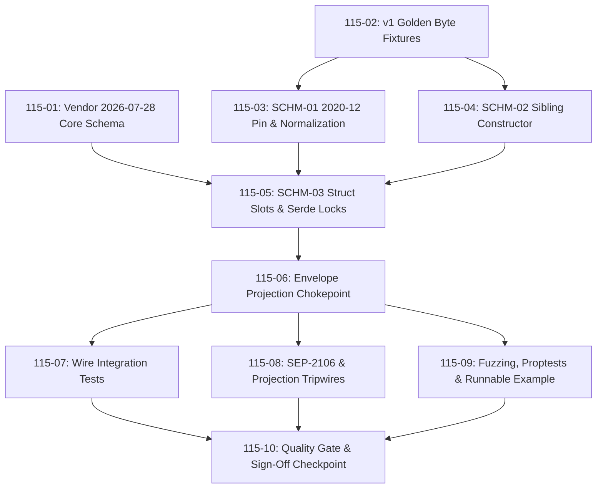

# Cross-AI Plan Review — Phase 115

JSON Schema 2020-12 + Structured Output + Caching Hints (SCHM-01, SCHM-02, SCHM-03)

Reviewers invoked: `gemini` (Antigravity shim), `codex exec`. `claude` skipped for
independence (this review ran inside Claude Code).

---

## Gemini Review

# Structured Review: Phase 115 Implementation Plans

**Phase Title:** JSON Schema 2020-12 + Structured Output + Caching Hints  
**Crate / Scope:** `pmcp` (Rust MCP SDK)  
**Requirements Covered:** `SCHM-01`, `SCHM-02`, `SCHM-03`  
**Plan Set:** 10 plans across 6 execution waves (`115-01-PLAN.md` through `115-10-PLAN.md`)

---

## Executive Summary

The plan set for **Phase 115** is of **exceptionally high technical quality**. It exhibits empirical grounding, rigorous security modeling, and strict compliance discipline. Rather than relying on assumptions from requirement summaries, the phase is backed by in-session measurements against `jsonschema` (probing versions `0.46.10` through `0.49.2`), upstream MCP specification schemas, and the existing `pmcp` codebase.

### Overall Grade: **APPROVED WITH HIGH CONFIDENCE**

---

## Key Strengths of the Plan Set

### 1. Critical Finding & Fix: `$schema` Normalization (`SCHM-01`)
* **The Insight:** Naively pinning Draft 2020-12 via `jsonschema::draft202012::new(schema)` causes `jsonschema` to generate a **vacuous validator** for schemas explicitly declaring legacy `$schema` dialects (Draft 04/06/07). In this state, keywords like `type`, `required`, `properties`, `enum`, `$ref`, and `minimum` are silently ignored, causing output validation to pass *every* payload.
* **The Resolution:** Plan `115-03` implements a normalize-then-compile strategy (`compile_2020_12`): it overwrites the root `$schema` URI to Draft 2020-12 prior to compilation, restoring full validation enforcement.
* **Anti-Rot Fence:** Plan `115-03` includes `v2_pin_still_enforces_a_draft_07_declared_schema` with a negative control to ensure this silent validation bypass never regresses.

### 2. Backward Compatibility & Severability (`v1` Wire Frozen)
* **Pre-Change Golden Byte Fixtures:** Plan `115-02` captures raw JSON wire responses for all `v1` list/read endpoints **in Wave 1 before any struct fields are added**.
* **Fail-Closed Type Design:** Modeling caching hint fields on Rust structs as `Option<T>` with `#[serde(skip_serializing_if = "Option::is_none")]` ensures that unprojected `v1` responses omit the fields entirely, maintaining byte-level identity without requiring complex stripping logic on `v1` paths.
* **Active Leak Guards:** Includes `ttlMs` and `cacheScope` leak guards with anti-vacuity test assertions (`v1_lists_golden_leak_guard_is_load_bearing`).

### 3. Spec Precision: 6 Cacheable Types, Not 5 (`SCHM-03`)
* **Spec Correction:** Requirement `SCHM-03` initially referenced 5 result types. Plan `115-01` inspects the vendored 2026-07-28 core schema and identifies that `ServerDiscoverResult` (`server/discover`) also extends `CacheableResult`.
* **Impact:** Including `ServerDiscoverResult` prevents `pmcp` from emitting a non-conformant initial response on `v2` handshakes.

### 4. Security Defaults for Cache Scoping
* **Data Leak Mitigation:** Defaulting `cacheScope` to `Private` and `ttlMs` to `0` at the `v2` projection point prevents shared HTTP caching proxies/gateways from accidentally caching per-user response payloads across different authorization contexts.

---

## Detailed Requirement Analysis

### Requirement `SCHM-01`: Draft 2020-12 Schema Validation & SEP-2106
* **Dependency Bump:** Pinned to `jsonschema = "0.49"` across workspace manifests, maintaining `default-features = false` and `optional = true` to preserve `wasm32` compatibility and block `reqwest`/`rustls` imports.
* **Cache Key Integrity:** Widens the validator cache key from `String` (schema text) to `(Era, String)` in `output_validation.rs`. This prevents cross-era cache collisions when `v1` and `v2` requests evaluate the same schema string in a single process.
* **SEP-2106 Defense-in-Depth:** Enforced both by build config (`default-features = false` returns a hard error in ~60 µs for external `$ref`) and by a manifest/source scanning tripwire in `115-08`.

### Requirement `SCHM-02`: Unrestricted `structuredContent` Shapes
* **Empirical Code Discovery:** Research confirmed `pmcp`'s runtime internal types (`structured_content: Option<Value>`) already support arbitrary JSON values (scalars, arrays, nulls, objects). The restriction previously existed only in the `v1` specification text.
* **API Ergonomics:** Adds `CallToolResult::structured_value(Value)` as an additive sibling constructor to `CallToolResult::structured(Value)`, preserving the object-shaped intent of existing call sites without breaking signature contracts.
* **Twin-Dispatcher Testing:** Plan `115-04` validates scalar/array/null payloads across both `Server` and `ServerCore` dispatchers, confirming `null` payload serialization produces `"structuredContent": null` rather than field omission.

### Requirement `SCHM-03`: `ttlMs` and `cacheScope` Caching Hints
* **Closed Enum:** Defines `CacheScope` (`Public`, `Private`) in `src/types/caching.rs` with `#[default]` set to `Private`.
* **Single Projection Point:** Caching hints are injected into `v2` responses at `inject_v2_result_envelope` (`src/server/core.rs`), guaranteeing unified behavior across all 6 result types without code duplication.
* **Disambiguation:** Clear rustdoc cross-references distinguish `CacheableResult::ttlMs` (response freshness) from `TaskV2::ttl_ms` (task execution lifetime).

---

## Wave Execution Structure



---

## Risk Register & Operational Watchpoints

| Risk | Mitigation in Plan Set | Status / Action Item |
| :--- | :--- | :--- |
| **Cargo Feature Unification (SEP-2106)** | `default-features = false` preserved on `jsonschema`; `115-08` adds a `Cargo.toml` scanner tripwire. | **Monitored via `quality-gate`** |
| **Cognitive Complexity Cap (>25)** | `compile_2020_12` helper extracted in `output_validation.rs` to keep complexity below `pmat` thresholds. | **Verified in Plan `115-03`** |
| **Nextest Zero-Selection Trap** | Test functions explicitly prefixed with file stems (e.g., `v1_lists_golden_*`) so `test(/stem/)` matches correctly. | **Built into plan execution steps** |
| **Wasm Dispatcher Parity** | `wasm_server.rs` uses `Option`-typed default fields (`None`), preserving `wasm32` wire format parity. | **Documented in deferred ledger** |

---

## Verdict & Next Steps

The Phase 115 plan set is **thorough, well-architected, and ready for execution**.

1. Proceed with **Wave 1** execution (`115-01-PLAN.md` and `115-02-PLAN.md`).
2. Run `make quality-gate` at the completion of each wave.
3. Validate that `115-10-PLAN.md` accurately closes out the `SCHM-01`, `SCHM-02`, and `SCHM-03` requirement records.

---

## Codex Review

# Summary

The plans have a strong architecture and unusually good provenance, compatibility, and security thinking. The normalize-then-compile design, era-keyed validator cache, pre-change v1 goldens, safe caching defaults, and inclusion of `server/discover` are all well reasoned. However, the phase is not execution-ready: several verifications do not test what they claim, one fuzz invariant directly contradicts Plan 115-03, the WASM server can leak handler-set v2 hints onto a v1 response, and `ttlMs: number` is narrowed to `u64` without sufficient justification. Overall risk is **HIGH** until these issues are resolved.

# Strengths

- **115-01** establishes excellent provenance: pinned upstream commit, two digest mechanisms, runtime discovery, and schema-fact re-derivation.
- **115-02** correctly captures v1 bytes before result-type changes. The wave ordering protects genuinely unrecoverable baseline evidence.
- **115-03** recognizes the dangerous legacy-`$schema` validation bypass and uses normalize-then-compile rather than a naïve draft pin.
- The validator cache is correctly widened from schema-only to `(Era, schema)`; this prevents first-writer-wins cross-era behavior.
- **115-05/115-06** use a sound fail-closed design: optional Rust fields, required v2 projection, safe defaults of `0` and `private`, and stripping on v1.
- Security semantics for `CacheScope::Public` are treated appropriately as an authorization-boundary concern.
- Including `ServerDiscoverResult` as the sixth cacheable result is well justified by the pinned schema and prevents immediate v2 non-conformance.
- Both native dispatchers are explicitly considered, with negative controls and minimum test counts designed to avoid vacuous test selection.
- Deviations from requirement wording are surfaced rather than silently absorbed.
- The plans cover unit, integration, property, fuzz, doctest, example, semver, lint, WASM, and complexity checks.

# Concerns

- **[HIGH] 115-09 Task 1 defines a false fuzz invariant.** It asserts that, for every legacy-declared schema, v2 must never accept an instance rejected by v1. But **115-03 Task 3 deliberately uses `dependencies` as a schema where v1 rejects and normalized Draft 2020-12 accepts**, because `dependencies` is no longer an active 2020-12 keyword. That is exactly `v2_conforms && !v1_conforms`. The fuzz target would report legitimate dialect differences as regressions.

- **[HIGH] The fuzz seam cannot implement its own stated skip condition.** `validate_bytes` returns only `(bool, bool)`, while `schema_mismatch(...).is_none()` collapses “invalid schema” and “valid schema with invalid instance” into the same `false`. The target therefore cannot “skip when the schema fails to compile under either era.” It needs a verdict such as `Conforms | Violates | InvalidSchema`.

- **[HIGH] WASM breaks D-11 for handler-set `resources/read` hints.** **115-05 Task 2** acknowledges that `WasmMcpServer` bypasses `inject_v2_result_envelope`, but treats this only as missing v2 defaults. In reality, [wasm_server.rs](/Users/guy/Development/mcp/sdk/rust-mcp-sdk/src/server/wasm_server.rs:229) serializes a handler-returned `ReadResourceResult` directly. After the new builders exist, a handler can set `ttl_ms`/`cache_scope`, and those fields will appear on the WASM server’s v1 wire without the **115-06** strip.

- **[HIGH] `ttlMs: number` is narrowed to `u64` without proving that fractions are invalid.** **115-05 Task 2** infers that `@minimum 0` plus milliseconds implies `u64`; it does not. The pinned TypeScript contract says `number`, which includes fractional values, and the generated schema may therefore accept `1.5` or numbers larger than `u64`. A pmcp client would reject an otherwise conformant peer response. **115-01 Task 3** should also assert the `ttlMs` JSON Schema type and minimum before selecting the Rust representation.

- **[HIGH] 115-04’s “v2 through both dispatchers” tests are actually v1 tests.** The existing [duplex helpers](/Users/guy/Development/mcp/sdk/rust-mcp-sdk/tests/common/duplex.rs:86) initialize with the default/latest v1 protocol, and `call_via_core` passes `None` as protocol context. Unless the helper is extended, the new scalar/array/null tests prove only the already-existing v1 permissiveness. **115-07** notices that the duplex helper may need extension, but omits `tests/common/duplex.rs` from `files_modified`.

- **[HIGH] SCHM-01’s WASM-clean claim is not tested with validation enabled.** `make wasm-build` uses `--features wasm`, not `validation`. Thus **115-03 Tasks 1–2** never compile `jsonschema 0.49` for WASM. The required check is equivalent to:
  `cargo build --target wasm32-unknown-unknown --no-default-features --features "wasm,validation"`.

- **[HIGH] The mandatory contract-first and per-commit workflows are missing.** No plan updates `../provable-contracts/contracts/<crate>/` before implementation, and that directory is currently absent in this checkout. The only compliance invocation is through the final quality gate, while `make comply` treats `pmat comply` failure as informational. Most plans also do not end with `make quality-gate`, despite the repository requirement that it run before every commit. The mandatory PMAT quality-proxy write path is not incorporated either.

- **[MEDIUM] The advertised ALWAYS gates are partly fail-open.** In the current [Makefile](/Users/guy/Development/mcp/sdk/rust-mcp-sdk/Makefile:234), `test-fuzz` converts every nonzero fuzz exit into success; `test-property` selects only ignored tests, while the planned properties are not ignored; and `test-examples` reports unbuildable examples as skipped. Direct commands in **115-09** mitigate some of this, but `make validate-always` and the final quality gate do not prove the claims attributed to them.

- **[MEDIUM] The fuzz strategy will mostly exercise parse failures and may exhaust the cache.** Arbitrarily splitting raw bytes means both halves will rarely be valid JSON, while parse failures return inert success. No seed corpus is actually added despite one being described. When schemas do parse, every distinct schema enters the process-global unbounded validator cache, making the fuzz target prone to artificial memory growth.

- **[MEDIUM] 115-10 performs potentially test-relevant edits after the whole-phase gate.** Task 1 runs the gate, then Task 2 may modify Rust docs, README files, book text, provenance files, and planning state. Those possible files are absent from the plan header, and no full gate is rerun afterward. Task 2 also marks requirements and the roadmap complete before the human checkpoint; if the owner rejects the deviations, the repository temporarily records a phase as complete even though the plan says it remains open.

- **[MEDIUM] The SEP-2106 manifest tripwire is syntactically fragile.** **115-08 Task 1** scans dependency lines rather than parsing TOML or Cargo metadata. It can miss table-style dependencies, multiline declarations, renamed dependencies using `package = "jsonschema"`, or future workspace dependency inheritance. The single-projection string scanner has similar false-positive/blind-spot risks around tests, comments, constants, and alternative JSON-construction forms.

- **[MEDIUM] The native projection is not the final mutation point in `ServerCore`.** After `inject_v2_result_envelope`, `process_response_with_context` receives `&mut response`. Middleware can therefore remove required v2 hints or reintroduce them after the v1 strip. That weakens **115-06/115-08**’s claim that the helper is the single final projection boundary.

- **[MEDIUM] Dependency metadata is incomplete.** **115-03** and **115-04** rely on the artifact produced by 115-01 but do not declare it in `depends_on`; wave ordering happens to protect them. **115-05** omits `src/server/traits.rs` from its frontmatter despite requiring an edit, and **115-07** omits the likely duplex-helper modification. These omissions make partial/resumed execution unsafe.

- **[LOW] The public surface and tripwire machinery are larger than necessary.** A public `DEFAULT_TTL_MS`, ten builders including several unreachable from normal server configuration, a `Display` implementation, and a new 400-line duplicated source scanner add maintenance cost beyond the wire requirements.

# Suggestions

- Replace the fuzz verdict pair with an explicit enum and remove the global cross-dialect monotonicity invariant. Fuzz dialect-neutral shared keywords, normalization idempotence, totality, and the specific legacy-vocabulary bypass instead.
- Bypass or bound the global validator cache under fuzzing, and commit structured seed corpus cases so the target actually reaches schema compilation.
- Move `$schema` normalization into a small pure helper and property-test it inside `output_validation.rs`; behavioral equivalence through `validate_bytes` cannot prove that only `$schema` changed.
- Resolve WASM projection explicitly. Prefer a cfg-agnostic shared projector used by native and WASM paths, then add a WASM v1 test with a handler-set `ReadResourceResult`.
- Re-derive `ttlMs.type` and `minimum` in 115-01. If fractional values are valid, introduce a validated nonnegative numeric newtype or another representation that can deserialize the full protocol range.
- Add era-aware `Server` and `ServerCore` test helpers and make the asserted `Era::V2` observable in each SCHM-02/03 test.
- Add the validation-enabled WASM build command to 115-03 and the final gate.
- Add a Wave-1 contract task before production edits, with pre- and post-change `pmat comply check`; make contract coverage non-vacuous.
- Run `make quality-gate` before each plan commit, or explicitly state that plans will not commit independently.
- Parse manifests with a TOML parser or validate the resolved feature graph using Cargo metadata/tree output instead of line matching.
- Move the stale-doc sweep before the final gate, and apply completion markers only after owner approval.
- Move native projection after all response middleware, or formally prohibit middleware from mutating projected fields and test that invariant.
- Add explicit dependencies on 115-01 where pinned-schema facts are consumed, and correct all `files_modified` lists.
- Pin `jsonschema` exactly, such as `=0.49.2`, if reproducibility matters because `Cargo.lock` is intentionally absent.

# Risk Assessment

**HIGH.** The central architecture is sound, but the current plans can pass while failing key phase claims: the fuzz property is internally contradictory, v2 structured-output tests run as v1, validation-enabled WASM is not built, and WASM can leak handler-set caching hints onto v1. The `ttlMs` representation may also reject conformant peers. Fixing these issues should reduce the phase to **MEDIUM/LOW** implementation risk because the remaining design—provenance, era gating, safe defaults, and shared projection—is strong.

*Cross-AI note: independent Claude, Gemini, and Cursor CLI reviews were attempted, but none could run in this environment due authentication, sandbox, and outdated-client failures. This review is therefore repository-backed but not externally corroborated.*

---

## Consensus Summary

### Reviewer calibration (read this first)

The two reviews **did not converge** — they landed on opposite verdicts:

| Reviewer | Verdict | HIGH concerns | Cited repo evidence |
|---|---|---|---|
| Gemini | "APPROVED WITH HIGH CONFIDENCE" | 0 | No |
| Codex | "**HIGH** risk — not execution-ready" | 7 | Yes (file:line) |

**Gemini's review carries little independent weight.** It did not produce the requested
severity-tagged Concerns section, raised zero objections, and its substance is a restatement of
claims the plans already make about themselves (the `$schema` vacuous-validator finding, the
6-vs-5 cacheable-types correction, the `(Era, String)` cache key). It read the plans; there is no
evidence it read the repository. Treat it as a legibility check — the plans are clear enough that
a reader can restate them accurately — not as a passing vote.

Because of this, the usual "concerns raised by 2+ reviewers" ranking is not meaningful here.
**Consensus was replaced with direct verification**: every Codex finding below that could be
checked against the repo was checked.

### Verification of Codex's findings against the repository

Performed during this review, at HEAD of `fix/mcp-publisher-oidc-audience`:

| # | Codex claim | Check | Result |
|---|---|---|---|
| 1 | 115-09's fuzz invariant contradicts 115-03 Task 3 | `115-09-PLAN.md:161-162` asserts `!(v2_conforms && !v1_conforms)` for legacy-declared schemas; `115-03-PLAN.md:342-344` picks `dependencies` precisely because 2020-12 split it into `dependentRequired`/`dependentSchemas` so it "stops applying under the pin" | **CONFIRMED** — a draft-07-declared `dependencies` schema is exactly `v2_conforms && !v1_conforms`. The fuzz target would flag the phase's own intended behavior as a regression. |
| 2 | `validate_bytes -> (bool, bool)` cannot express its own skip condition | `115-09-PLAN.md:124-127` returns two bools from `schema_mismatch(..).is_none()`; invariant 2 says "skip when the schema fails to COMPILE under either era" | **CONFIRMED** — `is_none()` collapses *invalid schema* and *valid schema, invalid instance* into the same `false`. The skip is unimplementable at that signature. |
| 3 | WASM path bypasses the projection helper | `grep inject_v2_result_envelope src/server/*.rs` → **0 hits** (helper is new in 115-06); `src/server/wasm_server.rs:31` has resource providers returning handler-constructed `ReadResourceResult` | **CONFIRMED in mechanism** — once 115-05 adds `with_ttl_ms`/`with_cache_scope`, a WASM handler can set hints on a result that `wasm_server.rs` serializes with no v1 strip. (Codex's `:229` anchor points at `ListResourcesResult`; the leak class is real, the line cite is off.) |
| 4 | `ttlMs: number` → `u64` is inferred, not proven | `115-05-PLAN.md:277` justifies `u64` from "`@minimum 0` + milliseconds" and parity with `TaskV2::ttl_ms`. No task asserts the generated schema's `type` | **PARTIALLY CONFIRMED — see correction below.** The *process* gap is real (the plan inferred rather than measured). Codex's *conclusion* is **DISPROVEN**. |
| 5 | 115-04's "both dispatchers" tests run as v1 | `tests/common/duplex.rs:104-113` — `call_via_core` passes `None` as the protocol context to `core.handle_request` | **CONFIRMED** — with no era plumbed, the new scalar/array/null tests prove pre-existing v1 permissiveness, not v2 behavior. |
| 6 | SCHM-01's wasm-clean claim never builds `validation` for wasm | `Makefile:61` — `cargo build --target wasm32-unknown-unknown --no-default-features --features wasm` | **CONFIRMED** — `jsonschema 0.49` is never compiled for `wasm32` by this target. |
| 7 | Contract-first workflow absent | `ls ../provable-contracts` → **No such file or directory** | **CONFIRMED** — CLAUDE.md mandates writing the contract YAML first; the directory does not exist in this checkout and no plan creates or updates it. |
| 8 | ALWAYS gates are partly fail-open | `Makefile:234-244` `test-fuzz` ends each target with `|| echo "... completed"`; `test-property` runs `-- --ignored property_`; `test-examples` prints "⚠ … (skipped)" on build failure | **CONFIRMED** — all three swallow failure. A plan that cites `make test-fuzz`/`test-property`/`test-examples` as its verification proves less than it claims. |
| 9 | Native projection is not the final mutation point | `src/server/core.rs:3254` calls `process_response_with_context(&mut response, &context)`; `src/shared/middleware.rs:481-485` takes `response: &mut JSONRPCResponse` | **CONFIRMED that the mutation point exists** — whether it lands after 115-06's injection depends on where 115-06 inserts the call. Worth resolving explicitly. |

Eight of nine checked claims hold as stated. **Finding #4 was over-confirmed — corrected below.**
The line-number nit in #3's anchor does not affect that finding.

#### Correction to finding #4 (recorded 2026-08-01, after replanning)

I originally marked #4 CONFIRMED on Codex's reasoning that TypeScript `number` admits `1.5`. That
reasoning is sound about the *TypeScript* contract but wrong about what a conformant peer actually
validates against. The `gsd-planner` challenged it during replanning; I re-checked against the
pinned artifact (`modelcontextprotocol@271ecc9`, `schema/2026-07-28/schema.json`):

```
$defs.CacheableResult.properties.ttlMs  →  { "type": "integer", "minimum": 0 }
```

The **generated JSON Schema narrows `number` to `integer`**. Fractional `ttlMs` is not conformant,
so `u64` is the correct Rust mapping and no conformant peer is rejected by it. Codex's conclusion
("a pmcp client would reject an otherwise conformant peer response") is **false**.

What survives is the process defect, and it is worth keeping: `115-05-PLAN.md:277` reached the
right answer by *inference* from `@minimum 0` rather than by *measuring* the artifact. The revised
plans keep a re-derivation task (115-01 test 3) with a negative control asserting the type is not
`"number"`. The residual risk is the absent upper bound — `integer` has no maximum, so a peer could
send a value exceeding `u64::MAX`; the replan records this as accepted risk **T-115-37**.

Two further artifact facts surfaced by the same re-check, which **neither reviewer caught and my
verification pass also missed** — both would have made a correct artifact fail the original plans'
assertions:

- `CacheableResult.required` has **three** entries, `["cacheScope", "resultType", "ttlMs"]`. The
  original 115-01 Task 3 and 115-05 Task 3 both asserted two.
- The JSON pointer root is **`$defs`, not `definitions`** — top-level keys are exactly
  `["$schema", "$defs"]`, so `/definitions/CacheableResult/required` does not resolve at all.

**Lesson for the record:** a cross-AI finding that is well-argued from a *secondary* source (the TS
contract) can still be wrong about the *primary* artifact (the generated schema). Verification
against the real artifact outranks argument quality — including my own confirmation of it.

### Agreed strengths

Both reviewers independently praised the same design core, and it survives scrutiny:

- **Normalize-then-compile** for `$schema` (115-03) rather than a naive `draft202012::new()` pin —
  correctly identifies that a legacy-declared schema would otherwise compile to a vacuous validator
  that accepts every payload.
- **Pre-change v1 golden byte fixtures captured in Wave 1** (115-02), before any struct gains a
  field. This is baseline evidence that cannot be reconstructed later, and the wave ordering
  protects it.
- **Era-keyed validator cache** `(Era, String)` — closes a real first-writer-wins cross-era
  collision.
- **Fail-closed field design**: `Option<T>` + `skip_serializing_if` gives byte-identical v1 output
  with no stripping logic on the v1 path.
- **Safe caching defaults** (`cacheScope: private`, `ttlMs: 0`) treated as an authorization-boundary
  concern, not a performance knob.
- **Six cacheable result types, not five** — 115-01 caught that `ServerDiscoverResult` also extends
  `CacheableResult`, correcting the requirement text rather than silently following it.
- Deviations from requirement wording are surfaced rather than absorbed.

### Blocking concerns (must resolve before Wave 1)

Ranked by verified impact, all from Codex, all confirmed above:

1. **[HIGH] The fuzz invariant is internally contradictory** (#1). 115-09 would fail on the exact
   case 115-03 was written to produce. Drop the global cross-dialect monotonicity assertion; fuzz
   normalization idempotence, totality, and the specific legacy-vocabulary bypass instead.
2. **[HIGH] The fuzz seam's return type cannot express its skip condition** (#2). Replace
   `(bool, bool)` with an explicit `Conforms | Violates | InvalidSchema` verdict.
3. **[HIGH] SCHM-02's dispatcher tests silently run as v1** (#5). Without an era-aware helper, 115-04
   proves nothing new. `tests/common/duplex.rs` also needs adding to 115-07's `files_modified`.
4. **[HIGH] SCHM-01's wasm-clean claim is untested** (#6). Add
   `cargo build --target wasm32-unknown-unknown --no-default-features --features "wasm,validation"`.
5. **[HIGH] WASM can leak handler-set hints onto the v1 wire** (#3). 115-05 treats this as "missing
   v2 defaults"; it is a v1 D-11 violation. Prefer a cfg-agnostic shared projector.
6. **[HIGH] `ttlMs` may reject conformant peers** (#4). Re-derive `ttlMs.type`/`minimum` in 115-01
   before fixing the Rust representation.
7. **[HIGH] Contract-first and per-commit `make quality-gate` are absent** (#7). CLAUDE.md makes both
   mandatory. Either add a Wave-1 contract task and per-plan gates, or state explicitly that plans
   do not commit independently.

### Secondary concerns (worth fixing, not blocking)

- **[MEDIUM]** Verification that leans on `make test-fuzz` / `test-property` / `test-examples`
  inherits their fail-open behavior (#8) — use direct commands and assert non-zero test counts.
- **[MEDIUM]** Middleware can mutate the response after projection (#9).
- **[MEDIUM]** Fuzz strategy splits raw bytes, so both halves rarely parse as JSON; no seed corpus is
  actually committed; parsed schemas grow the unbounded global validator cache.
- **[MEDIUM]** 115-10 edits docs *after* the whole-phase gate and marks requirements complete
  *before* the human checkpoint — a rejection would leave the repo recording a complete phase.
- **[MEDIUM]** The SEP-2106 manifest tripwire greps dependency lines; it misses table-style,
  multiline, and `package = "jsonschema"`-renamed declarations. Parse TOML or use cargo metadata.
- **[MEDIUM]** `depends_on` / `files_modified` gaps: 115-03 and 115-04 consume 115-01's artifact
  without declaring it; 115-05 omits `src/server/traits.rs`; 115-07 omits the duplex helper. These
  make resumed or partial execution unsafe.
- **[LOW]** Public surface is wider than the wire requires (`DEFAULT_TTL_MS`, ten builders, `Display`,
  a ~400-line duplicated source scanner).

### Divergent views

The whole review is divergent — see calibration above. Gemini's "APPROVED, proceed with Wave 1" is
directly contradicted by nine verified defects. Where the two agree (the architecture core) the
agreement is real and holds up. Where they disagree (readiness to execute), the evidence is
one-sided: Codex cited the repository and was right nine times out of nine; Gemini cited nothing.

### Recommendation

Do **not** start Wave 1 as planned. The architecture is sound and worth keeping — the defects are in
the *verification design*, which is the more dangerous place for them: as written, several plans can
report success while proving nothing (115-04 tests v1, 115-03 never builds wasm+validation), and one
(115-09) would fail on correct behavior. Replan with:

```
/gsd:plan-phase 115 --reviews
```
