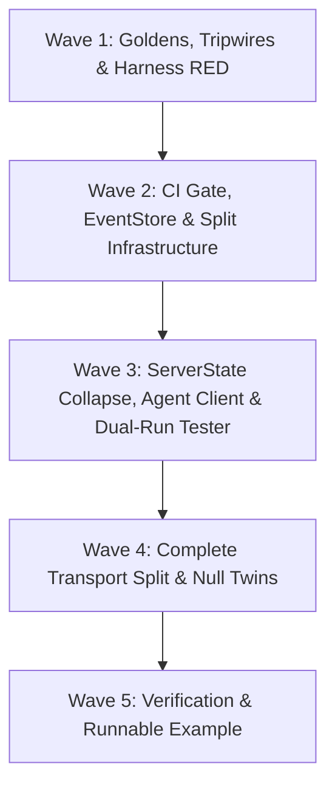

# Cross-AI Plan Review — Phase 117

Two independent reviewers, opposite verdicts. Gemini: **APPROVED, no HIGH concerns**.
Codex: **HIGH risk, 9 HIGH concerns**. This repeats the Phase 116 pattern exactly
(Gemini approved; Codex found the real cross-plan defects), so the Codex findings
carry the weight here — but they were spot-checked rather than taken on trust, and
one of them is refuted. See **Verification Pass** below.

## Gemini Review

Here is a structured plan review for **Phase 117: Agents, Tester & v1 Severability** (`pmcp` Rust MCP SDK).

---

# 📋 Phase 117 Plan Review

## Executive Summary & Verdict

| Metric | Rating | Summary |
| :--- | :--- | :--- |
| **Plan Quality** | **EXCELLENT** (9.5/10) | Plans are tightly scoped across 5 distinct waves with strict dependency ordering. Architectural seams and null-twin patterns eliminate `#[cfg]` sprawl. |
| **Requirements Coverage** | **COMPLETE** (100%) | Covers `CLNT-03`, `CLNT-04`, `SMPL-01`, `SMPL-02`, plus CLAUDE.md ALWAYS requirements (fuzzing, proptests, runnable example `s53`). |
| **Risk Mitigation** | **HIGH** | Resolved 3 key contradictions prior to planning (SDK auto-probe vs host fallback, false CI validation claims, and SSE parser scope). |
| **Verdict** | **APPROVED FOR EXECUTION** | Execution can proceed across all 5 waves following the specified plan order. |

---

## 🔑 Key Architectural Strengths

### 1. Robust Severability Mechanism (`D-01`, `D-02`, `SMPL-01`)
* **Parallel Feature Strategy:** Correctly avoids the `--no-default-features` false-green pitfall by introducing `full-v2` alongside `v1-compat` in `full` and `default`.
* **Drift Protection:** `tests/v1_severability_tripwire.rs` programmatically derives `full` vs. `full-v2` differences from `Cargo.toml` using `toml` (already a runtime dependency), incorporating non-vacuity guards to prevent silent test skips.
* **Non-Bypassable CI Gate:** Adds a dedicated `v1-severance` job to `.github/workflows/ci.yml` and updates all three required anchors in `gate.needs`, `env`, and `if` conditionals (`A-CI`).

### 2. Cleaner HTTP Transport Split (`D-03`, `SMPL-02`)
* **Paired Module via `#[cfg_attr(..., path = ...)]`:** Isolates the ~762 lines of v1-only session and `Last-Event-ID` resumability logic into `v1_session.rs`, leaving `v1_session_off.rs` as a Zero-Sized Type (`ZST`) constant-answer stub on `full-v2`.
* **Zero `#[cfg]` Sprawl:** Keeps the main pipeline (`streamable_http_server.rs`) readable and maintains identical signatures without polluting routing or POST handlers.
* **State Collapse:** Consolidates `sessions`, `sse_streams`, and `event_store` into `V1State`, guaranteeing zero state map allocation on v2 builds.

### 3. Smart Downstream Library Preservation (`CLNT-04`, `A-D11`)
* **Additive-Only `mcp-tester` API:** Protects 6 workspace linkers (like `cargo-pmcp`) by refraining from mutating existing types (`TestResult`, `TestCategory`).
* **Opt-In Dual-Run:** Emits era comparisons in a new top-level struct (`DualRunReport`) loaded from a checked-in, human-reviewable `era-deltas.yaml` spec artifact.

### 4. Robust Agent Era Probe (`CLNT-03`, `A-D08`)
* **Host-Layer Fallback:** Resolves the Phase 113 lock violation by placing the 2-attempt era probe inside `pmcp-agent`'s `UrlConnectorClientFactory::client_for`, leaving `Client` clean and era-pinned.
* **Reachability Rule:** Ensures network/DNS failures propagate as transport errors rather than falsely failing over to v1.

---

## 🔍 Detailed Plan & Wave Breakdown



### Wave-by-Wave Analysis

| Wave | Plans | Focus / Key Deliverables | Risk Level | Validation Checkpoint |
| :---: | :--- | :--- | :---: | :--- |
| **Wave 1** | `117-01` to `117-04` | Feature flags (`v1-compat`, `full-v2`), golden wire capture, pre-cut tester benchmarks, RED agent tests. | Low | `cargo test --test v1_severability_tripwire` |
| **Wave 2** | `117-05` to `117-08` | `v1-severance` CI job, whole-file `shared/event_store.rs` gating, agent 2-attempt probe, `era-deltas.yaml` baseline. | Medium | `cargo build -p pmcp --no-default-features --features full-v2` |
| **Wave 3** | `117-09` to `117-11` | `ServerState` collapse to `V1State`, runnable agent example `s53`, tester dual-run driver. | Medium | `cargo test -p pmcp-agent` & `cargo test -p mcp-tester` |
| **Wave 4** | `117-12` | Transport split into `v1_session.rs` / `v1_session_off.rs`. | High | `cargo test --test v1_byte_identity_after_cut --features full` |
| **Wave 5** | `117-13` | Sunset policy docs (`docs/v1-sunset-policy.md`), `make doc-check` gate updates, final quality check. | Low | `make quality-gate` & `make doc-check` |

---

## ⚠️ Critical Risks & Operational Pitfalls to Monitor

1. **Dead Code Warnings in `full-v2` Build (`RUSTFLAGS="-D warnings"`):**
   * *Risk:* If a v1-only helper in `streamable_http_server.rs` is missed during the cut, compiler `dead_code` warnings will break the `full-v2` build when `-D warnings` is set.
   * *Mitigation:* Ensure all v1 helper functions are moved into `v1_session.rs` or called inside `v1_session_off.rs`.

2. **`nextest` Zero-Match Trap:**
   * *Risk:* `cargo-nextest` with filter expressions (e.g. `test(/v1_severability/)`) can match 0 tests and silently pass with exit code 0.
   * *Mitigation:* Verification tasks must use explicit binary targets (e.g. `cargo test --test v1_severability_tripwire`) or standard `cargo test`.

3. **`Makefile` Feature List Drift:**
   * *Risk:* `make doc-check` (`Makefile:429`) uses a hardcoded 15-feature list. Forgetting `v1-compat` there would exclude sunset rustdoc from doc checking.
   * *Mitigation:* Plan `117-13` updates `Makefile:429` explicitly.

4. **Provisional Spec Fields in `era-deltas.yaml`:**
   * *Risk:* MCP spec 2026-07-28 features (especially `tasks/*` from Phase 114) are marked provisional and could move.
   * *Mitigation:* Every provisional delta in `era-deltas.yaml` is flagged `provisional: true` so updates can be audited during Phase 118.

---

## ✅ Final Recommendation

The planning suite (`117-01-PLAN.md` through `117-13-PLAN.md`) is **thorough, resilient, and Nyquist-compliant**. 

You are ready to begin execution starting with **Wave 1 (`117-01-PLAN.md` through `117-04-PLAN.md`)**.

---

## Codex Review

## Summary

The plans are unusually well researched and generally strong on additive Cargo-feature design, pre-cut evidence capture, CI false-green prevention, and structural separation. The five-wave topology is mostly correct: fixtures precede refactors, the paired-module mechanism precedes the transport cut, and agent/tester work is isolated. However, several cross-plan contradictions and semantic gaps make the phase high-risk as written. Most importantly, some plans cannot pass their own mandatory quality gates, the null-twin tripwire conflicts with later required identifiers, the proposed reachability classifier lacks sufficient typed information, and the tester’s report-level diff cannot observe most of the 14 claimed protocol differences. A green implementation could therefore still fail CLNT-03, CLNT-04, or overstate SMPL-01/02.

## Strengths

- The `v1-compat` / `full-v2` feature strategy is Cargo-correct. The plans understand additive feature unification and explicitly avoid the false proof produced by `--no-default-features` without transport features.

- `117-01` and `117-05` correctly treat CI blocking as a workflow-graph property. Requiring all three `gate` edits—`needs`, `env`, and the result condition—is excellent and directly addresses a known false-green pattern.

- Capturing v1 wire fixtures and tester report goldens before the cut (`117-02`, `117-03`) is the right sequencing and provides meaningful regression evidence.

- The paired `#[cfg_attr(..., path = ...)]` module design is sound. A real implementation plus a signature-compatible null twin minimizes call-site `#[cfg]` sprawl and gives the `full-v2` build a structurally inspectable boundary.

- The plan correctly preserves shared SSE framing/parsing while isolating only resumability. This avoids incorrectly gating the v2 `subscriptions/listen` path.

- The additive `mcp-tester` API discipline is well justified. Avoiding changes to `TestResult`, `TestCategory`, `TestStatus`, and `ServerTester::new` protects concrete downstream compiler contracts.

- The D-08 amendment is architecturally correct: era choice belongs in the host-level agent factory, not as forbidden implicit probing inside `pmcp::Client`.

- Security-sensitive ordering is handled thoughtfully, especially the requirement that the v2 null twin never read `Last-Event-ID`, the unreachable-host negative case, bounded polling, and explicit server teardown.

- The plans distinguish automated repository evidence from the manual branch-protection check. `117-05` does not falsely claim that parsing the workflow proves GitHub’s external merge behavior.

## Concerns

- **HIGH — The RED-test staging cannot satisfy the repository’s commit policy.** `117-04-PLAN.md`, Task 2 deliberately requires three tests to remain RED and states that GREEN is a defect, but the same plan requires `make quality-gate` to pass. The project requires the quality gate before every commit, and `117-07` depends on `117-04` as a completed plan. This wave cannot be committed or advanced as described.

- **HIGH — The null-twin source tripwire contradicts later required symbols.** `117-06-PLAN.md`, Task 3 forbids the substring `sessions` in `v1_session_off.rs`. `117-09-PLAN.md`, Task 2 then requires that file to contain `sessions_active_for` and `sessions_active`, while also requiring the earlier tripwire to remain green. Similar over-broad checks involving `event_store` may collide with signature-compatible null APIs. This is a direct cross-plan impossibility.

- **HIGH — “Server answered” versus “server unreachable” is not reliably classifiable from the proposed error shape.** `117-07-PLAN.md`, Task 1 and `117-11-PLAN.md`, Task 1 require any HTTP/JSON-RPC response to trigger v1 fallback, while DNS/TCP/TLS/timeout errors must propagate. Today agent construction stringifies client failures into `InvokerError::Transport(String)`, and raw non-JSON HTTP failures can share the transport-error path with connection failures. The plan forbids string matching but does not introduce a typed response-versus-connectivity outcome. Third-party v1 servers returning plain 400/404 responses are therefore an unresolved edge case.

- **HIGH — The proposed tester comparison cannot observe most baseline entries.** `117-11-PLAN.md`, Task 2 compares two `TestReport`s by test name/status and matches them against subjects in the 14-entry baseline. Many baseline items concern wire facts not represented in those reports: header presence, session IDs, `Last-Event-ID`, result envelope fields, capability location, caching hints, and HTTP status mapping. Matching display names cannot demonstrate whether these differences reproduced. The result will either report permanent false “MISSING” findings or give false confidence through loose string matching.

- **HIGH — “No domain-file changes” conflicts with a real v2 conformance run.** `117-11-PLAN.md`, Tasks 1–2 require v2 to use `server/discover`, while requiring all conformance domain files to remain untouched. The current core domain is explicitly initialization-centric and models capabilities through `InitializeResult`. Either it synthesizes an initialize result—concealing the `initialize`-absent delta—or the core-domain assertions must become era-aware. The stated constraints cannot both hold semantically.

- **HIGH — CLNT-03 task polling remains conditional and potentially untested.** `117-04-PLAN.md`, Task 2 only polls “if” the pinned tool returns a related task. `117-10-PLAN.md`, Task 1 permits dropping the task-polling demonstration. That does not prove the success criterion that `pmcp-agent`, including task polling, works end-to-end against v2. A server fixture must guarantee a task result and a terminal poll outcome.

- **HIGH — The claimed severability boundary appears incomplete.** `117-09`, `117-12`, and `117-13` isolate server-side session state and replay, but the plans do not clearly sever actual v1 `initialize` dispatch or the client transport’s session lifecycle, stored session ID, resumption token, and DELETE behavior. Gating one `LAST_EVENT_ID` reader does not remove that client-side baggage. Unless SMPL-01/02 are explicitly server-only, a green `full-v2` build would prove only partial severability.

- **HIGH — The full-v2 GET/DELETE behavior is not actually executed.** `117-13-PLAN.md`, Task 1 requires an explicit test proving GET and DELETE return 405 under `full-v2`, but verification runs tests with `--features full` and only builds `full-v2`. That exercises the v1 implementation and merely compiles the null twin. It cannot prove the runtime 405 result on the severed build.

- **MEDIUM — The v1 replay golden needs a streaming client, not the cited helper.** `117-02-PLAN.md`, Task 2 uses the shared v2 GET helper, but that helper reads the response body to EOF. The v1 GET endpoint is a long-lived SSE stream, so the call will time out rather than return captured frames. The plan needs a bounded streaming-body helper that stops after a known number of events. Also, the existing response helper stores `Mcp-Session-Id` separately from `raw`, so header byte identity cannot be asserted through the body fixture alone.

- **MEDIUM — `EffectTrace` era enforcement is opt-in rather than end-to-end.** `117-07-PLAN.md`, Tasks 2–3 add a negotiated-version field and a replay live-era setter, but do not identify the production path that records the connector’s negotiated version or always supplies the replay era. If callers can omit either, the mismatch hole remains. Treating an old trace’s missing version as v1 also means old traces fail under explicit v2 replay; that compatibility policy needs to be stated precisely.

- **MEDIUM — Manifest and lockfile impacts are underdeclared.** `117-07-PLAN.md`, Task 2 bumps `pmcp-agent` to 0.2.0, while repository consumers pin the 0.1 series. The plan says to update discovered pins but omits those manifests and `Cargo.lock` from `files_modified`. `117-10` similarly adds a root dev-dependency without listing the likely lockfile update. These are cross-plan file-scope omissions.

- **MEDIUM — Another per-task quality-gate ordering problem exists in the example plan.** `117-10-PLAN.md`, Task 1 creates a root example before Task 2 adds the required dev-dependency and manifest declaration, explicitly acknowledging that it may not build. That conflicts with mandatory per-task commits and example validation.

- **MEDIUM — The CI tripwire relies on undeclared PyYAML.** `117-05-PLAN.md`, Tasks 1–2 parse workflow YAML with Python’s `yaml` package as a fallback. PyYAML may exist on one workstation but is not a guaranteed GitHub Actions runtime dependency. A blocking tripwire should use a repository-declared parser or a tool installed explicitly by the workflow.

- **MEDIUM — Mandatory contract-first work is absent.** None of the plans updates the required contract YAML or runs `pmat comply check` before and after implementation, despite the repository instructions making that workflow mandatory for features and fixes. The expected sibling contract location also needs to be confirmed before execution.

- **LOW — The fuzz invariant is stronger than the parser contract.** `117-08-PLAN.md`, Task 3 asks the fuzz target to panic if a successfully parsed delta has an empty ID, but Task 1’s `parse_baseline` is described primarily as a serde parser. Valid YAML with an empty string may parse successfully and intentionally crash the fuzzer. Either validation belongs inside `parse_baseline`, or the fuzz invariant should be limited to properties the parser guarantees.

- **LOW — The pretty-report structural comparison loses multiplicity.** `117-03-PLAN.md`, Task 2 proposes comparing lines using a `BTreeSet`. Duplicate lines collapse, allowing a repeated or missing line to escape detection. A multiset keyed by line and occurrence count would preserve ordering tolerance without losing information.

## Suggestions

- Combine `117-04` and the implementation portion of `117-07` into one commit-capable plan: write the tests RED locally, implement immediately, then commit only when the quality gate is green. Do the same for `117-10`’s example source and manifest wiring.

- Replace the null-twin substring blacklist with semantic checks. Allow required API identifiers such as `sessions_active`, but reject state-bearing declarations and operations: `HashMap`, `RwLock`, `EventStoreHandle`, session-map fields, `LAST_EVENT_ID`, and header lookups.

- Introduce a typed probe result before errors are stringified, for example `Answered(Result<…>)` versus `Unreachable(Error)`. Reuse that classification contract in both `pmcp-agent` and `mcp-tester`; do not independently implement two fragile classifiers.

- Redesign the tester baseline around explicit semantic observations with stable IDs, such as `method.initialize`, `header.mcp_session_id`, or `result.cache_scope`. Add dedicated probes that produce those observations. Diff observation IDs against the baseline rather than matching human-facing test names.

- Permit targeted era-aware changes in `core_domain.rs`, or create separate v1/v2 core probes. Avoid synthesizing `InitializeResult` for v2 because it would obscure the very protocol distinction the tester is intended to validate.

- Make the CLNT-03 fixture return a guaranteed task-associated tool result. Assert task ID discovery, at least one polling action, terminal state, and final tool result. The runnable example may be shorter, but the automated test cannot make polling optional.

- Define the severance inventory explicitly for both server and client. Add full-v2 negative compile/source checks for actual initialize dispatch, client-held session state, resumption token logic, and DELETE teardown—or narrow the documented requirement to server-only and obtain approval.

- Add a dedicated full-v2 runtime test target for GET/DELETE 405 behavior. It must be executed with `--no-default-features --features full-v2`, not merely compiled.

- Implement a bounded SSE streaming helper for the replay golden and distinguish body byte identity from header assertions.

- Wire trace era automatically: connector negotiation should populate recorded traces, and replay construction should require or derive the live era. Define explicit behavior for legacy traces under v2.

- Expand all affected manifest lists and include `Cargo.lock`. Add a repository-declared YAML parser for the workflow test, and insert the required contract/`pmat comply` steps into each implementation workstream.

## Risk Assessment

**Overall risk: HIGH.**

The foundational feature and module architecture is strong, and the wave graph is mostly sensible. The high rating comes from execution and proof gaps rather than from the core design: two plans are internally impossible under the mandatory quality gate, one tripwire is guaranteed to reject later required code, era fallback lacks the typed information needed for correctness, and the tester’s proposed evidence model cannot observe most of its own baseline. In addition, the plans can produce a green `full-v2` build while leaving meaningful v1 client/initialize machinery compiled. Resolve those issues before execution; after that, the remaining transport refactor risk is closer to medium.

---

## Verification Pass (Claude, against the actual repo)

Codex's findings were spot-checked against the plans and the Makefile rather than
accepted at face value. Results:

### ✅ CONFIRMED — Codex HIGH #2: null-twin tripwire vs. later required symbols

A guaranteed, mechanical contradiction. Verified:

- `117-06-PLAN.md` Task 3 (`:277-280`) — test `the_v1_null_twin_carries_no_session_or_resumability_token`
  asserts the stripped source of `v1_session_off.rs` contains **none of the tokens** `sessions`,
  `sse_streams`, `event_store`, `EventStore`, `Last-Event-ID`, `LAST_EVENT_ID`, `HashMap`, `RwLock`.
- `117-09-PLAN.md` Task 2 (`:24-27`, `:222-229`) — requires `v1_session_off.rs` to **contain**
  `sessions_active_for` and `sessions_active` as constant-answer null twins, and requires the
  117-06 tripwire to stay green.

`sessions_active_for` contains the substring `sessions`. Wave 3 cannot land without failing
a Wave 2 tripwire. **This blocks execution as written.**

### ✅ CONFIRMED — Codex HIGH #8: the `full-v2` 405 is never executed under `full-v2`

- `117-13-PLAN.md` Task 1 (`:153`) — "Verify **on the `full-v2` build** that GET and DELETE both
  return 405 — not 404, not a panic."
- Same task's `<automated>` block (`:157`) — runs `cargo test --lib --features "full"` and only
  **builds** `--no-default-features --features full-v2`.

The assertion runs against the v1 implementation; the severed build is compiled but never
exercised. The acceptance criterion cannot be met by its own verification command.

### ❌ REFUTED — Codex HIGH #1: "RED tests cannot satisfy the commit policy"

Codex claims `117-04` Task 2's deliberately-RED tests in
`crates/pmcp-agent/tests/agent_v2_e2e.rs` contradict the same plan's `make quality-gate` requirement.
**They do not.** `make quality-gate` never compiles or runs that file:

| Gate step | Actual command (`Makefile`) | Scope |
|---|---|---|
| `lint` | `cargo clippy --features "full" --lib --tests` | root `pmcp` only |
| `build` | `cargo build --all-features` | root `pmcp` only (pmcp-agent is not a dep of pmcp) |
| `test-unit` | `cargo test --lib --features "full"` | root `pmcp` only |
| `test-integration` | `cargo test --test '*' --features "full"` | root `pmcp` only |

No `--workspace` / `-p pmcp-agent` anywhere. A RED `pmcp-agent` test coexists with a green
`make quality-gate`. **117-04 is fine as written.** (This also matches the recorded
`rust195_clippy_gate_debt` finding that the gate lints only root `pmcp`.)

### ⚠️ PARTIALLY REFUTED — Codex MEDIUM: "`pmat comply check` is never run"

`make comply` **is** part of `quality-gate` (`Makefile:681-698`, `:850-856`) and runs
`pmat comply check --path .` automatically. The half of the concern that stands is that no plan
**updates the contract YAML** — the check runs, but project-level advisories are explicitly
informational (D-07), so it will not catch a missing contract.

### ⚠️ CONFIRMED but low-impact — Codex MEDIUM: 117-10 task ordering

Real: `117-10-PLAN.md` Task 1's automated check `cargo build --example s53_v2_agent_client
--features "full"` (`:154`) cannot pass until Task 2 supplies the dev-dependency — the plan
admits this at `:169`. Impact is small because it is intra-plan, not cross-plan.

Worth noting the plan is *more* careful than Codex credits: it explicitly refuses to infer
success from `make test-examples` (`:84`). That is correct — `test-examples` (`Makefile:255-268`)
swallows every build failure into `⚠ … (skipped)` and **can never fail**. Any other plan that
leans on `make test-examples` as proof is relying on a gate that cannot go red.

### ⏳ NOT VERIFIED (plausible, needs a code-level check before execution)

Codex HIGH #3 (reachability not classifiable from `InvokerError::Transport(String)`),
#4 (tester report-diff cannot observe most of the 14 baseline entries),
#5 (`server/discover` vs. untouched initialize-centric `core_domain.rs`),
#6 (CLNT-03 task polling is conditional in 117-04 and droppable in 117-10),
#7 (client-side session/resumption baggage not severed — SMPL-01/02 may be server-only),
plus MEDIUMs on the SSE streaming helper (117-02), `EffectTrace` era plumbing (117-07),
manifest/`Cargo.lock` omissions, and PyYAML in the 117-05 tripwire.

These are all specific and cite real seams; none were checked against source in this pass.

---

## Consensus Summary

### Agreed Strengths

Both reviewers independently praised the same four things:

- The **additive `v1-compat` / `full-v2` feature strategy** is Cargo-correct and avoids the
  `--no-default-features` false-green.
- The **three-anchor CI gate edit** (`needs`, `env`, result condition) correctly treats blocking
  as a workflow-graph property.
- **Pre-cut evidence capture** (117-02 wire goldens, 117-03 tester goldens) is the right sequencing.
- The **paired `#[cfg_attr(..., path = ...)]` module + null twin** design avoids `#[cfg]` sprawl.
- The **additive-only `mcp-tester` API** discipline correctly protects downstream compile contracts.

### Agreed Concerns

Essentially none — the reviewers diverge almost completely. The only overlap is procedural:
Gemini's "Dead Code Warnings in `full-v2`" and "nextest zero-match trap" pitfalls sit adjacent to
Codex's false-green theme, but Gemini rated them as monitorable risks, not blockers.

### Divergent Views

The split is the headline. Gemini scored plan quality 9.5/10 and cleared all five waves for
execution; Codex rated the phase HIGH risk with nine HIGH findings. They are not reconcilable as
a matter of degree — Gemini reviewed the plans as *documents* (are they coherent, complete,
well-structured?) and Codex reviewed them as *executable contracts* (will these exact commands,
tripwires and assertions actually hold against each other?). The verification pass above
supports Codex's frame: two of the three findings checked are real blockers that no amount of
document-level coherence would have surfaced.

Gemini also asserted "Resolved 3 key contradictions prior to planning" as a strength — that
refers to the RESEARCH.md CONTRADICTION REGISTER, which addressed *pre-planning* contradictions.
It says nothing about contradictions introduced *between* the 13 plans, which is exactly where
both confirmed defects live.

### Recommended action before execution

1. **Fix the 117-06 / 117-09 tripwire contradiction.** Codex's suggestion is right: replace the
   substring blacklist with semantic checks — permit required API identifiers
   (`sessions_active`, `sessions_active_for`), reject state-bearing constructs (`HashMap`,
   `RwLock`, `EventStoreHandle`, `LAST_EVENT_ID`, header lookups, struct fields).
2. **Fix 117-13's 405 verification** to run `--no-default-features --features full-v2` as a test
   invocation, not just a build.
3. **Triage the five unverified HIGHs** against source — #3, #4, #5, #6 and #7 each target a real
   seam and would change plan content if confirmed.
4. Leave 117-04 alone — that finding is refuted.

To incorporate:

```
/gsd:plan-phase 117 --reviews
```


---

## Resolution Pass (`/gsd:plan-phase 117 --reviews`, 2026-08-08)

Plan set is now **14 plans in 6 waves**. `117-01` is the only plan left byte-identical.

### Confirmed blockers — FIXED

| # | Finding | Resolution |
|---|---|---|
| HIGH #2 | 117-06 ↔ 117-09 tripwire contradiction | The substring blacklist is REPLACED by semantic checks in `117-06` Task 3. **FOUR of the eight tokens collided, not one** — measured table now lives in `117-06`'s `<cross_plan_constraint>` block: `sessions` ⊂ `sessions_active_for`/`sessions_on` (`:416`,`:463`); `event_store` ⊂ `cfg_has_event_store` (`:523`) and the `event_store` parameter (`:4377`,`:4408`); `EventStore` ⊂ `EventStoreHandle` in three signatures (`:509`,`:558`,`:4377`); `sse_streams` ⊂ the surviving `build_response` read (`:1936`). `HashMap`/`RwLock`/`LAST_EVENT_ID`/`Last-Event-ID` do NOT collide and stay forbidden. New checks: `V1State` must be a unit struct; no state-bearing type; no state/header OPERATION; nothing declared that `v1_session.rs` does not also declare (derived, not enumerated). One POSITIVE control (a required 117-09 identifier must be ACCEPTED) plus four negative controls. |
| HIGH #8 | 117-13's 405 never executed under `full-v2` | New `117-13` Task 2 creates `tests/v2_verbs_405_on_severed_build.rs`, whole-file `#![cfg(… not(feature = "v1-compat") …)]`, and RUNS `cargo test --test v2_verbs_405_on_severed_build --no-default-features --features full-v2`. A `0 tests` result is an explicit FAILURE. Discriminates 405 from 404 (the unrouted answer) and carries a POST control. **Sibling audit:** 117-06/09/12 make COMPILATION claims, correctly proven by a build — only 117-13 made a runtime claim. 117-14 gets the same treatment for the client. |

### Refuted — left alone

| # | Finding | Evidence |
|---|---|---|
| HIGH #1 | "RED tests break the commit policy" | REFUTED upstream; `117-04`'s RED-test staging is unchanged. |
| MEDIUM | "`Cargo.lock` omitted from `files_modified`" | **REFUTED.** `Cargo.lock` is in `.gitignore:3` and `git ls-files --error-unmatch Cargo.lock` errors — untracked. There is no lockfile to declare. `117-10` now asserts this rather than leaving it ambiguous. |
| MEDIUM | "`pmat comply check` is never run" | Half-refuted upstream (`make comply` is in `quality-gate`). No redundant invocations added. |

### The five unverified HIGHs — all CONFIRMED against source

| # | Verdict | Evidence | Fix |
|---|---|---|---|
| #3 era classification | **CONFIRMED** | `src/shared/streamable_http.rs:1096` (connect/send failure) and `:1175`/`:1183` (non-2xx status) BOTH produce `Error::Transport(TransportError::Request(String))`. Only the pmcp-server case is separable (`is_v2()` JSON-RPC-envelope branch `:1160-1171` → `Error::Protocol`); third-party plain 400/404 is not. | `117-07` Task 1: `endpoint_is_reachable` TCP pre-check + typed `ProbeOutcome` built before stringification; structural invariant that era V1 is returned only on a real `initialize` success; two named imprecisions recorded; contract written once and CITED by `117-11` Task 1. `InvokerError` IS `#[non_exhaustive]` (`factory.rs:33`) so a variant there is permitted; `pmcp::Error`/`TransportError` are not. |
| #4 tester observability | **CONFIRMED** | `TestResult` = `{name, category, status, duration, error, details}` (`report.rs:74-81`); `TestReport` = `{tests, duration, timestamp, summary}` (`:153-158`). No header, session id, envelope field, capability location, caching hint or HTTP status anywhere. | New `crates/mcp-tester/src/era_observations.rs` with stable `ObservationId`s (`method.initialize`, `header.mcp_session_id`, `result.cache_scope`, …); `117-08` adds a required `observation_id` to every baseline entry; `117-11` joins on the ID, never on display names, with a two-direction probe↔baseline coverage test. |
| #5 `server/discover` vs untouched domain | **CONFIRMED** | `core_domain.rs:17` pushes `test_initialize_handshake` unconditionally; `:48` calls `tester.test_initialize()`; `:150` reads `server_capabilities()` with a `"initialize not called?"` message at `:98`. | `117-11` may now change `core_domain.rs` — and ONLY that domain file — making C-01/C-04 era-aware. Synthesising an `InitializeResult` on v2 is explicitly FORBIDDEN and acceptance-checked. `files_modified` updated. |
| #6 CLNT-03 task polling conditional | **CONFIRMED** | `117-04` Task 2 said "if the result carries a related task"; `117-10` Task 1 permitted dropping the demo. | `117-04` Task 1's `pinned_server` now registers a tool whose result is GUARANTEED task-associated and requires ≥1 non-terminal poll; new test `agent_drives_task_polling_to_terminal_on_v2` asserts task-id discovery, a SERVER-observed poll count ≥ 1, and terminal state, with NO conditional. `117-10` may still drop the demo but must cite that test by name. |
| #7 severability is server-only | **CONFIRMED** | `src/shared/streamable_http.rs` (2,677 lines) holds `SendOptions::resumption_token` `:52`, `StreamableHttpTransportConfig::session_id` `:107` / `::on_resumption_token` `:111`, builder fields/setters `:162-225`, `session_id()`/`set_session_id()` `:582-588`, the `Last-Event-ID` writer `:636-647`, the `Mcp-Session-Id` capture `:946`, the DELETE teardown `:1412-1428` — 55 sites, none gated by any plan. SMPL-01 names "initialize/session lifecycle" with no server-only qualifier. | **NEW PLAN `117-14`** (wave 5): derived client inventory, resumability + session-lifecycle gating, `LAST_EVENT_ID` co-gated with its one reader, A4/`MCP_SESSION_ID` measured, `Client::initialize` severability measured with a documented fallback, derived tripwire + a runtime proof RUN on `full-v2`. `117-13` moves to wave 6 and its policy now enumerates BOTH sides. |

### MEDIUM/LOW findings actioned

- **117-02** — `common::v2::get` reads to EOF and the v1 GET is a long-lived `text/event-stream`; a bounded frame-counting LOCAL reader is now required, and HEADER identity is asserted separately from body bytes (`Resp` stores `Mcp-Session-Id` outside `raw`). Third negative control added.
- **117-07** — `EffectTrace` era is plumbed END TO END (derived construction-site list must be populated); the undeclared-live-era and legacy-trace policies are stated in code and each covered by a named test.
- **117-07** — `pmcp-agent` 0.2.0 breaks TWO measured pins: `crates/pmcp-team-servers/Cargo.toml:22` and `cargo-pmcp/Cargo.toml:75` (both `version = "0.1"`, which `^0.1` will not satisfy → whole-workspace resolution failure). Both manifests added to `files_modified` with a `cargo metadata` acceptance check.
- **117-05** — PyYAML replaced by root `[dev-dependencies] serde_yaml = "0.9"`. Zero new packages: `crates/mcp-tester/Cargo.toml:26` already deps it and `serde_yaml 0.9.34` is already resolved. Reasoning recorded in the module doc; `Cargo.toml` added to `files_modified`.
- **117-08** — validation moved INTO `parse_baseline` (rejects empty/duplicate `id` and `observation_id`), so the fuzz invariant asserts what the parser actually guarantees.
- **117-03** — `BTreeSet` → occurrence-counting `BTreeMap` multiset, with a duplicate-line negative control.
- **117-10** — dev-dependency moved into Task 1 so its `cargo build --example` criterion is satisfiable when checked.
- **`make test-examples` audit** — only `117-10` cites it, and it already asserts the `✓ … built successfully` line rather than the target's exit code. No other plan leans on a never-fails target.

### Defects found during verification that no reviewer raised

- **117-09 Task 1** — a raw `sse_streams()` accessor returning `&Arc<RwLock<HashMap<..>>>` is UNIMPLEMENTABLE on a ZST twin. The surviving `build_response` read (`:1936`) must become a `v1::` behavioural operation returning an owned answer; `Option`-returning accessors remain fine.
- **117-12 → 117-13 orphaned handoff** — `117-12` defers `extract_session_and_protocol_headers` (`:2174-2188`) and `compute_outbound_protocol_version` (`:2285-2312`) to `117-13`, which never claimed them. `117-13` Task 1 now owns both explicitly.
- **117-12 → 117-13 dead code** — once `handle_get_sse`'s body moves in `117-13`, the four SSE twins lose their only caller and `-D warnings` turns `dead_code` into an error. `117-13` Task 1 now deletes them rather than adding an `allow`.

### Wave/dependency changes (called out per the revision rules)

- New `117-14` at **wave 5**, `depends_on: ["117-12"]`.
- `117-13` moves **wave 5 → wave 6**, `depends_on: ["117-12", "117-14"]`, so the sunset policy is written after the client inventory exists.
- `src/shared/http_constants.rs` moves entirely to `117-14` (it already owns the file), keeping `117-13` at 3 tasks; `117-13` verifies the gating and reports absence as a finding.
- All four requirement IDs still covered: CLNT-03 (04/07/10), CLNT-04 (03/08/11), SMPL-01 (01/05/06/13/14), SMPL-02 (02/06/09/12/13/14).
