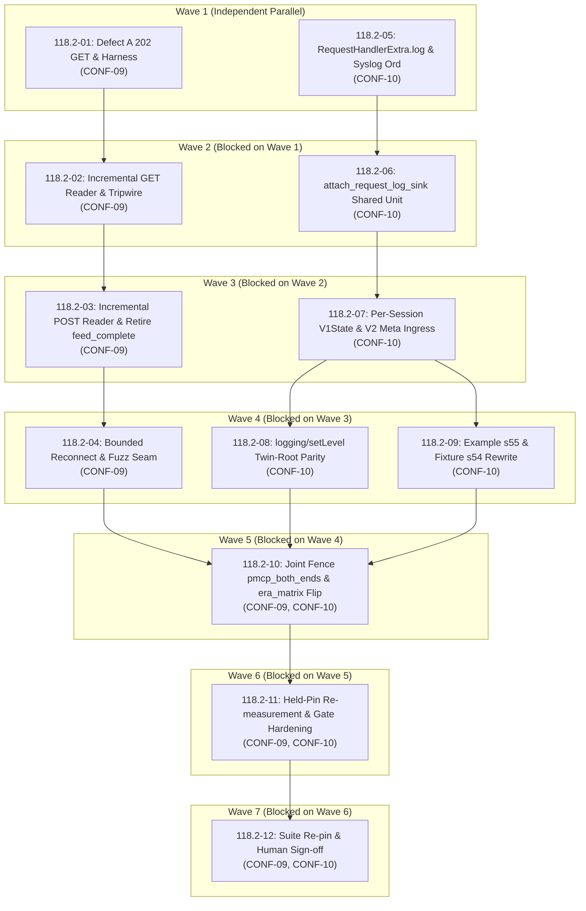

# Cross-AI Plan Review — Phase 118.2

## Codex Review

## Summary

The plans are unusually thorough and source-aware, but they are not execution-ready as written. The underlying defect analysis is correct: the initialized `202` branch is unreachable, both SSE paths perform whole-body reads, malformed events are silently dropped, and logging lacks a handler-facing producer. However, several plan boundaries conflict with the current async architecture. Most importantly, Plan 01 cannot turn green before Plan 02, spawned SSE reader errors have no route to `Transport::receive()`, the backpressure fence deadlocks by construction, the fuzz target cannot call the proposed private helpers, and the HTTP ingress cannot directly set a field on `RequestHandlerExtra`. Overall risk is HIGH until those architectural and sequencing gaps are resolved.

## Strengths

- The primary client defects are correctly localized.

  - `start_sse` calls `collect_body_within_cap` before spawning its reader at [src/shared/streamable_http.rs:1001](/Users/guy/Development/mcp/sdk/rust-mcp-sdk/src/shared/streamable_http.rs:1001), so a live GET body never returns.
  - The initialized `202` handling is indeed nested under `!response.status().is_success()` at [src/shared/streamable_http.rs:1469](/Users/guy/Development/mcp/sdk/rust-mcp-sdk/src/shared/streamable_http.rs:1469), making the `StatusCode::ACCEPTED` branch unreachable.
  - The POST SSE body is also collected whole at [src/shared/streamable_http.rs:1542](/Users/guy/Development/mcp/sdk/rust-mcp-sdk/src/shared/streamable_http.rs:1542), confirming that D-01 correctly widened scope beyond GET.
  - Both SSE readers silently discard JSON-RPC parse failures at [src/shared/streamable_http.rs:1048](/Users/guy/Development/mcp/sdk/rust-mcp-sdk/src/shared/streamable_http.rs:1048) and [src/shared/streamable_http.rs:1698](/Users/guy/Development/mcp/sdk/rust-mcp-sdk/src/shared/streamable_http.rs:1698).

- Reusing the subscription reader shape is a sound recommendation. It correctly handles partial UTF-8, latching parser overflow, pending-event drainage, and body errors at [src/client/subscriptions.rs:189](/Users/guy/Development/mcp/sdk/rust-mcp-sdk/src/client/subscriptions.rs:189), [src/client/subscriptions.rs:242](/Users/guy/Development/mcp/sdk/rust-mcp-sdk/src/client/subscriptions.rs:242), and [src/client/subscriptions.rs:312](/Users/guy/Development/mcp/sdk/rust-mcp-sdk/src/client/subscriptions.rs:312).

- The sink-hoisting analysis is accurate.

  - `progress_notification_sink` already prefers the request-scoped backchannel over `notification_tx` at [src/server/mod.rs:1283](/Users/guy/Development/mcp/sdk/rust-mcp-sdk/src/server/mod.rs:1283).
  - The progress-token gate exists separately at [src/server/mod.rs:1314](/Users/guy/Development/mcp/sdk/rust-mcp-sdk/src/server/mod.rs:1314), so logs can be made unconditional without weakening progress semantics.
  - `attach_request_peer` is a strong precedent for a shared, twin-root helper at [src/server/core.rs:4514](/Users/guy/Development/mcp/sdk/rust-mcp-sdk/src/server/core.rs:4514).
  - The tool authorization check precedes `RequestHandlerExtra` construction and peer attachment at [src/server/core.rs:820](/Users/guy/Development/mcp/sdk/rust-mcp-sdk/src/server/core.rs:820) and [src/server/core.rs:856](/Users/guy/Development/mcp/sdk/rust-mcp-sdk/src/server/core.rs:856), supporting the proposed ordering constraint.

- The per-session log-level choice is correct. `V1State` already owns a session map at [src/server/streamable_http_server/v1_session.rs:146](/Users/guy/Development/mcp/sdk/rust-mcp-sdk/src/server/streamable_http_server/v1_session.rs:146), while the full-v2 twin remains a unit struct at [src/server/streamable_http_server/v1_session_off.rs:81](/Users/guy/Development/mcp/sdk/rust-mcp-sdk/src/server/streamable_http_server/v1_session_off.rs:81).

- The gate-hardening analysis correctly identifies both floor traps. The current script has one shared scored-scenario floor at [scripts/run-conformance-suite.sh:265](/Users/guy/Development/mcp/sdk/rust-mcp-sdk/scripts/run-conformance-suite.sh:265) and a separately enforced blocking-list floor at [scripts/run-conformance-suite.sh:337](/Users/guy/Development/mcp/sdk/rust-mcp-sdk/scripts/run-conformance-suite.sh:337). Splitting the former without lowering v2 and widening rather than deleting the latter is the safer design.

- The plans consistently guard against zero-test `nextest` false-greens by checking parsed non-zero counts. That is a strong verification practice.

## Concerns

- **HIGH — Plan 01 cannot pass before Plan 02.**  
  Plan 01 makes the `202` branch reachable and then awaits `self.start_sse(None)`. But `start_sse` does not return until the entire GET body has been collected at [src/shared/streamable_http.rs:1001](/Users/guy/Development/mcp/sdk/rust-mcp-sdk/src/shared/streamable_http.rs:1001). The Plan 01 harness deliberately holds that body open forever. Therefore its post-fix `client.initialize(...)` still times out; the planned GREEN state is impossible until incremental reading lands.

- **HIGH — “Stream ends with a named error” has no delivery mechanism.**  
  The transport channel carries only `TransportMessage`, not `Result<TransportMessage>`, at [src/shared/streamable_http.rs:496](/Users/guy/Development/mcp/sdk/rust-mcp-sdk/src/shared/streamable_http.rs:496). `receive()` can only return a message or generic `ConnectionClosed` at [src/shared/streamable_http.rs:1727](/Users/guy/Development/mcp/sdk/rust-mcp-sdk/src/shared/streamable_http.rs:1727). An error created inside a spawned GET or POST reader cannot presently reach the consumer. Plans 02 and 04 require overflow, parse failure, and retry exhaustion to surface as named errors, but do not design an error channel, terminal-error slot, or task-join mechanism.

- **HIGH — The slow-consumer backpressure fence deadlocks by construction.**  
  Plan 02 says to push more than queue capacity, wait until every push has been attempted, and only then drain. Once the bounded receive queue fills, the reader awaits `sender.send(...).await`; it stops reading TCP, and the recording server eventually blocks writing. “All pushes completed before drain” is incompatible with actual backpressure. The test needs concurrent production and consumption with an intentional delayed drain.

- **HIGH — Plan 07 lacks a viable route from HTTP ingress to `RequestHandlerExtra::log_level`.**  
  The HTTP layer ultimately passes a `ProtocolContext` into dispatch; `RequestHandlerExtra` is created later inside the server roots, for example at [src/server/core.rs:856](/Users/guy/Development/mcp/sdk/rust-mcp-sdk/src/server/core.rs:856). `src/server/streamable_http_server.rs` does not construct `RequestHandlerExtra`, so it cannot call `with_log_level` as the plan requires. The plan does not include the necessary carrier change—such as extending `ProtocolContext`, `TransportBackchannel`, or request extensions—or a shared dispatcher resolver.

- **HIGH — The fuzz target cannot drive the claimed real helper path.**  
  The proposed `drain_sse_events` and `sse_stream_overflow` are private functions in `src/shared/streamable_http.rs`. A target under `fuzz/fuzz_targets` is a separate crate and cannot call them. Plan 04 simultaneously requires the fuzz target to use the real implementation and does not authorize changing visibility or extracting a reusable internal module. Reimplementing the sequence in the fuzz target would weaken the claim.

- **HIGH — Reconnect requires more state to enter the spawned task than the plan acknowledges.**  
  The current task receives cloned sender/callback/state only at [src/shared/streamable_http.rs:1019](/Users/guy/Development/mcp/sdk/rust-mcp-sdk/src/shared/streamable_http.rs:1019). Reissuing an authenticated/middleware-aware GET requires the client, URL/config, request-building logic, response headers, and cursor application. A helper borrowing `&self` cannot simply be invoked from a `'static` spawned task. The plan needs an explicit owned reader context or a transport actor design.

- **MEDIUM — Response middleware semantics are not addressed for streaming SSE.**  
  Both current paths apply response middleware to the collected body before parsing: GET at [src/shared/streamable_http.rs:1004](/Users/guy/Development/mcp/sdk/rust-mcp-sdk/src/shared/streamable_http.rs:1004) and POST at [src/shared/streamable_http.rs:1554](/Users/guy/Development/mcp/sdk/rust-mcp-sdk/src/shared/streamable_http.rs:1554). Moving directly to `Incoming::frame()` either bypasses that middleware or requires a streaming middleware contract. The plans silently change behavior without documenting or testing it.

- **MEDIUM — Plan 01’s claimed “one-line-class fix” understates method identification.**  
  `send_with_options` reduces the outbound value to a broad boolean at [src/shared/streamable_http.rs:1303](/Users/guy/Development/mcp/sdk/rust-mcp-sdk/src/shared/streamable_http.rs:1303), and `post_body` accepts only `body_bytes` plus `is_notification` at [src/shared/streamable_http.rs:1463](/Users/guy/Development/mcp/sdk/rust-mcp-sdk/src/shared/streamable_http.rs:1463). Narrowing to `notifications/initialized` requires changing the internal signature or inspecting the message before serialization—not merely moving the branch.

- **MEDIUM — Plan 05 adds more API than CONF-10 requires.**  
  Five methods (`log`, `log_with_data`, and three wrappers), two new fields, ordering derives, extensive documentation, a new example, and multiple property/fuzz obligations substantially expand scope. `log(level, message)` plus one structured overload would satisfy the requirement with less semver and maintenance exposure.

- **MEDIUM — `Result<()>` currently cannot represent sink failure.**  
  The sink type is `Fn(Notification)` and returns nothing. Consequently `extra.log()` can only return `Ok(())`, even if `notification_tx.try_send` drops/fails; the existing fallback explicitly ignores that result at [src/server/mod.rs:1296](/Users/guy/Development/mcp/sdk/rust-mcp-sdk/src/server/mod.rs:1296). The API documentation should not imply meaningful delivery acknowledgement.

- **MEDIUM — The v2 loss policy conflicts with the stated “no log loss” rationale.**  
  The plans acknowledge that the v2 progress queue drops newest records but still describe the emitter as preserving every log record. This is a real behavioral limitation, not merely documentation. At minimum, CONF-10 tests should include queue saturation and explicitly pin accepted loss behavior.

- **MEDIUM — RED evidence via old log files is weaker than a real joint-fence RED.**  
  Plan 10 permits using Plan 01’s “2 POSTs / 0 GETs” log instead of running the joint logging fence against an unfixed revision. That proves a prerequisite was broken, but it does not demonstrate that the exact joint fence was red. The phase’s locked RED-first rule calls for the latter.

- **LOW — Several grep acceptance checks are vulnerable to comments/rustdoc.**  
  Examples include counts of `reconnect_cursor`, `MAX_SSE_RECONNECT_ATTEMPTS`, and `extra.log`. These may match prose rather than executable code. They are supplemental at best and should not be treated as behavioral proof.

- **LOW — The plan set is over-segmented.**  
  Twelve plans and seven waves create many states that are knowingly incomplete, including Plan 01’s opened-but-unread SSE stream and Plan 05’s public API without production plumbing. This increases merge and bisect risk under the repository’s zero-defect quality policy.

## Suggestions

- Merge Plans 01 and 02, or reorder them so the incremental GET reader lands in the same atomic change as the reachable `202` branch. The first green commit must both open and read the live stream.

- Change the receive queue to carry a terminal outcome, for example:

  ```rust
  mpsc::Receiver<Result<TransportMessage>>
  ```

  or add a shared terminal-error slot checked by `receive()`. Define exactly how parse failure, overflow, reconnect exhaustion, cancellation, and ordinary EOF differ.

- Redesign the backpressure fence:

  - start a producer task sending `capacity + N` frames;
  - verify it stalls after the queue fills;
  - begin draining;
  - assert the producer completes;
  - assert all IDs arrive in order with no loss.

- Add an explicit internal carrier for resolved log level. The cleanest options are:

  - a private resolved-log-level field on `ProtocolContext`;
  - a typed value in `ProtocolContext`/`http::Extensions`;
  - a shared dispatcher helper that resolves v1 session state and v2 request metadata before constructing `RequestHandlerExtra`.

  Update the plan’s `files_modified` list accordingly.

- Extract the streaming decoder into a `pub(crate)` internal module that both the transport and an in-crate fuzz adapter can call. Avoid duplicating the decode sequence in the fuzz target.

- Before implementing reconnect, define an owned `SseReaderContext` containing everything needed to reopen a GET. The plan should spell out cancellation behavior and how `close()` stops a reader during backoff.

- Decide and document SSE middleware behavior:

  - prohibit body-transforming middleware on live SSE;
  - introduce frame-aware middleware; or
  - explicitly bypass response-body middleware for streaming responses and test that contract.

- Reduce the initial emitter API to the minimum required surface. Convenience wrappers can be added later without breaking compatibility.

- Require the exact joint fence to run red against the phase base, using a temporary worktree or a controlled feature toggle. Do not substitute prerequisite evidence.

- Replace grep-count acceptance criteria with AST/compiler-backed tests where possible. At minimum, exclude comments and require the corresponding behavioral test.

- Add cancellation/task-leak fences:

  - dropping or closing the transport aborts a live reader;
  - closing during reconnect backoff prevents another GET;
  - repeated `notifications/initialized` does not leave orphan tasks;
  - POST SSE task terminates when its owning request/client is dropped.

## Risk Assessment

**HIGH**

The phase goals are achievable and most defect analysis is correct, but several plans cannot satisfy their own acceptance criteria under the current code structure. The Plan 01/02 sequencing conflict alone blocks execution. Error propagation, reconnect ownership, the log-level carrier, and fuzz-helper visibility all require architectural decisions missing from the plan set. Resolving those issues before implementation would likely reduce the phase to MEDIUM risk; proceeding as written is likely to produce deadlocks, uncompilable tests, or weakened verification.

---

## Gemini Review

# Cross-AI Plan Review: Phase 118.2

**Phase Title:** The v1 client SSE transport and the `notifications/message` emitter  
**Requirements Covered:** [`CONF-09`](file:///Users/guy/Development/mcp/sdk/rust-mcp-sdk/.planning/REQUIREMENTS.md#L925) (Client SSE Transport), [`CONF-10`](file:///Users/guy/Development/mcp/sdk/rust-mcp-sdk/.planning/REQUIREMENTS.md#L926) (Log Notification Emitter)  
**Plans Reviewed:** 12 plans across 7 execution waves (`118.2-01` through `118.2-12`)  
**Repository:** [`pmcp` (Rust MCP SDK)](file:///Users/guy/Development/mcp/sdk/rust-mcp-sdk)

---

## Executive Summary & Verdict

### Verdict: **APPROVED (Ready for Execution with High Confidence)**

The implementation plans for Phase 118.2 represent an **exceptionally rigorous, production-grade engineering package**. The plans resolve two critical, previously open residuals from Phase 118.1:
1. **The Client SSE Transport Gap ([`CONF-09`](file:///Users/guy/Development/mcp/sdk/rust-mcp-sdk/.planning/REQUIREMENTS.md#L925)):** Eliminates both the dead `202 Accepted` branch (which prevented GET requests from ever being dispatched) and the whole-body `collect_body_within_cap` hang on long-lived SSE streams across both GET session streams and POST response streams.
2. **The Log Notification Emitter Gap ([`CONF-10`](file:///Users/guy/Development/mcp/sdk/rust-mcp-sdk/.planning/REQUIREMENTS.md#L926)):** Provides a clean, ergonomic, non-breaking log emission surface on [`RequestHandlerExtra`](file:///Users/guy/Development/mcp/sdk/rust-mcp-sdk/src/server/cancellation.rs), hoists the notification sink into a unified unit shared across both [`ServerCore`](file:///Users/guy/Development/mcp/sdk/rust-mcp-sdk/src/server/core.rs) and [`Server`](file:///Users/guy/Development/mcp/sdk/rust-mcp-sdk/src/server/mod.rs) dispatch roots, adds per-session v1 storage with a zero-allocation null twin, and aligns `logging/setLevel` behavior across both dispatchers.

---

## Key Architectural Strengths

### 1. Root-Cause Localisation & Live-Probe Validation
- **Defect A (Dead `202 Accepted` Branch):** Plan `118.2-01` directly addresses the empirical finding that `start_sse(None)` was nested inside `if !response.status().is_success()`. Because HTTP `202` is in the `200..300` success range, the client never issued GET requests.
- **Narrowed Initialized Predicate:** Mirrors the TypeScript SDK reference by restricting the stream-open trigger specifically to `notifications/initialized`, preventing connection teardown loops on subsequent `notifications/cancelled` or `notifications/progress` messages.
- **POST-Response Stream Deadlock Resolution:** Plan `118.2-03` eliminates the whole-body read on POST responses returning `text/event-stream`, resolving the deadlock where server-initiated requests (`sampling`, `roots`, `elicit`) could not be processed during in-tool calls.

### 2. Code Reuse & Cognitive Complexity Controls
- **Reusing Proven Primitives:** Rather than hand-rolling a new streaming tokenizer, the plans reuse the battle-tested 4-way incremental reader pattern from [`src/client/subscriptions.rs`](file:///Users/guy/Development/mcp/sdk/rust-mcp-sdk/src/client/subscriptions.rs) (`SseReadState`, `read_next_sse_frame`, `drain_sse_events`, `sse_stream_overflow`).
- **PMAT Compliance:** Preserving this 4-way decomposition keeps all functions strictly under the repository's PMAT cognitive complexity limit (≤ 25).
- **Proper Character Boundary Handling:** Drains UTF-8 prefixes chunk-by-chunk with [`take_utf8_prefix`](file:///Users/guy/Development/mcp/sdk/rust-mcp-sdk/src/shared/sse_parser.rs) instead of `String::from_utf8_lossy`, preventing UTF-8 truncation corruptions across TCP frame boundaries.

### 3. Dispatch Root Unification ([`attach_request_log_sink`](file:///Users/guy/Development/mcp/sdk/rust-mcp-sdk/src/server/core.rs))
- Follows the exact pattern established by [`attach_request_peer`](file:///Users/guy/Development/mcp/sdk/rust-mcp-sdk/src/server/core.rs#L4485-L4532).
- Resolves the structural asymmetry where [`ServerCore`](file:///Users/guy/Development/mcp/sdk/rust-mcp-sdk/src/server/core.rs) has no server-wide `notification_tx` by cleanly routing through [`TransportBackchannel`](file:///Users/guy/Development/mcp/sdk/rust-mcp-sdk/src/types/protocol/context.rs#L109).
- Attaches the sink post-authorization, ensuring unauthorized calls never execute handlers that emit log records.

### 4. Bounded Channels & Queue Policy Disambiguation (D-04 / D-09)
- Replaces unbounded queues with bounded `mpsc::channel(CLIENT_RECEIVE_QUEUE_CAPACITY)`.
- Explicitly documents why client receive backpressure uses `.send().await` (requests must never be dropped), while caller-task paths use `try_send()` (failing loudly to avoid self-deadlock), and why log records do not use progress-style rate limiters.

### 5. Dual-Era Severability & Null Twin Architecture
- Per-session log level on v1 lives in [`SessionInfo`](file:///Users/guy/Development/mcp/sdk/rust-mcp-sdk/src/server/streamable_http_server/v1_session.rs#L124-L131) behind paired accessors.
- On `full-v2` builds, [`v1_session_off.rs`](file:///Users/guy/Development/mcp/sdk/rust-mcp-sdk/src/server/streamable_http_server/v1_session_off.rs) provides zero-allocation `const fn` twins, fully compliant with [`tests/v1_severability_tripwire.rs`](file:///Users/guy/Development/mcp/sdk/rust-mcp-sdk/tests/v1_severability_tripwire.rs).
- Reconnect cursor handling uses paired accessors (`reconnect_cursor`) to ensure zero call-site `#[cfg]` proliferation in [`src/shared/streamable_http.rs`](file:///Users/guy/Development/mcp/sdk/rust-mcp-sdk/src/shared/streamable_http.rs).

---

## Detailed Plan-by-Plan Analysis



| Wave | Plan | Focus / Deliverable | Key Contracts & Guardrails |
| :--- | :--- | :--- | :--- |
| **1** | [**`118.2-01`**](file:///Users/guy/Development/mcp/sdk/rust-mcp-sdk/.planning/phases/118.2-the-v1-client-sse-transport-and-the-notifications-message-em/118.2-01-PLAN.md) | Client Defect A (202 Branch) + `RecordingServer` Harness | • Responds to `notifications/initialized` with GET.<br/>• Non-initialized notifications do not trigger GET.<br/>• Captures RED evidence (2 POSTs, 0 GETs). |
| **1** | [**`118.2-05`**](file:///Users/guy/Development/mcp/sdk/rust-mcp-sdk/.planning/phases/118.2-the-v1-client-sse-transport-and-the-notifications-message-em/118.2-05-PLAN.md) | Handler Log Emitter Surface | • `extra.log(...)` family added to [`RequestHandlerExtra`](file:///Users/guy/Development/mcp/sdk/rust-mcp-sdk/src/server/cancellation.rs).<br/>• Zero public trait modifications on [`PeerHandle`](file:///Users/guy/Development/mcp/sdk/rust-mcp-sdk/src/shared/peer.rs).<br/>• [`LoggingLevel`](file:///Users/guy/Development/mcp/sdk/rust-mcp-sdk/src/types/notifications.rs#L216-L234) derives `PartialOrd, Ord` across 64-pair severity matrix. |
| **2** | [**`118.2-02`**](file:///Users/guy/Development/mcp/sdk/rust-mcp-sdk/.planning/phases/118.2-the-v1-client-sse-transport-and-the-notifications-message-em/118.2-02-PLAN.md) | Incremental GET Reader + Tripwire | • Lifts 4-way incremental reader pattern from [`subscriptions.rs`](file:///Users/guy/Development/mcp/sdk/rust-mcp-sdk/src/client/subscriptions.rs).<br/>• Parser bound latches on overflow; terminates stream with named error.<br/>• Registers accumulation site in [`tests/v2_bounded_reads_tripwire.rs`](file:///Users/guy/Development/mcp/sdk/rust-mcp-sdk/tests/v2_bounded_reads_tripwire.rs). |
| **2** | [**`118.2-06`**](file:///Users/guy/Development/mcp/sdk/rust-mcp-sdk/.planning/phases/118.2-the-v1-client-sse-transport-and-the-notifications-message-em/118.2-06-PLAN.md) | Shared Unit [`attach_request_log_sink`](file:///Users/guy/Development/mcp/sdk/rust-mcp-sdk/src/server/core.rs) | • Both [`ServerCore`](file:///Users/guy/Development/mcp/sdk/rust-mcp-sdk/src/server/core.rs) and [`Server`](file:///Users/guy/Development/mcp/sdk/rust-mcp-sdk/src/server/mod.rs) call the shared function.<br/>• Progress token gating remains isolated to [`ProgressReporter`](file:///Users/guy/Development/mcp/sdk/rust-mcp-sdk/src/server/progress.rs).<br/>• Plumbed strictly post-authorization. |
| **3** | [**`118.2-03`**](file:///Users/guy/Development/mcp/sdk/rust-mcp-sdk/.planning/phases/118.2-the-v1-client-sse-transport-and-the-notifications-message-em/118.2-03-PLAN.md) | Incremental POST Reader + Retire `feed_complete_body` | • Shared incremental reader applied to POST responses.<br/>• Enables bi-directional elicitation/sampling during tool calls.<br/>• Retires `feed_complete_body` and updates tripwire justifications. |
| **3** | [**`118.2-07`**](file:///Users/guy/Development/mcp/sdk/rust-mcp-sdk/.planning/phases/118.2-the-v1-client-sse-transport-and-the-notifications-message-em/118.2-07-PLAN.md) | Per-Session Level (v1) & Ingress Meta (v2) | • [`SessionInfo`](file:///Users/guy/Development/mcp/sdk/rust-mcp-sdk/src/server/streamable_http_server/v1_session.rs#L124-L131) stores v1 level (no cross-session bleeding).<br/>• `v1_session_off.rs` null twin verified against severability tripwire.<br/>• v2 reads `io.modelcontextprotocol/logLevel` request `_meta`.<br/>• Malformed input falls back to `info` without crashing. |
| **4** | [**`118.2-04`**](file:///Users/guy/Development/mcp/sdk/rust-mcp-sdk/.planning/phases/118.2-the-v1-client-sse-transport-and-the-notifications-message-em/118.2-04-PLAN.md) | Bounded Reconnect & Fuzz Seam | • Single spawned task reconnect loop (avoids self-abort).<br/>• Reconnect cursor paired accessor avoids call-site `#[cfg]`.<br/>• Adds fuzz target `streamable_sse_frames.rs` with buffer-bound assertions. |
| **4** | [**`118.2-08`**](file:///Users/guy/Development/mcp/sdk/rust-mcp-sdk/.planning/phases/118.2-the-v1-client-sse-transport-and-the-notifications-message-em/118.2-08-PLAN.md) | Twin-Root `logging/setLevel` Parity | • v1 returns literal `{}` (`Object.keys(r).length == 0`).<br/>• v2 returns `-32601` on both dispatchers.<br/>• Residual documentation updated for `Subscribe`, `Unsubscribe`, `Ping`. |
| **4** | [**`118.2-09`**](file:///Users/guy/Development/mcp/sdk/rust-mcp-sdk/.planning/phases/118.2-the-v1-client-sse-transport-and-the-notifications-message-em/118.2-09-PLAN.md) | Runnable Example & Fixture Rewrite | • Ships [`examples/s55_handler_logging.rs`](file:///Users/guy/Development/mcp/sdk/rust-mcp-sdk/examples/s55_handler_logging.rs) (ALWAYS requirement).<br/>• Rewrites [`examples/s54_v2_dual_conformance.rs`](file:///Users/guy/Development/mcp/sdk/rust-mcp-sdk/examples/s54_v2_dual_conformance.rs) logging arm from `tracing::info!` to `extra.log`.<br/>• Emits ≥3 records within suite's 200ms observation window. |
| **5** | [**`118.2-10`**](file:///Users/guy/Development/mcp/sdk/rust-mcp-sdk/.planning/phases/118.2-the-v1-client-sse-transport-and-the-notifications-message-em/118.2-10-PLAN.md) | Joint Fence & Era Matrix Flip | • [`tests/pmcp_both_ends_logging.rs`](file:///Users/guy/Development/mcp/sdk/rust-mcp-sdk/tests/pmcp_both_ends_logging.rs) asserts pmcp client receiving logs from pmcp server.<br/>• Uses transport-level assertion seam to prevent client API scope creep.<br/>• Flips `deprecated_capabilities_complete_under_both_eras` to `completed` in [`era_matrix.rs`](file:///Users/guy/Development/mcp/sdk/rust-mcp-sdk/crates/pmcp-team-servers/tests/era_matrix.rs). |
| **6** | [**`118.2-11`**](file:///Users/guy/Development/mcp/sdk/rust-mcp-sdk/.planning/phases/118.2-the-v1-client-sse-transport-and-the-notifications-message-em/118.2-11-PLAN.md) | Held-Pin Re-measurement & Gate Hardening | • Re-measures at held pin `0.2.0-alpha.11`.<br/>• Hardens gate: `2025-11-25` joins `FULLY_SCORED_GREEN_REVISIONS` (requires exit 0).<br/>• Splits scored scenario floor (v1: 30, v2: 37) and widens blocking list to 30.<br/>• Books [`CONF-09`](file:///Users/guy/Development/mcp/sdk/rust-mcp-sdk/.planning/REQUIREMENTS.md#L925) and [`CONF-10`](file:///Users/guy/Development/mcp/sdk/rust-mcp-sdk/.planning/REQUIREMENTS.md#L926). |
| **7** | [**`118.2-12`**](file:///Users/guy/Development/mcp/sdk/rust-mcp-sdk/.planning/phases/118.2-the-v1-client-sse-transport-and-the-notifications-message-em/118.2-12-PLAN.md) | Suite Re-pin & Final Sign-Off | • Re-pins `@modelcontextprotocol/conformance` in `package.json` + `package-lock.json`.<br/>• Reports bump delta separately from fix delta.<br/>• Upward-only floor adjustments.<br/>• Human checkpoint for developer verification. |

---

## Critical Failure Modes, Tripwires & Defensive Controls

The planning suite demonstrates foresight in navigating the repository's strict quality gates and structural tripwires:

1. **The Tripwire Scanners:**
   - **Bounded Reads Tripwire ([`tests/v2_bounded_reads_tripwire.rs`](file:///Users/guy/Development/mcp/sdk/rust-mcp-sdk/tests/v2_bounded_reads_tripwire.rs)):** Accurately accounts for accumulation sites in `streamable_http.rs`, matching exact `ALLOWLIST` counts and providing substantive justifications.
   - **v1 Severability Tripwire ([`tests/v1_severability_tripwire.rs`](file:///Users/guy/Development/mcp/sdk/rust-mcp-sdk/tests/v1_severability_tripwire.rs)):** Identifiers are chosen carefully (e.g. `reconnect_cursor` instead of `reconnect_resumption_token` or `sse_session_id`) to avoid triggering token matches outside `v1-compat` gates.
   - **Example Binary Staleness Trap ([`tests/common/example_process.rs`](file:///Users/guy/Development/mcp/sdk/rust-mcp-sdk/tests/common/example_process.rs#L149)):** Plans 09, 11, and 12 mandate rebuilding `s54_v2_dual_conformance` before executing conformance tests, preventing stale binary failures.

2. **Conformance Suite Traps:**
   - **The Literal `{}` Requirement:** Plan 08 identifies that `logging-set-level` in the official suite strictly requires an empty JSON object (`Object.keys(r).length === 0`). Returning `null` or `{ "level": "info" }` would fail the scenario.
   - **The CI Scored-Floor Trap:** Plan 11 detects that `MIN_SCORED_SCENARIOS_PER_FULLY_GREEN_REVISION = 37` is calibrated for v2 (v1 has 30 scored scenarios), and splits the constant into per-revision lookups to avoid gate failure when v1 is added to `FULLY_SCORED_GREEN_REVISIONS`.
   - **The Blocking List Deletion Trap:** Avoids the trap of deleting v1 entries from `BLOCKING_GREEN_SCENARIOS` (which would violate `MIN_BLOCKING_GREEN_SCENARIOS = 29`), widening the list to 30 instead.

3. **ASVS Security Controls:**
   - **V3 Session Management:** Session log levels are isolated per-session in `V1State.sessions`, preventing cross-session privilege pollution.
   - **V4 Access Control:** Sinks are attached strictly after `tool_authorizer` checks.
   - **V7 Error Sanitization:** Overflows and parse errors report byte bounds/limits without echoing untrusted peer payloads in error strings.

---

## Risk Analysis & Execution Guidance

### 1. Conformance Timing on `tools-call-with-logging` (Plan 09 & 11)
- **Context:** The suite invokes `test_tool_with_logging` and sleeps for 200 ms, asserting that ≥ 3 log notifications arrive.
- **Guidance for Executor:** In [`examples/s54_v2_dual_conformance.rs`](file:///Users/guy/Development/mcp/sdk/rust-mcp-sdk/examples/s54_v2_dual_conformance.rs), emit the first notification immediately without an initial delay, keep intermediate intervals small (e.g. 10–20 ms), and have no trailing sleep before returning `CallToolResult`.

### 2. Upstream Suite Re-pin Flake Surface (Plan 12)
- **Context:** The known `ServerAcceptsWhitespaceHeaderValue` suite check is a test-design issue (trims OWS correctly in fresh processes, but can flake under concurrency).
- **Guidance for Executor:** Plan 12 handles this through its blocking human checkpoint. If a re-pin introduces suite-side flakiness or regressions, report the exact `checks.json` diff and hold the pin at `0.2.0-alpha.11` without softening gate assertions.

### 3. Contract & Purity Checks
- **Context:** `make quality-gate` executes `comply`, `purity-check`, `check-todos`, and `check-unwraps`.
- **Guidance for Executor:** Ensure newly added methods on [`RequestHandlerExtra`](file:///Users/guy/Development/mcp/sdk/rust-mcp-sdk/src/server/cancellation.rs) have matching doc-tests and corresponding contract updates in `../provable-contracts/contracts/pmcp/` prior to the first commit.

---

## Final Recommendation

The plan suite is **comprehensive, logically sequenced, and verified against real code boundaries**. Proceed directly with execution starting with **Wave 1** ([`118.2-01-PLAN.md`](file:///Users/guy/Development/mcp/sdk/rust-mcp-sdk/.planning/phases/118.2-the-v1-client-sse-transport-and-the-notifications-message-em/118.2-01-PLAN.md) and [`118.2-05-PLAN.md`](file:///Users/guy/Development/mcp/sdk/rust-mcp-sdk/.planning/phases/118.2-the-v1-client-sse-transport-and-the-notifications-message-em/118.2-05-PLAN.md)).

---

## Consensus Summary

The two reviewers reached **opposite verdicts**, and the disagreement is not a matter of taste: Codex
returned six HIGH concerns and an overall **HIGH risk / not execution-ready**; Gemini returned
**APPROVED, high confidence** with no HIGH findings at all.

The divergence is explained by evidence class. Codex's findings are anchored to specific line numbers
in the current tree and describe mechanisms (`start_sse` awaits a whole-body collect before spawning
its reader; the receive channel's element type is `TransportMessage`, not `Result<_>`). Gemini's
review is structurally a restatement of the plans' own claims — its "strengths" repeat the plans'
rationale back, its links point at files it does not appear to have opened (several cite line ranges
verbatim from the plan text), and its three "risks" are execution tips, not defects. This matches the
pattern recorded for these two reviewers on this repository in Phases 116 and 118.

Because there was no 2+ reviewer agreement to synthesize, the orchestrator **independently verified
Codex's HIGH findings against source** before recording consensus. Results below; two of the six
required adjustment.

### Verified — confirmed at source (orchestrator)

- **Plan 01 cannot reach its own GREEN before Plan 02 lands.** CONFIRMED. `start_sse` awaits
  `Self::collect_body_within_cap(response, ...)` at `src/shared/streamable_http.rs:1002` — *before*
  `tokio::spawn` at `:1020`. Plan 01's harness answers `GET` with "HOLD the socket open without
  sending a terminating chunk" (`118.2-01-PLAN.md:163-165`), and Plan 01 Task 2 has the 202 arm
  `first calls self.start_sse(None).await` (`118.2-01-PLAN.md:210`). So `client.initialize(...)` cannot
  return. Fence 1 might still observe the `GET ` request line (the recording server logs it on
  arrival, before hanging), but fence 2 —
  `a_non_initialized_notification_does_not_reopen_the_stream` — is specified as "after handshake",
  and the handshake never completes. Plan 01's `<done>` ("both fences are green") is unreachable in
  isolation. **Severity: HIGH. Blocks execution as sequenced.**

- **"Ends the stream with a named error" has no delivery mechanism.** CONFIRMED. The transport channel
  is `mpsc::UnboundedSender<TransportMessage>` / `UnboundedReceiver<TransportMessage>` at
  `src/shared/streamable_http.rs:496-498` — it carries no error variant. Plan 02 requires an
  unparseable frame to "END the stream with a named error" (`118.2-02-PLAN.md:265`) and fences it
  (`an_unparseable_frame_ends_the_stream_with_a_named_error`, `:379`), and Plan 04 requires reconnect
  exhaustion to do the same, but no plan changes the element type or adds a terminal-error slot. A
  spawned reader's named error currently dies with the task; `receive()` can only report generic
  channel closure. The fence as written can assert only a *generic* error, which is exactly the
  false-green shape this phase's validation strategy is built to prevent. **Severity: HIGH.**

- **Plan 07's declared write target does not exist where the plan puts it.** CONFIRMED with a sharper
  form than Codex stated. `src/server/streamable_http_server.rs` never constructs
  `RequestHandlerExtra` (verified: zero matches for `RequestHandlerExtra::new` under
  `src/server/streamable_http_server*`; the constructors live in `src/server/core.rs` and
  `src/server/mod.rs`). Plan 07's `data_flow` nonetheless declares `to: RequestHandlerExtra.log_level`
  / `pattern: with_log_level` with `streamable_http_server.rs` in `files_modified`. The plan's *prose*
  is sounder than its frontmatter — `118.2-07-PLAN.md:204` correctly routes the level through
  `attach_session_backchannel` in `peer_channel.rs`, "the same layer that already ... augments the
  `ProtocolContext`" — but **`peer_channel.rs` is absent from `files_modified`**. So the design exists
  and the declared flow contradicts it. **Severity: HIGH (as a plan defect), MEDIUM (as a design gap).**

- **Reconnect needs owned state the plan has not specified.** CONFIRMED as a real gap. The current
  spawned task receives only cloned sender/callback/last-event-id (`:1019-1022`). Reissuing an
  authenticated, middleware-aware GET from a `'static` task needs the client, URL, config and
  request-building path; a `&self` helper cannot be called from it. Plan 04 does not name an owned
  reader context. **Severity: HIGH.**

- **Response middleware is silently bypassed by the switch to incremental reads.** CONFIRMED. Both
  paths currently run `apply_response_middleware` over the *collected* body (GET at
  `src/shared/streamable_http.rs:1005`, POST at `:1554`). Reading `Incoming::frame()` incrementally
  either drops that call or needs a frame-aware contract. No plan states which. **Severity: MEDIUM.**

### Verified — Codex overstated (orchestrator correction)

- **The backpressure fence is not a deadlock — but it may be vacuous.** Codex asserted Plan 02's
  `a_slow_consumer_applies_backpressure_and_no_frame_is_dropped` "deadlocks by construction". It does
  not: the "pushes" are SSE frames the *recording server* writes over TCP, and the kernel socket
  buffer (typically ≥64 KB) will absorb `capacity + 8` — or even the fallback 128 — small frames while
  the reader is stalled awaiting queue capacity. The server never blocks, so the test completes. The
  real defect is weaker but still worth fixing: **nothing in the fence proves the reader ever hit the
  full queue**, so it can pass without exercising the backpressure path at all. Codex's suggested
  redesign (producer task, assert it stalls, then drain) is the right fix for the right reason.
  **Severity: MEDIUM, reframed — vacuity, not deadlock.**

- **The fuzz target CAN reach the real decode path — the plan just doesn't say how.** Codex asserted a
  `fuzz/fuzz_targets` target "cannot call" the new private helpers. The crate boundary is real
  (`fuzz/Cargo.toml` declares a separate, workspace-excluded `pmcp-fuzz` package that depends on `pmcp`
  as an ordinary dependency), but this repo already solved it: the named analog
  `fuzz/fuzz_targets/subscription_listen_frames.rs:101` calls
  `pmcp::client::subscriptions::decode_listen_chunks_for_fuzz(...)` — a public fuzz seam. Plan 04 lists
  `src/shared/streamable_http.rs` in `files_modified`, so the executor is authorized to add the twin
  seam; the plan simply never instructs it to. **Severity: LOW-MEDIUM, reframed — a missing
  instruction, not an impossibility.**

### Agreed Strengths (both reviewers)

- The defect localisation is correct and independently reproducible: the `202` branch is unreachable
  because `202` satisfies `is_success()` (`src/shared/streamable_http.rs:1469`), and both SSE paths do
  whole-body reads (`:1002`, `:1542`).
- Lifting the proven four-way incremental reader from `src/client/subscriptions.rs` (`:207`, `:242`,
  `:285`, `:312`) rather than hand-rolling a tokenizer — correct for behaviour and for the PMAT cog-25
  budget.
- `attach_request_peer` (`src/server/core.rs:4514`) is the right precedent for a shared twin-root sink
  helper, and attaching post-authorization is the right ordering.
- Per-session v1 log level in `V1State` with a zero-allocation `full-v2` null twin is the correct
  severability shape.
- The conformance-gate hardening correctly identifies both floor traps (widen the blocking list rather
  than delete v1 entries; split the shared scored floor rather than lower v2).
- Every plan guards its `nextest` invocations against the zero-test false-green by parsing a non-zero
  count — both reviewers called this out unprompted.

### Agreed Concerns (both reviewers)

Only one, and Gemini raised it as guidance rather than a defect: the `tools-call-with-logging`
conformance scenario's 200 ms observation window is tight, so the example must emit its first record
immediately and space the rest at 10–20 ms with no trailing sleep.

### Divergent Views

The whole review is a divergence. Gemini approved a plan set in which the first plan cannot reach its
own stated GREEN — a defect verifiable by reading two functions in the file the plan names. Weight the
two reviews accordingly: **Codex's findings carry the evidence, Gemini's carry none that survives
checking.** Gemini's output is retained above in full for completeness, not for consensus weight.

### Recommended disposition

Four items should be resolved before Wave 1 starts, because they change plan boundaries rather than
plan details:

1. **Merge Plans 01 and 02**, or move the incremental GET reader ahead of the reachable `202` branch,
   so the first green commit both opens and reads the stream.
2. **Decide the error carrier** (`Result<TransportMessage>` in the channel, or a terminal-error slot
   read by `receive()`) and define how overflow / parse failure / reconnect exhaustion / close / EOF
   differ — Plans 02 and 04 both depend on this and neither owns it.
3. **Fix Plan 07's `files_modified` and `data_flow`** to match its own prose: add `peer_channel.rs`,
   and stop declaring a `with_log_level` write from a file that never constructs `RequestHandlerExtra`.
4. **Specify the owned reconnect context** in Plan 04 before its reconnect task is written.

Three are cheap in-plan edits: the backpressure fence redesign (assert the stall), the fuzz seam
instruction, and an explicit statement of the SSE response-middleware contract.

Codex's remaining MEDIUM/LOW items (Plan 05 API surface larger than CONF-10 requires; `Result<()>`
cannot represent sink failure since the sink is `Fn(Notification) -> ()`; the v2 drop-newest queue
conflicting with "no log loss"; Plan 10 substituting Plan 01's RED log for a real joint-fence RED;
grep-count acceptance criteria matching rustdoc) are judgement calls for the developer, not blockers.
