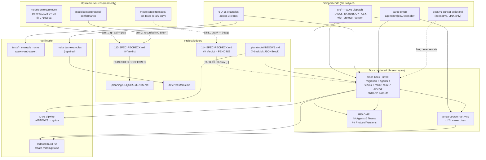

# Phase 119: Documentation — Three Shapes + v2 Migration - Research

**Researched:** 2026-08-18
**Domain:** Technical documentation (mdBook × 2 + README) over a shipped dual-protocol Rust SDK,
plus two bounded code exceptions: a requirements-ledger discharge (D-01) and an
example-verification harness (D-13/D-14)
**Confidence:** HIGH — every load-bearing claim below was measured this session with a command
whose output is quoted. Six commands were run against live upstream GitHub; twelve builds and six
example runs were executed locally.

---

<user_constraints>
## User Constraints (from CONTEXT.md)

### Locked Decisions

> **D-01: Phase 119's first plan is "task zero" — it formally runs and records Phase 113's arm-1
> re-verification, upgrades `113-SPEC-RECHECK.md`'s `## Verdict`, and flips HTTP-01..08 and
> CLNT-01/02/05 from `[~]` to `[x]`.** Docs are then written against a settled, recorded surface
> with no `[~]` hedging anywhere. The measurement is already done — it was taken during this
> discussion (2026-08-18) and came back clean. **The planner must RE-RUN it as the plan's own
> evidence, not cite this block.** Landing state: `PUBLISHED-CONFIRMED`. Arm 2 already ran and
> recorded NO DRIFT (plan 113.1-04, § B.6.5), so both arms are satisfied. The `## Verdict` was NOT
> upgraded during discussion and no requirement was flipped — that is task zero's job. Per arm 1
> step 4, requirements may be flipped only once BOTH arms are run and recorded; a `## Verdict`
> upgraded on arm 1 alone is invalid.
> — **Reversibility:** one-way.

> **D-02: The migration chapter owns a "Behaviour changes & known limitations" section**
> consolidating the CHANGELOG `[2.19.0] - Unreleased` wire changes, the four consumer-observable
> disclosure entries in `.planning/WINDOWS.md` (12, 13, 19, 20) and CR-03 (entry 23).
> `CHANGELOG.md` stays the **per-release** record; the guide is the **per-migration** one. The
> two-places-to-sync cost is accepted deliberately, and D-03 pays for it.

> **D-03: A tripwire test keeps that section from rotting.** The guide cites each disclosure by its
> `.planning/WINDOWS.md` entry id, and a test asserts every row flagged consumer-observable has a
> matching citation in the guide. A new disclosure that skips the guide fails CI. Chosen over
> greppable-ids-and-review-discipline because the milestone's habit is tripwires over convention.
> **Planner must handle:** `.planning/WINDOWS.md` rows currently carry `kind: deviation` with no
> consumer-observable marker. The tripwire needs something to key on — either a new `kind` value, a
> flag column, or a convention the test can match. Decide this before writing the test.

> **D-04: The v2 migration guide is a NEW pmcp-book chapter in Part III**, alongside 12.10–12.14.
> It holds the opt-in path, the dual-version story, the Tasks migration pointer, the D-02
> limitations section, and links to `docs/v1-sunset-policy.md` (already normative, written in Phase
> 117 — do NOT restate it). Two existing docs are deliberately **left untouched**:
> `docs/MIGRATION.md` (597 lines, pmcp crate 1.x → 2.0) and `pmcp-book/src/ch21-migration.md`
> (11-line "Coming Soon" stub, TypeScript → Rust).

> **D-05: Naming convention — protocol eras keep `v1`/`v2`; the crate is ALWAYS written with its
> name attached ("pmcp 2.19"), never bare "v2.0".** Each new doc opens with a one-line
> disambiguation callout. Rejected: always-dated eras ("MCP 2026-07-28").

> **D-06: The chapter's organizing spine is BY ROLE — server / client / agent.**
> | Role | What changes |
> |---|---|
> | **Server** | Nothing to opt into — one binary serves both eras by per-request negotiation. The only lever is opting *out* of v1: `cargo build --no-default-features --features full-v2` |
> | **Client** | Explicit: `ClientBuilder::with_protocol_version(PROTOCOL_VERSION_2026_07_28)` (`src/client/mod.rs:5190`). Explain why there is **no auto-probe** — Phase 113 D-08 lock, carried in-source at `src/client/mod.rs:871-878` |
> | **Agent** | `pmcp-agent` prefers v2 with v1 fallback; the era probe lives in `pmcp-agent`, NOT in `Client` (117 A-D08) |
> Each track leads with the `cargo pmcp` workflow. A reader finds their track and stops.

> **D-07: The Tasks era-delta AMENDS the existing `pmcp-book/src/ch12-7-tasks.md`**
> (extension-ization, `tasks/list` removed on v2, capability-negotiation change), and the migration
> chapter's role tracks link to it. That chapter is 799 lines and mentions `2026-07-28` **zero
> times**. — **Reversibility:** costly.

> **D-08: Two NEW Part III chapters — "Agents as MCP Clients" and "Agent Teams"** — beside the new
> migration chapter and 12.10–12.14. Plus **re-parent the existing
> `pmcp-book/src/ch17-04-sampling-hosting.md`** so it is reachable. That third chapter already
> exists and is written — 103 lines carrying exactly the LLM-server disambiguation Phase 111 asked
> for. Phase 111's three named chapters are therefore **two to write, one to relink**.

> **D-09: pmcp-course gets ONE new Part VIII chapter + exercises for Agents & Teams**, matching the
> `ch23-skills.md` depth (443 lines + 222 lines of exercises). **The v2 migration gets NO course
> chapter** — book-and-README only.

> **D-10: Docs cite examples by their FULL runnable cargo invocation, never a bare number. No
> renumbering, no new index page.** e.g. `cargo run -p pmcp-agent --example s50_standalone_vs_sampled`.

> **D-11: README gets two new sections, cargo-pmcp-first** — `## Agents & Teams` and `## Protocol
> Versions`. Plus runnable commands added to the `## Examples` block, and a refresh of the stale
> `## Latest Release: v2.0.0` header at `README.md:447`. Today Agents & Teams has exactly one
> bullet, at `README.md:24`, and eras have nothing.

> **D-12: The existing examples satisfy DOCS-06's runnable requirement as-is — the phase writes NO
> new example code.** What is missing is **prose**: the **Lambda deployment story**
> (`crates/pmcp-server/pmcp-server-lambda/src/main.rs`, era-blind today) and
> **`PMCP_REQUEST_STATE_KEY`** — "a SECURITY-RELEVANT deployment decision" that appears in **zero
> markdown files** repo-wide. Promote it into the migration chapter's **server** track.

> **D-13: "Verified against the shipped code" gets a real mechanism — spawn-and-assert run tests
> for the cited examples, PLUS a repair of `make test-examples`.** Neither existing mechanism
> verifies anything today. The house RUN precedent to follow:
> `tests/embedded_resource_example_run.rs` and `tests/log_records_example_run.rs`. **Book doctests
> stay OUT of scope.** — **Reversibility:** costly.

> **D-14: Pre-existing breakage is BASELINED BEFORE the gate change**, so it is never attributed to
> this phase; what is genuinely cheap gets fixed; the remainder is logged to `deferred-items.md`
> with measured error counts. This is exactly the 118.1-03 precedent. The gate lands green against
> a **recorded baseline**, not against zero.

> **D-15: The cited/gated set is SIX examples across three crates:** `s47_v2_stateless_mrtr`
> (root, DOCS-06), `s48_v2_mrtr_client` (root, DOCS-06 — s47's pair), `s53_v2_agent_client` (root,
> DOCS-06), `s49_sampling_host` (root, DOCS-04), `s50_standalone_vs_sampled` (`pmcp-agent`,
> DOCS-04), `doc_review_team` (`pmcp-team-servers`, needs `runtime`, DOCS-04).
> `s54_v2_dual_conformance` was considered and left out.

### Claude's Discretion

> None — every area presented was decided explicitly.

*(Scoping the two `ch10` chapters and choosing the D-03 marker were handed to the RESEARCHER, not
to executor discretion — see §§ F-1 and F-3, which give the planner costed recommendations.)*

### Deferred Ideas (OUT OF SCOPE)

> - **The two stale `ch10` transport chapters** — raised, explicitly not settled. **The researcher
>   should scope this and propose in/out.** *(→ § F-1.)*
> - **Enabling mdbook doctests** — `pmcp-book/book.toml:77-79`. Declined in D-13. Belongs in a
>   docs-infrastructure phase.
> - **Renumbering the example namespace** — declined in D-10 to protect traceability.
> - **A generated example index page** — declined as one more page to keep current.
> - **UNAS-01 / SEP-2243 `x-mcp-header` + `Mcp-Param-{Name}`** — carries to **v2.6**.
> - **Making `pmcp-server-lambda` era-aware**, and writing a genuinely Lambda-deployable v2
>   example — both declined in favour of documenting the contract.

</user_constraints>

<phase_requirements>
## Phase Requirements

| ID | Description (verbatim, `.planning/REQUIREMENTS.md:937-939`) | Research Support |
|----|-------------|------------------|
| **DOCS-04** | "Agents & Teams documented in three shapes (pmcp-book chapters, runnable examples, README/course), cargo-pmcp-first — carried from v2.4 Phase 111" | § F-6 proves all three DOCS-04 examples build AND run to completion today; § F-8 gives exact SUMMARY.md slot lines for both books; § F-9 gives README line numbers; § C-3 corrects the `cargo pmcp agent` verb list the "cargo-pmcp-first" framing must name |
| **DOCS-05** | "v2 migration guide + dual-version documentation: how to opt into v2, the dual-version story, Tasks extension migration, and the legacy sunset policy" | § F-4 gives task zero's exact procedure and authorized edits; § F-2 gives the claim-by-claim verdict for the Tasks sub-item (the one genuinely blocked half); § F-3 gives the D-03 tripwire key; § F-1 scopes the transport chapter; `docs/v1-sunset-policy.md` (333 lines, 12 `##` sections) is a LINK target, already normative |
| **DOCS-06** | "Runnable v2 examples: a stateless (Lambda-style) v2 server and a v2 client/agent example" | § F-6 records a live run of s47 + s48 + s53 (both clients exit 0 against the s47 server); § F-7 gives the harness pattern precisely; § F-5 gives the measured `make test-examples` baseline |

</phase_requirements>

---

## Summary

Phase 119 is a documentation phase whose *risk* is concentrated in three non-prose places, and this
research went to each of them with a command rather than an argument.

**The good news dominates.** Task zero (D-01) is fully runnable and lands `PUBLISHED-CONFIRMED`:
upstream now has `schema/2026-07-28/`, its blobs at `main` are byte-identical to the pinned commit
`271ecc9a…`, nothing has touched the path in 21 days, and all three error constants and their three
payload shapes match the vendored copy exactly (§ F-4). All six D-15 examples **build and run to
completion** — verified by execution, not inference (§ F-6). The `make test-examples` baseline
across every workspace member is **zero failures** (§ F-5), so D-14's baselining task is a
one-command record rather than a repair project. And the spawn-and-assert harness D-13 needs is
already a shared, hardened module (`tests/common/example_process.rs`) with a staleness guard, a
`Drop`-based reap and a measured runtime cost of **0.09 s** per test (§ F-7).

**Two findings change the plan's shape.** First, D-03's tripwire marker cannot be a new `kind`
value and cannot be a new column: `KINDS` is an `Object.freeze`d enum inside the GSD tool, and
`validateEntryShape` returns a ten-key *whitelisted projection*, so an unknown kind bricks the
ledger for `gsd-tools windows` entirely while an extra field is silently deleted on the next
mutation. The only durable marker is a sentinel inside `description` — and `BEHAVIOUR CHANGE`
already selects exactly {12, 13, 19, 20} (§ F-3). Second, **Phase 114's hold is still live and is
not this phase's to discharge**: `modelcontextprotocol/ext-tasks` still carries only `draft/`, with
0 tags and 0 releases, measured today. TASK-01..06 stay `[~]`. The Tasks era-delta may state every
*behaviour* as shipped (the code is in `src/` and quoted verbatim in § F-2) but must not state the
wire *values* as final (§ F-2's verdict table).

**On the deferred `ch10` question: scope it IN, minimally.** The measured staleness is one line per
chapter, but the real defect is a 90-line taxonomy (`## Understanding Streamable HTTP Modes`) that
frames statelessness as a *build-time* config choice — which `examples/s47_v2_stateless_mrtr.rs`
falsifies by running the STATEFUL default config and still serving v2 sessionlessly. A ~40-line
era-callout addition beats both a 917-line rewrite and leaving the taxonomy wrong (§ F-1).

**Primary recommendation:** Sequence the plan as `task zero (D-01)` → `baseline + gate repair
(D-14 before D-13)` → `WINDOWS.md sentinel + tripwire (D-03)` → `book/course/README prose` →
`mdbook build` as the closing gate, and treat § F-2's verdict table as the authority on what the
Tasks era-delta may assert.

---

## Corrections to CONTEXT.md (measured, not inferred)

CONTEXT.md is a high-quality record, but six of its factual pointers have drifted or were slightly
off. The planner should use these values, not CONTEXT.md's.

| # | CONTEXT.md says | MEASURED reality | Impact |
|---|---|---|---|
| **C-1** | D-06: the no-auto-probe lock is "carried in-source at `src/client/mod.rs:871-878`" | `:871-878` is the **sampling-capability sync** block (`sync_cap(&mut capabilities.sampling, …)`), unrelated. The D-08 lock is at **`src/client/mod.rs:1101`** — *"it to CHOOSE an era (Phase-113 D-08 forbids exactly that auto-probe)."* — and **`:5153`** — *"client NEVER probes `server/discover` to CHOOSE an era (Phase-113 D-08)."* [VERIFIED: src/client/mod.rs:1101, :5153, :865-885] | D-06's client track would cite a wrong line in shipped docs |
| **C-2** | D-11: "CHANGELOG shows `2.19.0 - Unreleased`; **2.17.0** is published" | crates.io: `pmcp = "2.18.0"`. Root `Cargo.toml:3` = `version = "2.18.0"`. CHANGELOG top is `## [2.19.0] - Unreleased` (`:8`) **and `## [2.18.0] - Unreleased` (`:99`)** — 2.18.0 is labelled Unreleased in CHANGELOG but IS on crates.io. [VERIFIED: `cargo search pmcp`; Cargo.toml:3; CHANGELOG.md:8,99] | The README release-header refresh would name a wrong version. Also a genuine CHANGELOG defect the plan may fix in passing |
| **C-3** | "`cargo pmcp` verbs already exist for `agent` (`new`, `dev`, `run`, `sources`)" | `AgentCommand` has **exactly two** variants: `New`, `Dev` (`cargo-pmcp/src/commands/agent/mod.rs:20-25`). `run.rs`/`sources.rs` are internal helper modules consumed by `dev.rs:31-32`, **not** CLI verbs. Confirmed by running `cargo pmcp agent --help`: `new`, `dev`, `help`. `TeamCommand` has exactly one: `Dev`. [VERIFIED: cargo-pmcp/src/commands/agent/mod.rs:20-25, team/mod.rs:17-20; live `--help`] | Every "cargo-pmcp-first" lead in README/book/course must name only `cargo pmcp agent new`, `cargo pmcp agent dev`, `cargo pmcp team dev` |
| **C-4** | "Eight v2 examples already ship **and are feature-gated in `Cargo.toml`**" | **Six** carry `[[example]]` blocks. `s50_v2_tasks_server` and `s51_v2_tasks_agent` have **no** `[[example]]` declaration — they are auto-discovered and build under **default** features. (So do `c11_oauth_iss_state_validation` and `s48_durable_poll_decision`.) [VERIFIED: parsed all `[[example]]` blocks in Cargo.toml vs `ls examples/*.rs`] | D-10's "full runnable invocation" for s50/s51 needs **no** `--features` flag; adding one would be wrong |
| **C-5** | "the `## Examples` block at ~545" | `## Examples` is at **`README.md:532`**. `## Latest Release: v2.0.0` at **`:447`** ✓ (exact). The Agents & Teams bullet at **`:24`** ✓ (exact). [VERIFIED: `grep -n '^## ' README.md`] | Minor; use 532 |
| **C-6** | D-15 table: `doc_review_team` "needs `runtime` feature" | ✓ correct (`crates/pmcp-team-servers/Cargo.toml:161-163`), **but** the example's own header (`:24`) documents `cargo run -p pmcp-team-servers --example doc_review_team --all-features`. Both work; `--features runtime` is minimal and was the one measured. [VERIFIED: crates/pmcp-team-servers/Cargo.toml:161-163; example header line 24; build exit 0] | D-10 must pick one invocation and make the example header agree with it |

---

## Architectural Responsibility Map

| Capability | Primary Tier | Secondary Tier | Rationale |
|------------|-------------|----------------|-----------|
| v2 migration narrative (opt-in, dual-version, limitations) | **pmcp-book** (`pmcp-book/src/`, Part III) | README `## Protocol Versions` (pointer only) | D-04 locks Part III; the book is the long-form tier and README is the index tier |
| Agents & Teams concepts | **pmcp-book** Part III (2 new + 1 relink) | pmcp-course Part VIII (1 chapter + exercises), README `## Agents & Teams` | D-08/D-09/D-11 — three shapes, three tiers, one concept |
| Tasks era-delta | **`ch12-7-tasks.md`** (amend in place) | migration chapter link | D-07: fix staleness where readers already are |
| Sunset policy | **`docs/v1-sunset-policy.md`** (already normative, 333 lines, 12 `##` sections) | migration chapter (link only) | D-04 forbids restating it |
| Per-release wire changes | **`CHANGELOG.md`** | migration chapter's D-02 section (per-migration view) | D-02 makes the split explicit and D-03 pays the sync cost |
| Example correctness | **`tests/*_example_run.rs`** (spawn-and-assert) | `make test-examples` (build-only gate) | D-13: the run tier asserts behaviour; the build tier asserts compilation |
| Pre-existing breakage record | **`deferred-items.md`** | `.planning/WINDOWS.md` | D-14 / 118.1-03 precedent |
| Requirements ledger | **`.planning/REQUIREMENTS.md`** + `113-SPEC-RECHECK.md` `## Verdict` | `.planning/ROADMAP.md` phase marker | D-01 task zero; arm 1 step 4 is the authority |

---

## Standard Stack

### Core

| Library / Tool | Version | Purpose | Why Standard |
|---------|---------|---------|--------------|
| `mdbook` | **v0.4.40** | Builds both books in CI | Pinned by URL in `.github/workflows/docs.yml:43` and `course.yml:42` [VERIFIED: .github/workflows/docs.yml:43] |
| `mdbook-mermaid` | (unpinned) | `[preprocessor.mermaid]` in `pmcp-book/book.toml:26-28` | Already configured; diagrams in new chapters may use ```` ```mermaid ```` [VERIFIED: pmcp-book/book.toml:26-28] |
| `mdbook-quiz` | **0.4.0** | pmcp-course quizzes | `cargo install mdbook-quiz --locked --force --version 0.4.0` [VERIFIED: .github/workflows/docs.yml:50] |
| `mdbook-exercises` | (unpinned) | pmcp-course exercises | Installed with `\|\| echo "…continuing without exercise support"` — a soft dependency [VERIFIED: .github/workflows/docs.yml:54] |
| `cargo` / `cargo nextest` | workspace toolchain | Builds + runs the D-13 harness | House standard |
| `gh` CLI | 2.x | Task zero arm 1 step 1 and the PROVENANCE re-fetch | Named in the recorded procedure itself [CITED: 113-SPEC-RECHECK.md § Arm 1 step 1] |

### Supporting

**No new crate dependencies.** The D-13 run tests reuse the existing `tests/common/` modules
(`example_process`, `v2`) and existing dev-dependencies. The D-03 tripwire needs only `std::fs` +
string matching.

### Alternatives Considered

| Instead of | Could Use | Tradeoff |
|------------|-----------|----------|
| mdbook `create-missing = false` (fails on a SUMMARY entry with no file) | `create-missing = true` | **Do not change it.** It is the plan's cheapest structural gate — see § F-10 |
| Hand-written run tests per example | Widening `make test-examples` to `cargo run` everything | Rejected by D-13's scope: three of the six examples need a peer process or bind a port |

**Installation:** none required. Everything above is already installed by CI or already in the
workspace.

---

## Package Legitimacy Audit

**This phase installs ZERO external packages.** It adds no `[dependencies]`, no
`[dev-dependencies]`, and no `cargo install` step. Verified by construction: D-12 forbids new
example code, D-13's harness reuses `tests/common/`, and the D-03 tripwire needs only `std`.

| Package | Registry | Verdict | Disposition |
|---------|----------|---------|-------------|
| _(none)_ | — | — | No package-legitimacy gate applies |

**Packages removed due to `[SLOP]` verdict:** none.
**Packages flagged as suspicious `[SUS]`:** none.

> The four mdBook tools in § Standard Stack are **pre-existing CI tooling**, already installed by
> `.github/workflows/docs.yml` before this phase. They are not new installs. Two of them
> (`mdbook-mermaid`, `mdbook-exercises`) are **unpinned** in CI, which is the same unpinned-tooling
> drift shape recorded in the project's CI Purity Gate memory. Pinning them is **not** this phase's
> job, but the planner should not add a new *dependency* on either without pinning it.

---

## Measured Findings

Each subsection answers one numbered research priority. Every quantitative claim carries the
command that produced it.

### F-1 — The two stale `ch10` transport chapters: **scope IN, minimally** (research priority 1)

#### The measurement

```
$ for f in ch10-transports.md ch10-03-streamable-http.md ch10-02-http.md ch12-7-tasks.md ch17-04-sampling-hosting.md; do
    echo "$f : $(wc -l < $f) lines / 2025-11-25 hits: $(grep -c '2025-11-25' $f) / 2026-07-28 hits: $(grep -c '2026-07-28' $f)"
  done
```

| File | Lines | `2025-11-25` | `2026-07-28` | `session` (ci) | `Last-Event-ID` | `resumab` (ci) | `##` |
|---|---|---|---|---|---|---|---|
| `ch10-transports.md` | 917 | **1** | 0 | 42 | **0** | **0** | 18 |
| `ch10-03-streamable-http.md` | 168 | **1** | 0 | 6 | **0** | **0** | 6 |
| `ch10-02-http.md` | 70 | 0 | 0 | 1 | 0 | 0 | 6 |
| `ch12-7-tasks.md` (D-07 target) | 799 | 2 | 0 | 7 | 0 | 0 | 12 |
| `ch17-04-sampling-hosting.md` (D-08 relink) | 103 | 1 | 0 | 0 | 0 | 0 | 4 |

**The `2025-11-25` staleness is literally one line per chapter, and it is the same line:**

```
ch10-transports.md:572:- **`mcp-protocol-version`**: Protocol version header (e.g., `2025-11-25`)
ch10-03-streamable-http.md:73:- `mcp-protocol-version`: Protocol version (e.g., `2025-11-25`)
```

Both sit under a "Headers enforced by the server" bullet list. That is a two-token edit.

**And `Last-Event-ID` / "resumability" appear ZERO times in either chapter.** CONTEXT.md's
`<deferred>` reasoning — *"the transport chapter is where v2 statelessness lands hardest (no
sessions, no `Last-Event-ID`)"* — is half right: the chapters never mention resumability at all, so
there is nothing to *correct* there. The exposure is **omission**, not contradiction.

#### Where the exposure actually is

`grep`ing the 42 session-mentioning lines in `ch10-transports.md` and attributing each to its
enclosing `##` section:

| `##` section | session-lines |
|---|---|
| **`## Understanding Streamable HTTP Modes`** (lines 184–273) | **12** |
| `## Transport Configuration` | 8 |
| `## Real-World Deployment Patterns` | 7 |
| `## Choosing the Right Transport` | 5 |
| `## Transport Characteristics Comparison` | 3 |
| `## Performance Considerations` | 3 |
| `## Available Transport Options` | 2 |
| `## Transport Architecture Deep Dive` | 1 |
| `## What's Next` | 1 |

The concentration is in one 90-line section, and that section is **wrong by omission in a way a
reader will act on.** Verbatim (`ch10-transports.md:188-206`):

```markdown
### Mode 1: Stateless + JSON Response (Serverless-Optimized)

**When to use:**
- AWS Lambda, Cloudflare Workers, Google Cloud Functions, Azure Functions
...
**How it works:**
```rust
let config = StreamableHttpServerConfig {
    session_id_generator: None,  // ❌ No sessions
    ...
```

This teaches that statelessness is a **build-time config choice** (`session_id_generator: None`).
`examples/s47_v2_stateless_mrtr.rs` falsifies that for v2, in its own header (`:19-22`):

> *"**No `Mcp-Session-Id`.** The server below is built with the STATEFUL default HTTP config (it
> still mints sessions for 2025-11-25 clients), yet no v2 response carries a session id. That is
> the PER-REQUEST era gate, not a build-time stateless switch."*

A reader who follows Mode 1 to get v2 statelessness will disable v1 sessions unnecessarily. That is
a *behavioural* miss, not a cosmetic one — and it is exactly the D-07 argument (fix staleness where
readers already are).

#### Costed options for the planner

| Option | Edit surface | What it buys | What it costs |
|---|---|---|---|
| **(A) OUT** — leave both chapters | 0 lines | Nothing | The Mode-1 misteaching stands, and the two chapters keep naming only `2025-11-25` in a milestone whose whole point is dual-version |
| **(B) MINIMAL-TOUCH — RECOMMENDED** | 2 edited lines + ~40 new | (i) `:572` / `:73` become era-aware (`2025-11-25` or `2026-07-28`); (ii) one `> **Era note**` callout at the head of `## Understanding Streamable HTTP Modes` stating that the three modes are **v1 build-time** modes and that v2 statelessness is **per-request and orthogonal**, linking the new migration chapter's server track; (iii) the same one-line disambiguation callout D-05 mandates for new docs, at the top of each chapter | ~40 lines of new prose in two chapters. No restructuring, no code-block rewrites |
| **(C) FULL REWRITE** | ~250 lines rewritten | A four-mode taxonomy including v2 | Duplicates the new migration chapter's server track (D-06), re-opens `## Transport Configuration` / `## Real-World Deployment Patterns` / `## Transport Characteristics Comparison`, and turns a docs phase into a chapter rewrite. **Recommend against** |

**Recommendation: option (B), scoped IN as a single plan task, with an explicit acceptance
criterion that no code block in either chapter is modified.** Rationale: the measured surface is
tiny (2 lines wrong, 1 section incomplete), the D-07 precedent already licenses in-place staleness
repair on a large chapter, and leaving the Mode-1 taxonomy as-is contradicts the shipped s47
example the same phase is citing as DOCS-06's proof.

---

### F-2 — Phase 114: what the Tasks era-delta may state as SHIPPED (research priority 2)

**Verdict in one sentence: every Tasks *behaviour* is in shipped code and may be documented as
such; the Tasks *wire values* derive from an experimental `draft/` schema and must carry a
provisionality callout, because Phase 114's publication hold is STILL LIVE — measured today.**

#### The two independent holds on Phase 114

`.planning/ROADMAP.md:2221` records Phase 114 as `[~]` with two reasons:

> *"**All 20 plans shipped (2026-08-01) and the whole-phase gate is GREEN** — `make quality-gate`
> exit 0 at 4899 passed / 0 failed … The phase is nonetheless NOT complete, for two independent
> reasons …: (1) **`114-18`'s Task 4 sign-off checkpoint (`checkpoint:human-verify
> gate="blocking"`) has NOT been answered** … (2) **Blocked on publication.**
> `114-SPEC-RECHECK.md` `## Verdict` is `PENDING` and TASK-01..06 are booked `[~]` … **The sole
> remaining condition is a ONE-repository check on `ext-tasks`; nothing watches it (`D-114-S`).**"*

`114-SPEC-RECHECK.md:711-737` confirms:

> *"**PENDING** … `modelcontextprotocol/ext-tasks` still carries only `draft/`. Under the **DQ6
> both-repositories** trigger this is a **partial publication**, which `## Third Outcome Policy`
> rule 5 defines as **`STILL-ABSENT`** … **Consequence:** TASK-01, TASK-02, TASK-03, TASK-04,
> TASK-05 and TASK-06 are booked `[~]` — *implemented; pending final schema* … They are flipped
> together, never individually."*

#### I ran the one-repository check (2026-08-18)

```
$ gh api repos/modelcontextprotocol/ext-tasks/contents/schema --jq '.[].name'
draft
$ gh api repos/modelcontextprotocol/ext-tasks/tags --jq 'length'
0
$ gh api repos/modelcontextprotocol/ext-tasks/releases --jq 'length'
0
```

**`ext-tasks` STILL carries only `draft/`, 0 tags, 0 releases.** The Phase-114 hold has not moved
since 2026-08-01. `STILL-ABSENT` remains the landing state; TASK-01..06 stay `[~]`.

> **This is NOT task zero's to discharge.** D-01 names exactly eleven requirements —
> HTTP-01..08, CLNT-01/02/05 — governed by `113-SPEC-RECHECK.md`. TASK-01..06 are governed by a
> **different record** with a **different trigger** (DQ6's both-repositories condition), and
> `114-SPEC-RECHECK.md` says they are *"flipped together, never individually."* A plan that flips
> them under D-01's authority would be an invalid verdict upgrade of exactly the kind arm 1 step 4
> forbids.

#### Claim-by-claim verdict for the D-07 amendment

Each claim was checked against `src/`, with the source-of-truth line read and quoted verbatim.

| # | Candidate claim for `ch12-7-tasks.md` | Verifiable in shipped code TODAY? | Evidence (read this session) | How the chapter may state it |
|---|---|---|---|---|
| T-1 | Tasks are negotiated on v2 through the **extensions map** under `io.modelcontextprotocol/tasks` | **YES — the constant ships** | `pub const TASKS_EXTENSION_KEY: &str = "io.modelcontextprotocol/tasks";` [VERIFIED: src/types/capabilities.rs:346] | State plainly, **with** the provisionality callout below |
| T-2 | v2 reads it at `result.capabilities.extensions["io.modelcontextprotocol/tasks"]`; the v1 path stays `experimental.tasks` | **YES** | `src/types/capabilities.rs:301-332` documents both positions incl. *"byte-for-byte `{"extensions":{"io.modelcontextprotocol/tasks":{}}}`"* [VERIFIED: src/types/capabilities.rs:301-346] | State plainly |
| T-3 | **`tasks/list` is retired on v2** and answers `-32601` | **YES** | *"There is no v2 counterpart and no projection type: `tasks/list` is ABSENT from the `io.modelcontextprotocol/tasks` extension and answers `-32601` on a v2-negotiated request (inventory row 37, plan 114-08). The removal is a SECURITY improvement — with no enumeration primitive a server cannot leak the existence of one caller's tasks to another. Kept unchanged for v1."* [VERIFIED: src/types/tasks.rs:579-585] | State plainly. **Quote the security rationale** — it is the strongest sentence in the whole delta and appears nowhere in the book today |
| T-4 | The per-era method sets: v1 serves `tasks/get`, `tasks/result`, `tasks/list`, `tasks/cancel`; v2 serves `tasks/get`, `tasks/update`, `tasks/cancel` | **YES** | *"v1 (2025-11-25) serves `tasks/get`, `tasks/result`, `tasks/list` and `tasks/cancel`; v2 (2026-07-28) serves `tasks/get`, `tasks/update` and `tasks/cancel`, with `tasks/list` and `tasks/result` retired to `-32601`."* [VERIFIED: src/types/tools.rs:160-163] | State plainly. **Note that `tasks/result` is retired too** — CONTEXT.md's D-07 summary names only `tasks/list` |
| T-5 | `tasks/update` exists on v2 | **YES** | `pub(crate) const TASKS_UPDATE_METHOD: &str = "tasks/update";` [VERIFIED: src/types/mrtr.rs:219] | State plainly |
| T-6 | v2 task-augmented results use `resultType:"task"` with `CreateTaskResult` | **YES (type ships)** | `pub struct CreateTaskResult {` [VERIFIED: src/types/tasks.rs:511] | State plainly |
| T-7 | The runnable v2 Tasks examples are `s50_v2_tasks_server` + `s51_v2_tasks_agent` | **YES, but under DEFAULT features** | Neither has an `[[example]]` block; both auto-discovered [VERIFIED: parsed Cargo.toml `[[example]]` set vs `ls examples/*.rs` — see C-4]. Cited by name at `src/types/tools.rs:164-166` | D-10 invocation: `cargo run --example s50_v2_tasks_server` with **no** `--features` flag |
| T-8 | **TASK-01..06 are complete / the v2 Tasks wire is final** | **NO — PLAN-ONLY / HELD** | `ext-tasks` measured today: `draft/` only, 0 tags, 0 releases. `114-SPEC-RECHECK.md:713` `## Verdict` = `PENDING` | **Must NOT be stated.** See the required callout below |

#### The provisionality callout the chapter must carry

The SDK already says this to Rust readers, at the definition site
[VERIFIED: src/types/capabilities.rs:340-345]:

> *"…repository had published a versioned (non-`draft`) schema directory, so every value read from
> the draft is provisional. Re-verify against
> `.planning/phases/114-tasks-extension-migration/114-SPEC-RECHECK.md` (verdict `PENDING`) before
> any TASK-0x requirement is flipped complete. A mismatch between this constant and the published
> schema is a phase-reopening event, not an advisory."*

The book chapter has no equivalent. **The D-07 amendment must add one** — one short callout,
reader-facing (drop the internal `.planning/` path; say "the Tasks extension schema is still
`draft/` upstream, so these wire values may change"). Without it, the docs would assert as settled
exactly what the SDK's own source calls provisional, and D-01's "no `[~]` hedging anywhere" would
be satisfied by *concealing* a hold rather than by discharging one.

> **Flag for the planner, per CONTEXT.md's instruction to flag rather than assume:** D-01 promises
> docs written "against a settled, recorded surface with no `[~]` hedging anywhere." That is
> achievable for HTTP-01..08 / CLNT-01/02/05 (§ F-4). It is **not** achievable for TASK-01..06, and
> no action available to Phase 119 makes it achievable. The honest resolution is the callout above.
> This is a scope fact, not a defect in D-01.

---

### F-3 — The `.planning/WINDOWS.md` consumer-observable marker (research priority 3)

#### The real schema (both halves of it)

`.planning/WINDOWS.md` is **321 lines** and has **three** parts, not one:

1. **YAML frontmatter** (lines 1–8) — `schema_version: 1`, `open_count: 17`, `waived_count: 0`,
   `fixed_count: 6`, `total_count: 23`, `last_updated`.
2. **A rendered markdown table** (lines 16–40) — human view, columns
   `| id | phase | kind | file | line | description | status | reason | recorded_at | resolved_at |`.
   One row per entry, id `N` at line `17 + N`.
3. **A machine-readable JSON array** (lines 41–321) inside a **four-backtick** fence
   (` ````json ` … ` ```` `). **This is the authoritative parse target.**

Entry keys, measured: `['id','kind','phase','file','line','description','status','reason','recorded_at','resolved_at']`.
Observed `kind` values across all 23 entries: **`deviation`, `unmet-truth`** only.

The file is written by `gsd-tools windows`, whose implementation lives **outside this repo** at
`~/.claude/gsd-core/bin/lib/broken-windows.cjs`. Three facts from that file dominate the design
space:

| Fact | Location | Consequence |
|---|---|---|
| `KINDS` is `Object.freeze([... 8 values ...])` and `validateEntryShape` throws `WINDOWS_LEDGER_MALFORMED` on any kind outside `KIND_SET` | `broken-windows.cjs:88-97`, `:371-373` | **One unknown kind makes the ENTIRE ledger unparseable** to `status`/`append`/`waive`/`fixed`, and `/gsd-ship`'s `windows_enforce` gate stops working |
| `validateEntryShape` returns a **whitelisted ten-key projection** — it constructs a fresh object from exactly the ten keys above and discards everything else | `broken-windows.cjs:389-401` | An extra JSON field **parses fine but is silently DELETED** the next time any verb writes the file (`renderLedger` → `JSON.stringify(ledger.entries, null, 2)`, `:461`) |
| `rejectBacktickRun` forbids a 4-backtick run in `description`; `description` must be a non-empty string | `broken-windows.cjs:151-172` | A sentinel may not contain ` ```` `. Brackets/uppercase are safe |
| The only verbs are `status`, `append`, `waive`, `fixed` | `broken-windows.cjs:59-62` | **There is no `edit` verb.** Retro-tagging an existing entry is a manual file edit |

#### Three concrete marker designs, with parse cost

| Design | Mechanism | Parse cost (Rust test) | Durability | Verdict |
|---|---|---|---|---|
| **A — new `kind` value** (e.g. `kind: "consumer-observable"`) | Add a value to the `kind` column | n/a | **NEGATIVE — bricks the tool.** `KIND_SET` is frozen in a file this repo does not own; upgrading GSD would not help since the enum is a deliberate typed surface with a locking test | **REJECT** |
| **B — new JSON field / table column** (e.g. `"consumer_observable": true`) | Extend the entry object | trivial (`serde_json` optional bool) | **ZERO.** Dropped by the whitelist projection on the next `gsd-tools windows append`. The tripwire would go green-then-silently-blind, which is the exact vacuous-gate shape this repo has burned four phases eliminating | **REJECT** |
| **C — sentinel token inside `description`** | Prefix the description string | one `str::contains` per entry (23 entries → O(n) over ~40 KB) | **FULL.** `description` is the one free-text field carried verbatim through the projection and re-rendered into both the table and the JSON | **RECOMMEND** |

#### Which sentinel — measured

I parsed the JSON block and tested four candidate tokens against all 23 descriptions:

```
'BEHAVIOUR CHANGE'      -> ids [12, 13, 19, 20]
'consumer-observable'   -> ids [16, 19, 20]
'CONSUMER CONSEQUENCE'  -> ids [12, 13]
'consumer'              -> ids [7, 12, 13, 16, 19, 20]
```

`BEHAVIOUR CHANGE` **already selects exactly the four entries D-02 names** — {12, 13, 19, 20} — and
nothing else. Entry 23 (CR-03) carries none of the four tokens; entry 16 (`status: fixed`) is the
CR-02 *defect* record, not a disclosure, and would be a false positive for `consumer-observable`.

Entry openings, verbatim:

- **12** `deviation` `open` — *"BEHAVIOUR CHANGE, by design (118.2-15, CR-02 half 1): Transport::receive()'s terminal reas…"*
- **13** `deviation` `open` — *"BEHAVIOUR CHANGE (118.2-15, CR-02 half 2): Client::dispatch_request now compares response.…"*
- **19** `deviation` `open` — *"BEHAVIOUR CHANGE, by design and OPEN as a disclosure (118.2-19, closing BLOCKER 1): THREE …"*
- **20** `deviation` `open` — *"BEHAVIOUR CHANGE, by design and OPEN as a disclosure (118.2-20, closing BLOCKER 2): TWO co…"*
- **23** `unmet-truth` `open` — *"CR-03, OPEN AND DEFERRED BY DEVELOPER DECISION (2026-08-18), recorded at the severity re-m…"*

**Recommendation: adopt an explicit bracketed sentinel `[CONSUMER-OBSERVABLE]`, prefixed to the
descriptions of entries 12, 13, 19, 20 and 23 — a five-string edit — rather than reusing
`BEHAVIOUR CHANGE`.** Three reasons: (i) entry 23 is a *deferred defect*, not a behaviour change,
so reusing `BEHAVIOUR CHANGE` would require mislabelling it; (ii) `BEHAVIOUR CHANGE` is prose a
future recorder may phrase differently ("Behavior change", "BEHAVIOURAL CHANGE"), whereas a
bracketed token is obviously a marker and survives copy-paste; (iii) it is greppable in one
unambiguous form, which is what the tripwire's failure message must be able to instruct a future
recorder to add.

**Mechanics the plan must encode:**

- Edit **both** representations — the markdown table row (line `17 + id`) **and** the JSON entry.
  The table is regenerated only on the next `gsd-tools windows` mutation, so a JSON-only edit
  leaves the human view disagreeing with the machine view until then.
- After editing, run `gsd-tools windows status` to confirm the ledger still parses and the
  frontmatter counts still cross-check (`parseLedger` throws if
  `open/waived/fixed/total` disagree with the entries — `broken-windows.cjs:429-441`).
- Do not touch `status`, `kind`, or the counts. Entries 12/13/19/20/23 are all `open`; the ledger's
  `open_count: 17` must stay 17.
- The tripwire's assertion message must name the sentinel literally, so a recorder who trips it is
  told exactly what to add and where.

#### Packaging: the tripwire reads TWO excluded trees — and the repo has a decided precedent

The tripwire reads `.planning/WINDOWS.md` and the new migration chapter under `pmcp-book/src/`.
**Both trees are in `Cargo.toml`'s `exclude` array** — `".planning/"` at `:82`, `"pmcp-book/"` at
`:32`. `Cargo.toml:68-79` records the fork explicitly:

> *"tests/ci_severance_gate_wiring.rs SHIPS because everything it reads … also ships …
> tests/v2_conformance_pin.rs SHIPS while reading the EXCLUDED `.planning/` tree because it returns
> early on a missing path, and that tolerance is deliberate there (the pin degrades to a no-op
> downstream) but WRONG for the conformance reader, whose whole job is to fail when the wiring is
> absent — a reader that silently skips is exactly the vacuous gate Phase 118 exists to prevent."*

The copyable guard is `tests/v2_conformance_pin.rs:96-111` [VERIFIED: read this session]:

```rust
/// `113-SPEC-RECHECK.md`, or `None` when there is nothing to check.
///
/// Guard semantics …: `.planning/` is excluded from the published crate (`Cargo.toml`
/// `exclude`), so a downstream `cargo test` has no record to read and returns early. A
/// phase directory that EXISTS but has no record is a FAILURE — that is a deleted gate,
/// not a packaging artifact.
fn recheck_doc() -> Option<String> {
    let dir = phase_dir();
    if let Ok(text) = fs::read_to_string(dir.join("113-SPEC-RECHECK.md")) {
        return Some(text);
    }
    assert!(
        !dir.exists(),
        "the phase directory exists but 113-SPEC-RECHECK.md is missing — HTTP-08's \
         conformance-predicate pin would go unenforced"
    );
    None
}
```

**Recommendation: copy this shape rather than adding an `exclude` entry.** Applied twice (once for
`.planning/`, once for `pmcp-book/src/`), it lets the test SHIP while staying non-vacuous in-repo:
skip only when the whole tree is absent; **FAIL** when the tree exists but the file does not. The
plan must verify with `cargo package --list` (the 115-REVIEW CR-01 precedent) that the test file's
disposition is deliberate either way.

---

### F-4 — Task zero (D-01): the exact procedure, and its authorized edits (research priority 4)

#### The governing text

`113-SPEC-RECHECK.md § Re-verification obligation (binding)` establishes two arms and a shared
landing state:

> *"**Arm 1 watches the SCHEMA. Arm 2 watches the CONFORMANCE SUITE. Running arm 1 alone is NOT a
> run of this gate, and does NOT discharge this obligation.**"*
>
> *"**Landing state (shared).** Arm 1's step 4 is the landing state for the obligation as a whole.
> It is reached only when **both** arms have been run and recorded. A `## Verdict` upgraded on the
> strength of arm 1 alone is invalid, and requirements flipped under it must be flipped back."*

**Arm 2 status: ALREADY RUN, NO DRIFT** — recorded in the file itself:

> *"**RUN 2026-07-27 by plan 113.1-04 (phase 113.1, D-19) — verdict NO DRIFT.** Executed against
> upstream HEAD `5cc567c39912bc6105b14287d42abed2956e7955`. The predicate is byte-identical to
> § B.6.2's quotation, having moved only to `:992-1025`; the disjunct set is unchanged;
> `v2_conformance_pin` passes 5/5. The run log … is **§ B.6.5** below."*

So task zero runs **arm 1** and cites arm 2's recorded run. Whether to *re-run* arm 2 is a planner
call; the text does not require it (§ B.6.5 is the record), but arm 2 is not gated on publication
and re-running it costs one `gh api` call — **recommend re-running it** so the plan's discharge
rests on two commands it executed rather than one it executed and one it cited.

#### Arm 1 — the four steps, and my execution of each (2026-08-18)

**Step 1** — *"confirm `2026-07-28` now exists"*:

```
$ gh api repos/modelcontextprotocol/modelcontextprotocol/contents/schema --jq '.[].name'
2024-11-05
2025-03-26
2025-06-18
2025-11-25
2026-07-28      ← EXISTS
draft
```

**Supplementary (from `PROVENANCE.md § Reproducing this fetch` step 1 + `§ Independent
corroboration`)** — the pin still resolves and `main` has not drifted:

```
$ gh api repos/.../commits/271ecc9accafdd9b83a3c869fa67c22953b2af80 --jq '{sha,date:.commit.author.date,subject:…}'
{"date":"2026-07-28T16:42:34Z","sha":"271ecc9accafdd9b83a3c869fa67c22953b2af80",
 "subject":"fix(schema): apply subscriptions/listen envelope and MetaObject rename to 2026-07-28"}

$ gh api "repos/.../commits?path=schema/2026-07-28&per_page=3" --jq '.[]|{sha,date,subject}'
271ecc9a… 2026-07-28T16:42:34Z  fix(schema): apply subscriptions/listen envelope…   ← NEWEST
b488c166… 2026-07-28T15:56:05Z  Add 2026-07-28 MCP specification

$ gh api "repos/.../contents/schema/2026-07-28?ref=main" --jq '.[]|{name,sha,size}'
{"name":"schema.json","sha":"213c58f6d9a1c2ce6ad055afe90bbdb095a29ee8","size":181474}
{"name":"schema.ts",  "sha":"9b55feeb412bc3ae877f2eac10b5c01ba29a2eed","size":98426}
```

Both blob SHAs at **`main`** are **identical** to `PROVENANCE.md § Independent corroboration`'s
table (`9b55feeb…` / `213c58f6…`) and both sizes match (98426 / 181474). **Nothing has touched the
path in 21 days.**

**Step 2** — *"Grep `schema/2026-07-28/schema.ts` for the three identifiers"* (run against the
vendored byte-identical copy):

```
$ grep -n 'HEADER_MISMATCH\|MISSING_REQUIRED_CLIENT_CAPABILITY\|UNSUPPORTED_PROTOCOL_VERSION' \
    schema/vendored/core-2026-07-28/schema.ts
434: export const HEADER_MISMATCH = -32020;
442: export const MISSING_REQUIRED_CLIENT_CAPABILITY = -32021;
450: export const UNSUPPORTED_PROTOCOL_VERSION = -32022;
468:   code: typeof HEADER_MISMATCH;
488:   code: typeof UNSUPPORTED_PROTOCOL_VERSION;
518:   code: typeof MISSING_REQUIRED_CLIENT_CAPABILITY;
```

Two hits each — matching CONTEXT.md D-01's recorded "all present, 2 hits each".

**Step 3** — *"Assert each identifier still maps to `-32020` / `-32021` / `-32022` respectively, and
that the HTTP-400 mappings and the `requiredCapabilities`-is-an-object /
`supported`-is-a-string-array payload shapes are unchanged."*

| Assertion | Result | Verbatim evidence |
|---|---|---|
| `HEADER_MISMATCH = -32020` | ✅ | `export const HEADER_MISMATCH = -32020;` [VERIFIED: schema.ts:434] |
| `MISSING_REQUIRED_CLIENT_CAPABILITY = -32021` | ✅ | `export const MISSING_REQUIRED_CLIENT_CAPABILITY = -32021;` [VERIFIED: schema.ts:442] |
| `UNSUPPORTED_PROTOCOL_VERSION = -32022` | ✅ | `export const UNSUPPORTED_PROTOCOL_VERSION = -32022;` [VERIFIED: schema.ts:450] |
| HTTP-400 on `HeaderMismatchError` | ✅ | *"For HTTP, the response status code MUST be `400 Bad Request`."* [VERIFIED: schema.ts:452-455] |
| HTTP-400 on `UnsupportedProtocolVersionError` | ✅ | *"For HTTP, the response status code MUST be `400 Bad Request`."* [VERIFIED: schema.ts:473-476] |
| HTTP-400 on `MissingRequiredClientCapabilityError` | ✅ | *"For HTTP, the response status code MUST be `400 Bad Request`."* [VERIFIED: schema.ts:503-505] |
| `supported: string[]` | ✅ | `supported: string[];` [VERIFIED: schema.ts:492] |
| `requested: string` | ✅ | `requested: string;` [VERIFIED: schema.ts:497] |
| `requiredCapabilities: ClientCapabilities` (an object) | ✅ | `requiredCapabilities: ClientCapabilities;` [VERIFIED: schema.ts:522] |

**Step 4 — landing state:** the directory EXISTS and steps 2–3 AGREE → **`PUBLISHED-CONFIRMED`**.
Arm 1 step 4's table [CITED: 113-SPEC-RECHECK.md § Arm 1 step 4]:

> | Step-1 result | Landing state | Action |
> |---|---|---|
> | the directory EXISTS and steps 2-3 agree | `PUBLISHED-CONFIRMED` | upgrade this file's `## Verdict`. Only then may requirements be flipped — and only once **arm 2 has also been run and recorded**. |

#### The one extra obligation the plan must not skip

`## Third Outcome Policy § Two measured facts a future re-runner must carry` ends with:

> *"**The one forward risk worth re-checking is PR #2678** … It proposes `SERVER_ERROR = -32000`,
> `NOT_FOUND = -32001` and `RESOURCE_NOT_FOUND = -32002` … **Re-check #2678's state at every future
> run of this obligation.**"*

I ran it:

```
$ gh api repos/modelcontextprotocol/modelcontextprotocol/pulls/2678 --jq '{state,merged,title,updated,draft}'
{"draft":false,"merged":false,"state":"open",
 "title":"SEP-2678: Introduce additional error codes to protocol",
 "updated":"2026-06-23T18:02:47Z"}
```

**Still open, still unmerged, unchanged since 2026-06-23** (now ~2 months stale). It does not touch
the three constants under exception. The plan's task zero **must run this check and record the
result** — it is an explicit instruction of the policy, and omitting it makes the run incomplete.

#### The exact edits arm 1 step 4 authorizes

| Edit | File | Precise change | Authority |
|---|---|---|---|
| **E-1** | `.planning/phases/113-…/113-SPEC-RECHECK.md` | `## Verdict` (line 232, body at `:233-253`) → **`PUBLISHED-CONFIRMED`** | Arm 1 step 4, row 1 |
| **E-2** | same file | Append a dated sub-section under `### Verdict re-verification` (the existing `:255` heading is *"Verdict re-verification — plan 12 Task 3 (2026-07-26)"*; match that pattern) recording: the five-directory listing, the pin-resolution output, the two `main` blob SHAs, the six step-2 grep hits, the nine step-3 assertions, the PR #2678 state, and the arm-2 citation | `## Third Outcome Policy` rule 4 — *"the run **is still recorded** … so that 'we checked and it was absent' is distinguishable from 'nobody checked'"* — applies a fortiori to a confirming run |
| **E-3** | `.planning/REQUIREMENTS.md` | Flip **eleven** checkboxes `[~]` → `[x]`: **HTTP-01** (`:36`), **HTTP-02** (`:37`), **HTTP-03** (`:38`), **HTTP-04** (`:39`), **HTTP-05** (`:40`), **HTTP-06** (`:41`), **HTTP-07** (`:42`), **HTTP-08** (`:50`), **CLNT-01** (`:911`), **CLNT-02** (`:912`), **CLNT-05** (`:915`). Format is `- [~] **ID**: …` → `- [x] **ID**: …` [VERIFIED: `grep -n '^- \[~\]' .planning/REQUIREMENTS.md`] | Arm 1 step 4 row 1 + `## Third Outcome Policy § The rule` item 2, which names these eleven exactly: *"HTTP-01 … HTTP-08, CLNT-01, CLNT-02, CLNT-05"* |
| **E-4** | `.planning/REQUIREMENTS.md` | Apply the **three authorized requirement-TEXT corrections** in `### Authorised for the re-verification run — requirement TEXT corrections`. **These were deliberately deferred to this exact run** — *"`.planning/REQUIREMENTS.md` was deliberately not edited by plan 113-28 (0-byte diff), so that every requirement-text change in this phase lands in one reviewable place — the re-verification run."* Specifically: (1) HTTP-08 citation `stateless.ts:988-1015` → **`stateless.ts:983-1016`**; (1b) mark the HTTP-08 caveat sentence *"The gate needs a second arm pinning a conformance-repo sha…"* as **SATISFIED**; (2) where HTTP-08 describes what **gates the stream**, name the **`resources.subscribe` capability**, keeping `resourceSubscriptions` only where it describes the `SubscriptionFilter` **field** | The authorization table itself, which says *"apply at the re-verification run, not before"* |
| **E-5** | `.planning/ROADMAP.md:2219` | The Phase 113 marker's clause *"Re-run the `113-SPEC-RECHECK.md` checkpoint on or after 2026-07-28 to close (2)"* is discharged by E-1/E-3 — amend it to record the discharge (and note that reason **(1)**, the three open codebase gaps, is a separate matter this phase does not touch) | Consistency; the ⚠ block after the v2.5 progress table warns that Phase 113's "Complete" counts PLANS, not REQUIREMENTS |

**Two things task zero must NOT do:**

- **Must not change HTTP-07's wording.** *"HTTP-07's wording is NOT in this table and must not be
  changed. Plan 113-23 measured pmcp's actual `subscriptionId` emission over a live socket and
  recorded: 'HTTP-07's CURRENT wording is CORRECT and is CONFIRMED by measurement.'"*
- **Must not touch TASK-01..06.** See § F-2 — different record, different trigger, still `[~]`.

**Estimated cost:** 6 `gh api` calls + 2 greps + 5 file edits. One plan, one wave, no build.

---

### F-5 — `make test-examples` baseline before the gate change (research priority 5)

#### The false green, confirmed verbatim

`Makefile:253-266` [VERIFIED: read this session]:

```make
test-examples:
	@echo "Running example tests (ALWAYS required for new features)..."
	@echo "Note: Examples are built but not run to avoid blocking on I/O"
	@for example in $$(ls examples/*.rs 2>/dev/null | sed 's/examples\///g' | sed 's/\.rs$$//g'); do \
		echo "Building example: $$example"; \
		if $(CARGO) build --example $$example --all-features 2>/dev/null; then \
			echo "✓ Example $$example built successfully"; \
		elif $(CARGO) build --example $$example --features "full" 2>/dev/null; then \
			echo "✓ Example $$example built successfully"; \
		else \
			echo "⚠ Example $$example requires specific features (skipped)"; \
		fi; \
	done
	@echo "✓ All examples processed successfully"
```

**Three independent defects, not one:**

1. **Build failure → "skipped", exit 0.** The `else` branch cannot distinguish "needs features not
   in `full`" from "does not compile". D-13 names this one.
2. **`2>/dev/null` discards the diagnostic.** Even a human watching the run learns nothing about
   *why*.
3. **NOT NAMED BY D-13, and the planner should know: the loop iterates `ls examples/*.rs` only.**
   It never reaches `crates/pmcp-agent/examples/` or `crates/pmcp-team-servers/examples/` — so **two
   of D-15's six gated examples are outside this target's reach entirely.** Whether to widen the
   loop or add a second loop is a plan decision; leaving it root-only would mean the repaired gate
   still cannot see `s50_standalone_vs_sampled` or `doc_review_team`.

#### The measured baseline (2026-08-18, HEAD of `gsd/phase-118.1-conformance-gaps`)

**Workspace members — ZERO failures.**

```
$ cargo build --all-features --examples                          → exit 0
$ cargo build -p pmcp-agent --all-features --examples            → exit 0
$ cargo build -p pmcp-team-servers --all-features --examples     → exit 0
$ grep -c '^error' /tmp/allex.log                                → 0
$ grep -c '^warning' /tmp/allex.log                              → 0
```

| Scope | Examples | Build result |
|---|---|---|
| root `examples/*.rs` | **85** files (**81** declared `[[example]]` + 4 auto-discovered) | **all build, 0 errors, 0 warnings** |
| `crates/pmcp-agent/examples/` | 1 (`s50_standalone_vs_sampled.rs`) | **builds, 0 errors** |
| `crates/pmcp-team-servers/examples/` | 1 (`doc_review_team.rs`) | **builds, 0 errors** |

**So D-14's baselining task, for everything the repaired gate can reach, is a one-command record of
ZERO.** The gate lands green against a clean baseline — no repair project, no triage.

**Workspace-EXCLUDED example sub-crates — measured separately** (built with
`cargo build --manifest-path examples/<dir>/Cargo.toml`; only dirs with a `Cargo.toml`):

| Crate | Exit | `error` lines | Classification |
|---|---|---|---|
| `examples/25-oauth-basic` | 0 | 0 | clean |
| `examples/27-course-server-minimal` | 0 | 0 | clean |
| `examples/mcp-apps-chess` | 0 | 0 | clean |
| `examples/mcp-apps-dataviz` | 0 | 0 | clean |
| `examples/mcp-apps-map` | 0 | 0 | clean |
| `examples/test-basic` | 0 | 0 | clean |
| **`examples/26-server-tester`** | 101 | **8 real errors** (+1 summary line) | **Pre-existing, UNCHANGED since 118.1-03.** `1× E0432` + `1× E0433` (`pmcp::client::auth` behind `http-client`; the crate's `Cargo.toml:17` asks only for `streamable-http`), `3× E0599` (`reqwest::ClientBuilder::tls_danger_accept_invalid_certs` gone in reqwest 0.13), `3× E0639` (`#[non_exhaustive]` struct literals). Exactly the 8 that `118.1-…/deferred-items.md:60-72` logged |
| `examples/wasm` | 101 | 1 | **NOT a code defect** — `error: current package believes it's in a workspace when it's not`. A manifest/workspace artifact |
| `examples/wasm-client` | 101 | 2 | **Needs classification** — a wasm-target crate; a *native* `cargo build` is not the right measurement. Try `--target wasm32-unknown-unknown` before recording as breakage |
| `examples/wasm-mcp-server` | 101 | 6 | **Needs classification** — same caveat |

**Planner guidance:** the excluded sub-crates are outside `make test-examples`'s loop today and
outside `cargo build --workspace` and `make lint` (as `118.1-…/deferred-items.md:69-72` records:
*"The crate is workspace-EXCLUDED (`Cargo.toml:784`), so neither `cargo build --workspace` nor
`make lint` has ever gated it"*). **Recommend keeping them out of D-13's repaired gate** and simply
re-recording the measured table above in `deferred-items.md` per D-14. Widening the gate to reach
them would import 8 known-pre-existing errors plus three unclassified wasm crates into a docs
phase.

---

### F-6 — Do the six D-15 examples build and run today? (research priority 6)

**All six build. All six run to completion.** Executed this session; outputs quoted.

| Example | Crate | Minimal invocation (measured) | Build | Runs to completion? |
|---|---|---|---|---|
| `s47_v2_stateless_mrtr` | root | `cargo run --example s47_v2_stateless_mrtr --features streamable-http,testing -- 127.0.0.1:8199` | ✅ 0 errors | **NO — long-lived server, binds and blocks. Needs a peer.** Default bind `127.0.0.1:8147`; accepts an optional `argv[1]` address |
| `s48_v2_mrtr_client` | root | `cargo run --example s48_v2_mrtr_client --features streamable-http,http-client -- 127.0.0.1:8199` | ✅ 0 errors | **YES — exit 0** against a live s47 |
| `s53_v2_agent_client` | root | `cargo run --example s53_v2_agent_client --features streamable-http,http-client -- 127.0.0.1:8199` | ✅ 0 errors | **YES — exit 0** against a live s47 |
| `s49_sampling_host` | root | `cargo run --example s49_sampling_host` (**no features needed**) | ✅ 0 errors | **YES — self-contained** (in-process mock server over a duplex transport). Terminates on its own |
| `s50_standalone_vs_sampled` | `pmcp-agent` | `cargo run -p pmcp-agent --example s50_standalone_vs_sampled` (**default features**) | ✅ 0 errors | **YES — self-contained, network-free.** Terminates on its own |
| `doc_review_team` | `pmcp-team-servers` | `cargo run -p pmcp-team-servers --example doc_review_team --features runtime` | ✅ 0 errors | **YES — exit 0**, self-contained (in-memory transports, `FixedSourceFactory` mock, no sockets) |

`--features full` also satisfies s47/s48/s53 (`full` contains `streamable-http`, `http-client`,
`testing`, `v1-compat` — `Cargo.toml:243`), and is what those examples' own headers document.

#### Observed terminal output (excerpted)

```
$ cargo run -q --example s49_sampling_host
Sampling host example (client answers inbound sampling/createMessage)
  [client] issuing tools/list (keeps the receive loop alive)
  [host handler] received sampling request: "What is the capital of France?"
Round-trip complete. Server received completion: model=mock-llm-model, text="mock completion for: …"

$ cargo run -q -p pmcp-agent --example s50_standalone_vs_sampled
pmcp-agent s50: one loop, two sources
== 1. STANDALONE (mock CompletionSource) ==   outcome = Completed, tools dispatched = 1
== 2. HOSTED-SAMPLED (AgentServer + SamplingSource) ==   terminal task status = completed, …
Done — the same AgentEngine ran standalone and hosted-sampled.

$ cargo run -q -p pmcp-team-servers --example doc_review_team --features runtime   ; echo rc=$?
… ✅ doc-review flow complete — 4 hosting task(s) torn down cleanly.
   All four reference servers cooperated in ONE offline process.
rc=0

$ ./target/debug/examples/s47_v2_stateless_mrtr 127.0.0.1:8199 &      # server
$ ./target/debug/examples/s48_v2_mrtr_client 127.0.0.1:8199 ; echo rc=$?
  All three demonstrations behaved as documented.
rc=0
$ ./target/debug/examples/s53_v2_agent_client 127.0.0.1:8199 ; echo rc=$?
  All three demonstrations behaved as documented.
rc=0
```

#### Consequences for D-13's harness design

**The six examples split into TWO shapes, and one harness will not fit both.**

| Shape | Examples | Harness needed |
|---|---|---|
| **Long-lived server + peer** | `s47` (server) driven by `s48` and `s53` (clients) | `spawn_example` + `wait_until_listening` + drive the peer + `wait_until_released` — exactly what `tests/embedded_resource_example_run.rs` does. But note: the peers here are **themselves example binaries**, not in-test HTTP calls. The test must spawn TWO children, or spawn s47 and `Command::new(client_binary).status()` |
| **Run-to-completion, self-contained** | `s49_sampling_host`, `s50_standalone_vs_sampled`, `doc_review_team` | A **different, simpler** shape: `Command::output()` + assert `status.success()` + assert on `stdout`. `spawn_example`'s `Stdio::null()` and `wait_until_listening` are wrong here — none of the three binds a socket |

**A live gotcha for the s47 server leg:** on startup s47 emits a real `WARN` before its banner —

```
WARN pmcp::server::request_state: PMCP_REQUEST_STATE_KEY is not set — generated a per-process
requestState key. Multi-round-trip requests whose follow-up lands on a DIFFERENT instance behind a
load balancer cannot be resumed and will be re-elicited. Set PMCP_REQUEST_STATE_KEY to the SAME
32-byte base64url (or hex) value on every instance to enable resumption. key_id=0a9763de64539708
```

That warning is **the D-12 prose, already written, already emitted at runtime**, and is the
strongest possible source text for the migration chapter's server track. The plan should quote it.

**Port allocation.** Ports already claimed in `tests/`, `scripts/` and `examples/`:
`8147, 8149, 8150, 8151, 8153, 8155, 8157, 8159` [VERIFIED: grep across those trees]. **The next
free ports are 8161, 8163, 8165.** The two existing example-run tests each document their port
choice in a module-header section titled "Port NNNN, deliberately"; the plan should follow that
convention. (Only the s47 leg needs a port; the other three shapes bind nothing.)

---

### F-7 — The spawn-and-assert harness pattern (research priority 7)

The pattern is **already factored into a shared module**: `tests/common/example_process.rs` (272
lines), consumed by `tests/embedded_resource_example_run.rs` (227 lines) and
`tests/log_records_example_run.rs` (334 lines). Its own header states why:

> *"Both were written in parallel and each grew a character-for-character identical copy of the
> same process-lifecycle code … That is exactly the code duplication must not be tolerated in: a
> `Drop` that only one copy fixes leaves the other leaking a listener … It lives here once."*

#### Public surface, precisely

| Item | Signature | Behaviour |
|---|---|---|
| `target_dir()` | `-> PathBuf` | `CARGO_TARGET_DIR` if set, else `CARGO_MANIFEST_DIR/target` |
| `spawn_example(rel_path, bind_addr)` | `(&str, &str) -> (SocketAddr, ChildGuard)` | Joins `target_dir()/rel_path`; **asserts the binary is a file** (fails, never skips); asserts it is not stale; passes `bind_addr` as the **sole argv**; `Stdio::null()` on both streams |
| `ChildGuard` | `Drop` → `kill()` + `wait()` | Reaps on **every** exit path including unwind |
| `wait_until_listening(addr, &mut guard, ready_timeout)` | `async` | Polls `TcpStream::connect` every 50 ms; consults the guard each pass so a child that exited *before* binding is reported as such with an `lsof` hint, not as a slow start |
| `wait_until_released(addr, release_timeout)` | `async` | Polls until connect **fails**; panics if the port is still held — *"the teardown did not tear down"* |

#### How the binary is located, and the staleness guard

`const EXAMPLE_REL_PATH: &str = "debug/examples/s54_v2_dual_conformance";` —
**a path under `target/`, not `CARGO_BIN_EXE`.** `CARGO_BIN_EXE_<name>` only exists for `[[bin]]`
targets, not examples, which is why the module resolves the path by hand.

The consequence is the module's most important assertion, `assert_binary_is_not_stale`, whose
rustdoc records a measured incident:

> *"…at the Phase-118.1 Wave-10 merge, `tests/v2_sse_progress.rs` was 10/10 in the executor's
> worktree and `9 passed / 1 failed` on the merged tree, because
> `target/debug/examples/s54_v2_dual_conformance` there had been built five hours BEFORE the
> plan-11 and plan-12 sources it was supposed to exercise … **`cargo test --test <name>` does NOT
> rebuild examples.** Target selection excludes them …"*

It compares the binary's mtime against the newest of (a) `examples/<name>.rs` and (b) **every**
`.rs` under root `src/`. Unreadable metadata is tolerated (returns early rather than inventing a
signal).

> **⚠ GAP THE PLANNER MUST HANDLE.** `assert_binary_is_not_stale` looks only at root
> `CARGO_MANIFEST_DIR/examples/<name>.rs` and root `CARGO_MANIFEST_DIR/src/`. For
> `s50_standalone_vs_sampled` and `doc_review_team` the example source lives under `crates/…` — so
> `consider(manifest.join("examples").join("<name>.rs"))` reads a **non-existent path**
> (`modified_at` → `None`, silently skipped) and changes to `crates/pmcp-agent/src/` or
> `crates/pmcp-team-servers/src/` are **invisible to the staleness check**. The guard would still
> compare against root `src/`, so it is not *vacuous*, but it is **weaker than advertised for
> non-root examples**. Either generalize the roots or state the limitation in the new test's header.

#### How features are handled

Not by the harness — the harness only consumes an already-built binary. The *test file* gates
itself with a crate-feature `cfg`, and the *build* is a prerequisite:

```rust
#![cfg(all(feature = "streamable-http", feature = "http-client", not(target_arch = "wasm32")))]
```
```rust
#![cfg(all(feature = "streamable-http", feature = "http-client", feature = "v1-compat",
           not(target_arch = "wasm32")))]
```

The staleness assertion's failure message names the rebuild command literally:
`cargo build --features full --example {example_name}`. Its "why this cannot turn CI red spuriously"
section records the two paths that build examples first: *"`make quality-gate` runs `test-all`,
whose `test-examples` prerequisite builds every example before `test-integration`; CI's `test` job
runs `cargo test --all-features` with default target selection, which compiles examples."*

#### How output is asserted, and how timeouts are bounded

- **Long-lived server legs assert on the WIRE, not on stdout.** Both existing tests use
  `Stdio::null()` — deliberately: *"Do not 'improve' this to `Stdio::piped()` without also draining
  the pipe — a full buffer would wedge the example mid-run and present as a bind timeout rather
  than as the block it is."* They then drive real HTTP through `tests/common/v2.rs`
  (`v1_body`/`v2_body`/`v2_headers_for`/`post`) and assert on the responses.
- **Every leg runs before any is asserted.** *"both round trips complete and the artifact is
  written BEFORE the first assertion, so a failure on either era is diagnosed against a recording
  of both."* Both tests write a JSON artifact to `target/` for the SUMMARY to quote.
- **Timeouts are ARGUMENTS, not constants** — *"A shared constant would silently re-tune a leg that
  was deliberately given more (or less) room."* Existing budgets:
  `READY_TIMEOUT = Duration::from_secs(30)`, `RELEASE_TIMEOUT = Duration::from_secs(10)`.
- **A positive control accompanies every negative assertion.** `log_records_example_run.rs`'s
  three-leg table exists precisely so leg B's *"zero records"* cannot pass vacuously:
  *"a negative assertion with no positive control beside it is the most comfortable false green in
  this repo's history."*

#### Measured runtime cost

```
$ cargo test --features full --test embedded_resource_example_run
test the_dual_conformance_example_serves_a_real_blob_on_both_eras ... ok
test result: ok. 1 passed; … finished in 0.09s
real 0.37
```

**0.09 s.** CI runs `cargo test --all-features --verbose -- --test-threads=1`
(`.github/workflows/ci.yml:93`), so these tests serialize — but at ~0.1 s each, adding three to six
of them is **immeasurable against a suite of ~5 000 tests**. The real cost is the example *build*,
which `make test-examples` already pays.

**Acceptance criteria the planner can write against:** a D-13 run test is correct iff (1) it
`assert!`s the binary exists rather than skipping; (2) it asserts non-staleness; (3) its child is
reaped by `Drop`, not by a trailing `kill()`; (4) for socket legs, it polls to ready and proves the
port was released; (5) it records every leg before asserting any; (6) it declares its port choice
and why, when it takes one; (7) any negative assertion is paired with a positive control.

---

### F-8 — Book / course structural facts (research priority 8)

#### `pmcp-book/src/SUMMARY.md` — 83 lines

Conventions: top-level entries are `- [Title](file.md)` at column 0; children are indented **two
spaces**; part headings are `## Part N: Name` with a blank line after.

| Fact | Line(s) | Verbatim |
|---|---|---|
| Part III opens | **24** | `## Part III: Advanced Features` |
| `ch10-transports.md` | **27** | `- [Chapter 10: Transport Layers](ch10-transports.md)` |
| `ch10-03-streamable-http.md` (child, 2-space indent) | **30** | `  - [Streamable HTTP](ch10-03-streamable-http.md)` |
| `ch12-7-tasks.md` (D-07 amendment target) | **34** | `- [Chapter 12.7: MCP Tasks — Long-Running Operations](ch12-7-tasks.md)` |
| 12.10 | **38** | `- [Chapter 12.10: Config-Driven SQL Servers (cargo pmcp)](ch12-10-config-driven-sql-servers.md)` |
| 12.11 | **39** | `- [Chapter 12.11: Config-Driven OpenAPI Servers (cargo pmcp)](openapi-built-in-server.md)` |
| 12.12 | **40** | `- [Chapter 12.12: OpenAPI over Microsoft Graph (Contoso M365)](openapi-graph-m365.md)` |
| 12.13 | **41** | `- [Chapter 12.13: Config-Driven Workbook Servers (cargo pmcp)](ch12-13-config-driven-workbook-servers.md)` |
| **12.14 — the LAST Part III entry** | **42** | `- [Chapter 12.14: Workbook Table Authoring — Your Excel Process as an MCP Tool](workbook-table-authoring.md)` |
| Part III ends / Part IV begins | 43 (blank), **44** | `## Part IV: Real-World Applications` |
| `ch17-examples.md` (a "Coming Soon" **stub**) | **53** | `- [Chapter 17: Complete Examples](ch17-examples.md)` |
| **`ch17-04-sampling-hosting.md` — the D-08 re-parent source** | **57** | `  - [Sampling & Hosting](ch17-04-sampling-hosting.md)` |

**Slot for the three new Part III chapters: immediately after line 42, before the blank line 43.**
Numbering convention is `Chapter 12.NN:` → the next free numbers are **12.15, 12.16, 12.17**.

**The re-parent (D-08)** = delete line 57 and re-insert it at top level (column 0, `- [...]`) inside
Part III. Note it becomes the **fourth** new Part III entry, and the section title in the file
itself ("Sampling & Hosting") may want a `Chapter 12.NN:` prefix for consistency with its new
neighbours — a plan decision.

#### `pmcp-course/src/SUMMARY.md` — 189 lines

Convention: `- [Title](./part8-advanced/chNN-name.md)` at column 0, with a **two-space-indented**
child `  - [Chapter NN Exercises](./part8-advanced/chNN-exercises.md)`, and a **blank line between
chapter groups**. Note the leading `./`, which the book's SUMMARY does not use.

| Fact | Line(s) | Verbatim |
|---|---|---|
| Part VIII opens | **157** | `# Part VIII: Advanced Patterns` (a **single** `#`, unlike the book's `##`) |
| ch21 Tasks group | 171–174 | `- [MCP Tasks: Long-Running Operations](./part8-advanced/ch21-tasks.md)` + 3 children |
| ch22 Code Mode group | 176–177 | `- [Code Mode: Validated LLM Code Execution](./part8-advanced/ch22-code-mode.md)` + 1 child |
| **ch23 Skills — the D-09 depth template** | **179–180** | `- [Skills: Agent Workflow Instructions](./part8-advanced/ch23-skills.md)` / `  - [Chapter 23 Exercises](./part8-advanced/ch23-exercises.md)` |
| Part VIII ends | **182** | `---` |
| Appendices | **184** | `# Appendices` |

**Slot for the new chapter: after line 180, before the blank line 181 and the `---` at 182.**
Next free number: **ch24**.

**Depth template, measured:** `ch23-skills.md` = **443 lines**; `ch23-exercises.md` = **222 lines**
[VERIFIED: `wc -l pmcp-course/src/part8-advanced/*.md`]. D-09's "matching the `ch23-skills.md`
depth" is therefore a concrete ~443 + ~222 target. Sibling depths for calibration:
`ch22-code-mode.md` 419 / `ch22-exercises.md` 173; `ch21-tasks.md` 131 + three children
(420 / 290 / 210).

---

### F-9 — README surfaces (research priority 9)

All 15 `##` headings, with line numbers [VERIFIED: `grep -n '^## ' README.md`; file is **757** lines]:

```
 19 ## Overview          37 ## Quick Start        256 ## PMCP Ecosystem Components
447 ## Latest Release: v2.0.0                     464 ## Core Features
505 ## Documentation    532 ## Examples           566 ## MCP Server Tester
599 ## Quality & Performance                      649 ## WebAssembly Support
671 ## Development      711 ## Compatibility      730 ## License
736 ## Acknowledgments  745 ## Links
```

| D-11 target | Confirmed? | Detail |
|---|---|---|
| `README.md:24` — the single Agents & Teams bullet | ✅ **exact** | `- **🤝 Agents & Teams** - Build deploy-anywhere agents and small teams: the agent loop (\`pmcp-agent\`), four reference team servers (\`pmcp-team-servers\`), and a portable AI-Package format (\`pmcp-package\`) — driven from the \`cargo pmcp agent\`/\`team\`/\`package\` verbs`. It sits in an 8-bullet `## Overview` list (lines 23–30) |
| `README.md:447` — `## Latest Release: v2.0.0` | ✅ **exact, and stale by 18 minor versions** | Its body (`:449-459`) advertises "**Protocol v2025-11-25**: Full alignment with the latest MCP specification" — **directly contradicted** by this milestone. It also says "**60+ Examples**" while the tree has **85** root example files |
| the `## Examples` block | ⚠ at **532**, not ~545 | Runs 532–562: an intro line, one ```` ```bash ```` block with six comment-grouped sections (Basic / Type-safe / Advanced / Agent Skills / Testing / AI-assisted), then `See [examples/README.md](examples/README.md) for complete list.` The **Agent Skills** group is the exact template for a new "Agents & Teams" and "MCP 2026-07-28 (v2)" group |

#### Version reality, for the release-header refresh

| Source | Value |
|---|---|
| crates.io (`cargo search pmcp --limit 3`) | `pmcp = "2.18.0"`, `cargo-pmcp = "0.20.0"`, `pmcp-macros = "0.6.1"` |
| crates.io (agents/teams) | `pmcp-agent = "0.2.0"`, `pmcp-team-servers = "0.1.0"` |
| root `Cargo.toml:3` | `version = "2.18.0"` |
| `CHANGELOG.md:8` | `## [2.19.0] - Unreleased` |
| `CHANGELOG.md:99` | `## [2.18.0] - Unreleased` ← **but 2.18.0 IS published** |
| `CHANGELOG.md:176` | `## [2.17.0] - Unreleased` ← same defect |
| `README.md:447` | `## Latest Release: v2.0.0` |

**Recommendation:** the refreshed header should name **2.18.0 (published)** with 2.19.0 as the
in-flight unreleased line, and — since D-11 already opens `CHANGELOG.md` for the D-02 consolidation
— the plan may cheaply correct the two mislabelled `- Unreleased` headings for 2.17.0/2.18.0. That
is a one-line-each edit and it removes a directly checkable falsehood from the repo's most-read
changelog. Flag it as optional so it does not expand the phase.

---

### F-10 — Quality-gate reality for a docs phase (research priority 10)

#### What `make quality-gate` actually runs

`Makefile:802-824` — twelve sub-targets in order:

```
lint-plans → fmt-check → lint → build → test-all → pmcp-package-gate → audit
→ unused-deps → check-todos → check-unwraps → validate-always → purity-check → comply
```

| Sub-target | Does a docs-only change trip it? | Evidence |
|---|---|---|
| `lint-plans` | **YES, for the plan files themselves** — `./scripts/lint-plan-verify-commands.sh`, the D-19 gate: *"No verification command masks the status of what it verifies"* (`Makefile:344-347`). **This is the `nextest test() vs binary()` selector trap's home.** Every `PLAN.md` verify block this phase writes is linted | Makefile:344-347 |
| `fmt-check` / `lint` / `build` | Only if the phase touches `.rs` — it does (D-13 tests, D-03 tripwire) | — |
| **`test-all`** | **YES — this is the main one.** `test-all: test-unit test-doc test-property test-examples test-integration` (`Makefile:490`). It runs **both** the repaired `test-examples` **and** `test-integration` = `cargo test --test '*' --features "full"` (`Makefile:306`), which is where the new run tests and the D-03 tripwire execute. `full` contains `streamable-http`, `http-client`, `testing`, `v1-compat`, so every `#![cfg(...)]` gate the harness needs is satisfied | Makefile:490, 306, 224-227; Cargo.toml:243 |
| `check-todos` | **NO** for `book.toml` — it greps `src/ --include="*.rs"` only (`Makefile:893-896`). **The deferred mdbook-doctest `TODO` at `pmcp-book/book.toml:77` is NOT gated**, confirming it is genuinely deferrable. **But** a `TODO`/`FIXME`/`HACK`/`XXX` in any **new `.rs`** this phase adds under `src/` WILL fail it — note the tripwire/tests live under `tests/`, which is also not scanned | Makefile:893-896 |
| `audit` / `unused-deps` / `check-unwraps` / `purity-check` / `comply` | No new deps → no new exposure | — |
| **`make doc-check`** (`Makefile:547-551`) | **NOT in `quality-gate`.** It is `RUSTDOCFLAGS="-D warnings" cargo doc --no-deps --features composition,http,http-client,jwt-auth,macros,mcp-apps,oauth,rayon,resource-watcher,schema-generation,simd,sse,streamable-http,validation,websocket,v1-compat`. Relevant only if the phase edits **rustdoc** (e.g. adding a book link to a doc comment); a pure-markdown edit cannot trip it. Note `D-113-W` records 26 pre-existing rustdoc errors here — **do not let this phase inherit that** | Makefile:547-551 |
| **`mdbook build`** | **NOT in `quality-gate` at all.** No Makefile target for either book is chained in | Makefile:802-824 |

#### The gate that matters most is NOT in `make quality-gate`

`pmcp-book/book.toml:14`:

```toml
create-missing = false  # Prevent accidental file creation
```

**Consequence: a `SUMMARY.md` entry pointing at a file that does not exist makes `mdbook build`
FAIL.** And `.github/workflows/docs.yml` triggers on `pmcp-book/**` (`:7`, `:14`) and runs
`cd pmcp-book && mdbook build` (`:59-62`). So the *most likely* way this phase breaks CI —
a SUMMARY entry written before its chapter file — is **invisible to `make quality-gate`** and
surfaces only in `docs.yml`.

`pmcp-course/book.toml` has **no** `create-missing` key (default `true`), so the course book will
NOT fail the same way — it will silently generate an empty page. **Asymmetric, and worth an
acceptance criterion.**

#### What the plan must include so the gate passes

1. **A `mdbook build` step for BOTH books, run locally, as an explicit plan task** — not left to
   CI. Suggested: `cd pmcp-book && mdbook build && cd ../pmcp-course && mdbook build`. If a `make
   book` / `make course` target exists, prefer it; otherwise consider adding one (a small, in-scope
   improvement that makes the gate reachable from the dev loop).
2. **File-before-SUMMARY ordering** — every new `.md` must exist before its SUMMARY line lands, or
   the two must land in the same commit.
3. **Zero `TODO`/`FIXME`/`HACK`/`XXX` in any new `src/*.rs`.** (Nothing this phase writes should
   land under `src/` at all — the tests go in `tests/`.)
4. **`make quality-gate` before every commit**, per CLAUDE.md. Budget for it: it runs the full
   ~5 000-test suite plus `validate-always` (fuzz + property + unit).
5. **`cargo package --list`** after adding the D-03 tripwire, to confirm its shipping disposition is
   deliberate (§ F-3).
6. **`gsd-tools windows status`** after the WINDOWS.md sentinel edits, to confirm the ledger still
   parses and its counts still cross-check.

> **Two false-green traps already recorded in this repo that the plan's verify blocks must avoid:**
> (a) `cargo nextest run -E 'test(/foo/)'` **silently selects ZERO tests and exits 0** — use
> `binary(foo)`. `lint-plans` exists to catch exactly this. (b) `make validate-always`'s FUZZ step
> reports success while fuzzing nothing on stable (WINDOWS.md entry 22) — do not cite it as
> evidence of anything.

---

## Architecture Patterns

### System Architecture Diagram



### Recommended plan structure

```
Wave 0  (no dependencies, run first)
  ├── task zero (D-01)              → 113-SPEC-RECHECK Verdict + 11 flips + 3 text corrections
  └── baseline (D-14)               → record measured example table into deferred-items.md

Wave 1  (needs Wave 0's baseline on record)
  ├── D-13a: repair make test-examples (strict, no swallowed failure)
  ├── D-13b: run tests, shape A (s47 server + s48/s53 client peers)
  ├── D-13c: run tests, shape B (s49 / s50 / doc_review_team, run-to-completion)
  └── D-03a: WINDOWS.md sentinel edits (12, 13, 19, 20, 23) + gsd-tools windows status

Wave 2  (prose; needs Wave 0's settled requirements)
  ├── D-04/D-05/D-06: new Part III migration chapter (server / client / agent tracks)
  ├── D-08: two new Part III chapters + ch17-04 re-parent
  ├── D-07: amend ch12-7-tasks.md (with the § F-2 provisionality callout)
  ├── F-1 (B): ch10 era callouts, 2 chapters, no code-block edits
  ├── D-09: pmcp-course ch24 + ch24-exercises
  └── D-11: README two sections + Examples block + release-header refresh

Wave 3  (needs Wave 2's chapter to exist)
  ├── D-03b: the tripwire test (guide ↔ WINDOWS.md), with the v2_conformance_pin guard shape
  └── closing gate: mdbook build ×2 + make quality-gate + cargo package --list
```

**Ordering rationale:** D-14 strictly before D-13 (the 118.1-03 precedent — a baseline recorded
*after* a gate change proves nothing). D-03a (the sentinel) before D-03b (the test), and D-03b
after Wave 2 because the test reads the chapter. Task zero first, because every "no `[~]` hedging"
claim in Wave 2's prose depends on it.

### Pattern 1: The three-shapes rule, cargo-pmcp-first

**What:** every user-facing feature is documented in README + pmcp-book chapter + pmcp-course
chapter, each leading with the `cargo pmcp` CLI workflow and only then dropping to crate APIs.
**When to use:** DOCS-04 (all three shapes); DOCS-05 (book + README only, per D-09).
**Example** — the exact verb surface, measured:

```bash
# Source: `cargo pmcp agent --help` / `cargo pmcp team --help`, run 2026-08-18
$ cargo pmcp agent --help
Commands:
  new   Scaffold a new agent package (AgentPackage manifest + runnable crate)
  dev   Run an agent loop against a completion source (openai-compat, sampling, or fixed)

$ cargo pmcp team --help
Commands:
  dev   Run an in-process small team (member agents + the four reference servers)
```

### Pattern 2: Tripwires over convention

**What:** encode an invariant as a failing test rather than a documented rule.
**When:** D-03. Precedents in-tree: `tests/v1_severability_tripwire.rs` (`full` vs `full-v2` drift,
which *derives* both lists from `Cargo.toml` at test time rather than re-enumerating them),
`tests/vendored_schema_provenance.rs` (digest pin), `tests/keyword_list_mirrors.rs` (three-copy
list drift).
**Key discipline, learned the hard way in Phase 115:** a fence that **restates** the rule under test
cannot detect a defect in that rule. `tests/keyword_list_mirrors.rs` carries its **own** container
literal rather than importing the crate's. The D-03 tripwire must likewise derive its expected set
from `.planning/WINDOWS.md` itself, never from a hard-coded list of ids — otherwise a new entry 24
is invisible to it, which is precisely the rot D-03 exists to prevent.

### Pattern 3: Baseline before you tighten a gate

**What:** measure the pre-existing failure surface, record it with counts, *then* change the gate.
**When:** D-14. Precedent verbatim (`118.1-…/deferred-items.md:60-72`): *"Measured at the plan's base
commit `2ab06a44` in a detached worktree: **10 errors**, in four classes … This plan fixed the two
`E0027`s … taking the crate from 10 errors to **8**. The remaining 8 are all pre-existing …"*
**Status for this phase:** § F-5 already has the numbers. The 8 are still 8.

### Anti-Patterns to Avoid

- **Restating `docs/v1-sunset-policy.md` in the migration chapter.** D-04 forbids it, and the
  policy is 333 lines across 12 `##` sections including *"What is deliberately NOT severed"* (the
  seven-item table) and *"Explicit non-commitments"*. A paraphrase would drift and contradict.
- **Writing "v2.0" to mean the protocol.** D-05: eras are `v1`/`v2`; the crate is always
  name-attached ("pmcp 2.18"). The stale `## Latest Release: v2.0.0` header is the exact confusion
  D-05 exists to prevent — refreshing it is part of fixing the vocabulary, not a side quest.
- **Citing an example by bare number.** D-10, and the namespace genuinely collides (`s49` twice in
  root; `s50` in both root and `pmcp-agent`).
- **A `#[ignore]` or a skip in a D-13 run test.** `spawn_example`'s own rustdoc: *"FAILS rather than
  skipping when the binary is absent, by design: a skip would restore the unenforced 'the example
  demonstrates the fix' criterion that the consuming legs exist to close."*
- **Adding a `kind` value or a column to `.planning/WINDOWS.md`.** § F-3, designs A and B.
- **Flipping TASK-01..06.** § F-2, T-8.

---

## Don't Hand-Roll

| Problem | Don't Build | Use Instead | Why |
|---------|-------------|-------------|-----|
| Spawn an example binary and assert on it | A fresh `Command`/`kill` block per test | `tests/common/example_process.rs` (`spawn_example`, `ChildGuard`, `wait_until_listening`, `wait_until_released`) | Its header records that duplicating it once already cost a leaked listener; it carries the mtime-staleness guard that caught a real 118.1 false result |
| Build a v1 or v2 HTTP request in a test | Hand-rolled `curl`/`reqwest` framing | `tests/common/v2.rs` (`v1_body`, `v2_body`, `v2_headers_for`, `post`, `header`, `Resp`) | *"a hand-rolled `curl` probe gets that contract wrong in ways that produce a red saying nothing about the gap under test"* — the v2 signal is three headers **plus** a reserved `params._meta` |
| Read an excluded-tree file from a shipping test | A bare `read_to_string().unwrap()` (panics downstream) or a silent `if let Ok` (vacuous) | The `tests/v2_conformance_pin.rs:96-111` guard: skip only when the whole tree is absent, **FAIL** when the tree exists and the file does not | `Cargo.toml:68-79` records this exact fork and why each branch was chosen |
| Detect a stale example binary | Compare against `examples/<name>.rs` only | Compare against the newest mtime across `examples/<name>.rs` **and all of `src/`** | Measured: the 118.1 staleness came from `src/shared/peer.rs`, not the example source |
| Describe how to sever v1 | A prose retelling | Link `docs/v1-sunset-policy.md` | D-04; it is normative, cross-read 26/26 claims in Phase 117 |
| Track which examples are gated | A hand-maintained list in a doc | Derive from `Cargo.toml`'s `[[example]]` blocks (and remember the 4 auto-discovered ones) | § C-4 — a hand list is already wrong in CONTEXT.md |

**Key insight:** every mechanism this phase needs already exists in-tree, hardened by a prior phase
that paid for it with a measured false green. The work is composition and prose, not construction.

---

## Runtime State Inventory

> Phase 119 is not a rename, but it **does** mutate cross-phase ledgers and a gate. The same
> question applies: after every file is edited, what state still disagrees?

| Category | Items Found | Action Required |
|----------|-------------|------------------|
| **Stored data** | **None.** No database, no persisted collection, no user_id. The only "stores" this phase writes are text files under `.planning/` and `docs/` | none |
| **Live service config** | **None.** No external service holds Phase-119 state. Upstream GitHub is read-only (arm 1, arm 2, PR #2678) | none |
| **OS-registered state** | **None.** No scheduled task, daemon, or port registration. The D-13 run tests bind ephemeral ports **only for the duration of a test** and `wait_until_released` proves each is returned | none |
| **Secrets / env vars** | **`PMCP_REQUEST_STATE_KEY`** — read at runtime by `src/server/request_state.rs` and referenced from `src/types/mrtr.rs`, `src/server/mod.rs`, `src/server/builder.rs`, `src/testing/mod.rs`. **It appears in ZERO markdown files repo-wide** (measured — D-12's claim VERIFIED). This phase *documents* it; it does not set, rename or read it. Also `PMCP_REQUEST_STATE_KEY_PREVIOUS` (accepting-set-only rotation key, `examples/s47_v2_stateless_mrtr.rs:50`) — **document both or neither** | Documentation only. **Do not** add a value to CI or a `.env` |
| **Build artifacts** | **`target/debug/examples/*`** — the D-13 harness reads these. A stale binary is a real, measured hazard, which is why `assert_binary_is_not_stale` exists. **`make quality-gate` → `test-all` → `test-examples` rebuilds them before `test-integration`**, so the ordering is already safe; a developer running `cargo test --test <name>` alone is **not** safe (target selection excludes examples) | The new tests inherit the staleness guard. Extend its roots for the two non-root examples (§ F-7 gap), or state the limitation |
| **Cross-phase ledgers** (added category) | `.planning/REQUIREMENTS.md` (11 flips + 3 text corrections), `113-SPEC-RECHECK.md` `## Verdict`, `.planning/ROADMAP.md:2219`, `.planning/WINDOWS.md` (5 description edits, both representations), `deferred-items.md` (D-14 baseline) | All five must land; a partial set leaves the ledgers disagreeing with each other |

---

## Common Pitfalls

### Pitfall 1: Flipping the requirements before recording BOTH arms
**What goes wrong:** the `## Verdict` is upgraded on arm 1's strength and eleven checkboxes flip.
**Why:** arm 1 is rigorous, so completing it *feels* like completing the gate. The record names this
exact failure mode: *"The failure mode this guards against is not neglect but misplaced confidence
… Anyone recording `PUBLISHED-CONFIRMED` after running only arm 1 has verified the schema and
asserted nothing whatsoever about HTTP-08."*
**How to avoid:** cite arm 2's § B.6.5 record explicitly in the new `### Verdict re-verification`
sub-section — or better, re-run it (one `gh api` call).
**Warning signs:** a verdict sub-section that mentions only `schema.ts`.

### Pitfall 2: Marking the D-03 marker with a new `kind` or a new column
**What goes wrong:** either the ledger stops parsing for `gsd-tools windows` entirely (new `kind`),
or the marker is silently deleted on the next `append` (new field).
**Why:** the writer is an external frozen-enum tool with a whitelisted projection (§ F-3).
**How to avoid:** sentinel inside `description`; verify with `gsd-tools windows status` after.
**Warning signs:** `WINDOWS_LEDGER_MALFORMED` on any windows verb; or a `git diff` on WINDOWS.md
after an unrelated `windows append` that removes your field.

### Pitfall 3: A tripwire that hard-codes the entry ids
**What goes wrong:** entries 12/13/19/20/23 are checked forever; a future entry 24 is invisible —
the exact rot D-03 exists to prevent.
**Why:** hard-coding is the easy implementation and it passes on day one.
**How to avoid:** derive the expected id set by scanning WINDOWS.md's JSON block for the sentinel;
never enumerate. Phase 115's `keyword_list_mirrors.rs` is the in-tree template.
**Warning signs:** a `const IDS: [u32; 5]` anywhere in the test.

### Pitfall 4: A SUMMARY.md entry with no file
**What goes wrong:** `mdbook build` fails in `docs.yml` — and `make quality-gate` does **not** catch
it (§ F-10).
**Why:** `create-missing = false` (`pmcp-book/book.toml:14`), and no book build is chained into the
gate.
**How to avoid:** run `mdbook build` for both books as an explicit plan task.
**Warning signs:** the phase's local gate is green and CI's `docs` workflow is the only red.
**Asymmetry:** the *course* book has no `create-missing` key, so it silently generates an empty page
instead of failing. A missing course chapter will NOT be caught by anything.

### Pitfall 5: `nextest -E 'test(/foo/)'` in a verify block
**What goes wrong:** selects **zero** tests and **exits 0** — a plan "passes" having run nothing.
**Why:** `test()` matches test *names*; `binary()` matches test *binaries*. The wrong one is silent.
**How to avoid:** `binary(<file_stem>)`, and assert a **non-zero** run count. `make lint-plans`
(inside `quality-gate`) exists to catch this — do not disable it.
**Warning signs:** `0 tests run` in a block whose narrative claims a proof.

### Pitfall 6: Documenting `cargo pmcp agent run` or `agent sources`
**What goes wrong:** shipped docs teach a CLI verb that does not exist.
**Why:** `run.rs` and `sources.rs` are real files in `cargo-pmcp/src/commands/agent/` — plausible
enough that CONTEXT.md recorded them as verbs (§ C-3).
**How to avoid:** name only what `cargo pmcp agent --help` prints: `new`, `dev` (and `team dev`).
**Warning signs:** a doc command that has never been executed.

### Pitfall 7: Attributing pre-existing breakage to this phase
**What goes wrong:** the repaired `test-examples` goes red on `examples/26-server-tester`'s 8
long-standing errors and the phase owns a reqwest-0.13 migration it never signed up for.
**How to avoid:** D-14's baseline record (§ F-5) **before** the gate change, and keep the excluded
sub-crates outside the repaired loop.

### Pitfall 8: Claiming the Tasks wire is final
**What goes wrong:** the book asserts as settled what `src/types/capabilities.rs:340-345` calls
provisional, and a future `ext-tasks` publication makes the chapter wrong.
**How to avoid:** § F-2's provisionality callout.
**Warning signs:** a Tasks section with no upstream-draft caveat.

---

## Code Examples

### The task-zero arm-1 command block (D-01), verified executable

```bash
# Source: 113-SPEC-RECHECK.md § Arm 1, steps 1-3; schema/vendored/core-2026-07-28/PROVENANCE.md
#         § Reproducing this fetch. All commands below were RUN on 2026-08-18.

# Step 1 — the versioned directory exists (the TRIGGER is a condition, not a date)
gh api repos/modelcontextprotocol/modelcontextprotocol/contents/schema --jq '.[].name'

# Step 1b — the pin still resolves, and nothing newer touched the path
gh api repos/modelcontextprotocol/modelcontextprotocol/commits/271ecc9accafdd9b83a3c869fa67c22953b2af80 \
  --jq '{sha:.sha,date:.commit.author.date,subject:(.commit.message|split("\n")[0])}'
gh api "repos/modelcontextprotocol/modelcontextprotocol/commits?path=schema/2026-07-28&per_page=3" \
  --jq '.[]|{sha:.sha,date:.commit.author.date,subject:(.commit.message|split("\n")[0])}'

# Step 1c — main's blobs vs PROVENANCE.md's recorded blob SHA-1s
gh api "repos/modelcontextprotocol/modelcontextprotocol/contents/schema/2026-07-28?ref=main" \
  --jq '.[] | {name:.name, sha:.sha, size:.size}'

# Step 2 — the three identifiers
grep -n 'HEADER_MISMATCH\|MISSING_REQUIRED_CLIENT_CAPABILITY\|UNSUPPORTED_PROTOCOL_VERSION' \
  schema/vendored/core-2026-07-28/schema.ts

# Step 3 — the values, the HTTP-400 mappings and the payload shapes
sed -n '425,530p' schema/vendored/core-2026-07-28/schema.ts

# Mandated by § Third Outcome Policy: re-check PR #2678 at EVERY run of this obligation
gh api repos/modelcontextprotocol/modelcontextprotocol/pulls/2678 \
  --jq '{state:.state,merged:.merged,title:.title,updated:.updated_at,draft:.draft}'

# The digest half, from PROVENANCE.md § Reproducing this fetch (steps 2-5)
BASE=https://raw.githubusercontent.com/modelcontextprotocol/modelcontextprotocol/271ecc9accafdd9b83a3c869fa67c22953b2af80/schema/2026-07-28
curl -sSf -o /tmp/schema.ts "$BASE/schema.ts" && shasum -a 256 /tmp/schema.ts
diff /tmp/schema.ts schema/vendored/core-2026-07-28/schema.ts
```

### The wire contract the migration chapter documents (verbatim from the vendored schema)

```typescript
// Source: schema/vendored/core-2026-07-28/schema.ts:434-450, :488-500, :518-523
export const HEADER_MISMATCH = -32020;
export const MISSING_REQUIRED_CLIENT_CAPABILITY = -32021;
export const UNSUPPORTED_PROTOCOL_VERSION = -32022;

export interface UnsupportedProtocolVersionError extends Omit<JSONRPCErrorResponse, "error"> {
  error: Error & {
    code: typeof UNSUPPORTED_PROTOCOL_VERSION;
    data: {
      supported: string[];   // versions the server supports
      requested: string;     // the version the client asked for
    };
  };
}

export interface MissingRequiredClientCapabilityError extends Omit<JSONRPCErrorResponse, "error"> {
  error: Error & {
    code: typeof MISSING_REQUIRED_CLIENT_CAPABILITY;
    data: { requiredCapabilities: ClientCapabilities };
  };
}
// All three: "For HTTP, the response status code MUST be `400 Bad Request`."
```

### D-06 server track: opting OUT of v1 (the only server-side lever)

```toml
# Source: Cargo.toml:242-269, read verbatim this session
default  = ["logging", "v1-compat"]
full     = ["websocket", "http", "streamable-http", "sse", "validation", "resource-watcher",
            "rayon", "schema-generation", "jwt-auth", "composition", "mcp-apps", "http-client",
            "logging", "macros", "testing", "v1-compat"]
full-v2  = [ /* identical to `full`, EXCEPT `v1-compat` */ ]
v1-compat = []   # dependency-free marker feature: do NOT add it to any other feature's list
```

```bash
# The SMPL-01 severance proof — the ONLY server-side v2 opt-out
cargo build -p pmcp --no-default-features --features full-v2
```

The `Cargo.toml` comment is itself quotable prose for the chapter:

> *"`--no-default-features` alone proves nothing here, because `default = ["logging"]` — it would
> strip `http`/`streamable-http` too and 'prove' v1 is severable by never compiling the transport at
> all. Hence a parallel positive list."*
>
> *"An inverted `v2-only` feature was REJECTED (D-02): cargo features are additive and cannot be
> subtracted, so any crate anywhere in the dependency graph enabling a negative feature would
> silently strip v1 for every other consumer."*

### D-06 client track: the explicit opt-in, and the no-auto-probe lock

```rust
// Source: src/client/mod.rs:5183-5200 (the doctest in `with_protocol_version`'s own rustdoc)
let client = ClientBuilder::new(StdioTransport::new())
    .with_protocol_version(ProtocolVersion(PROTOCOL_VERSION_2026_07_28.to_string()))?
    .build();
```

```
// Source: src/client/mod.rs:1101 and :5153 — the Phase-113 D-08 lock, in-source
//   :1101  "it to CHOOSE an era (Phase-113 D-08 forbids exactly that auto-probe)."
//   :5153  "client NEVER probes `server/discover` to CHOOSE an era (Phase-113 D-08)."
```

### D-12 server track: `PMCP_REQUEST_STATE_KEY`, captured from a live run

```
# Source: stderr of `./target/debug/examples/s47_v2_stateless_mrtr 127.0.0.1:8199`, 2026-08-18
WARN pmcp::server::request_state: PMCP_REQUEST_STATE_KEY is not set — generated a per-process
requestState key. Multi-round-trip requests whose follow-up lands on a DIFFERENT instance behind a
load balancer cannot be resumed and will be re-elicited. Set PMCP_REQUEST_STATE_KEY to the SAME
32-byte base64url (or hex) value on every instance to enable resumption.
env_var="PMCP_REQUEST_STATE_KEY" key_id=0a9763de64539708
```

Plus, from `examples/s47_v2_stateless_mrtr.rs:50`:

> *"`PMCP_REQUEST_STATE_KEY_PREVIOUS` joins the ACCEPTING set only, for [rotation]"*

**This is the whole Lambda story in two paragraphs**: an unset key means every MRTR follow-up that
lands on a different Lambda instance re-elicits. The chapter's server track needs exactly this.

### The excluded-tree guard the D-03 tripwire should copy

```rust
// Source: tests/v2_conformance_pin.rs:96-111, verbatim
/// Guard semantics …: `.planning/` is excluded from the published crate (`Cargo.toml`
/// `exclude`), so a downstream `cargo test` has no record to read and returns early. A
/// phase directory that EXISTS but has no record is a FAILURE — that is a deleted gate,
/// not a packaging artifact.
fn recheck_doc() -> Option<String> {
    let dir = phase_dir();
    if let Ok(text) = fs::read_to_string(dir.join("113-SPEC-RECHECK.md")) {
        return Some(text);
    }
    assert!(!dir.exists(), "the phase directory exists but 113-SPEC-RECHECK.md is missing — …");
    None
}
```

---

## State of the Art

| Old Approach | Current Approach | When Changed | Impact |
|--------------|------------------|--------------|--------|
| `schema/draft/schema.ts` @ `71e3069` as the strongest source, under a written developer exception | **Published `schema/2026-07-28/` @ `271ecc9a`, vendored and digest-fenced** at `schema/vendored/core-2026-07-28/` | Upstream 2026-07-28; vendored 2026-08-01 (Phase 115) | Task zero can land `PUBLISHED-CONFIRMED` (§ F-4). The exception is spendable-down |
| `tasks/list` + `tasks/result` served on both eras | **Retired to `-32601` on v2**; `tasks/update` added; negotiation moved to the extensions map | Phase 114, shipped 2026-08-01 | D-07's amendment content (§ F-2) |
| One-off process-lifecycle code copy-pasted per example-run test | **Shared `tests/common/example_process.rs`** with a `Drop` reap, a bind-poll and an mtime staleness guard | Phase 118.1 | D-13 composes rather than constructs (§ F-7) |
| `2>/dev/null` + "skipped" on any example build failure | *(this phase)* strict `make test-examples` against a recorded baseline | D-13/D-14 | § F-5 |
| `pmcp = 2.17.0` on crates.io | **`pmcp = 2.18.0`**; `pmcp-agent = 0.2.0`; `cargo-pmcp = 0.20.0` | since CONTEXT.md was written | § C-2, § F-9 |

**Deprecated / outdated in-repo:**

- `README.md:447` `## Latest Release: v2.0.0` — 18 minor versions stale; its body still says
  "Protocol v2025-11-25: Full alignment with the **latest** MCP specification".
- `CHANGELOG.md:99` `## [2.18.0] - Unreleased` and `:176` `## [2.17.0] - Unreleased` — both are
  published.
- `README.md` "60+ Examples" (`:458`) and "includes 60+ comprehensive examples" (`:534`) — the tree
  has **85** root example files.
- `pmcp-book/book.toml:76-77` — a SATD `TODO` gating mdbook doctests. **Deferred** (`<deferred>`),
  and **not** caught by `make check-todos` (§ F-10), so deferral costs nothing today.
- `pmcp-book/src/ch21-migration.md` — an 11-line "Coming Soon" stub. **Leave untouched** (D-04).

---

## Environment Availability

| Dependency | Required By | Available | Version | Fallback |
|------------|------------|-----------|---------|----------|
| `cargo` / rustc | every build and test | ✓ | workspace toolchain | — |
| `gh` CLI, authenticated | task zero arms 1 & 2, PR #2678 re-check, PROVENANCE re-fetch | ✓ | ran 6 live API calls successfully this session | none — arm 1 is not runnable without it |
| network to `api.github.com` / `raw.githubusercontent.com` | same | ✓ | — | none |
| `mdbook` | closing gate, both books | **✗ locally** (CI installs v0.4.40) | — | **CI-only** (`docs.yml`) — but then a broken SUMMARY is invisible until push. **Recommend installing locally** for the plan's gate task |
| `mdbook-mermaid` | `pmcp-book` `[preprocessor.mermaid]` | ✗ locally | unpinned in CI | `mdbook build` **fails** without a configured preprocessor — must be installed alongside mdbook |
| `mdbook-quiz` 0.4.0, `mdbook-exercises` | pmcp-course | ✗ locally | CI installs with `\|\| echo …continuing` | Soft in CI; course builds degrade rather than fail |
| `timeout` / `gtimeout` | bounding example runs during measurement | ✓ | `/opt/homebrew/bin/timeout` | `perl -e alarm` |
| `shasum` | PROVENANCE digest re-check | ✓ | macOS builtin | — |
| `gsd-tools` (`~/.claude/gsd-core/bin/gsd-tools.cjs`) | `windows status` after the D-03 sentinel edits | ✓ | present | manual JSON validation |
| Node ≥ 22 | the official conformance suite | not needed | — | **Not required by this phase.** Arm 2 needs only `gh` |
| Docker | — | not needed | — | — |

**Missing dependencies with no fallback:** none block the phase.

**Missing dependencies with fallback:** `mdbook` + `mdbook-mermaid` locally. The fallback (rely on
CI) is viable but **weakens the plan's own gate**, since `make quality-gate` chains no book build
(§ F-10). **Recommend the plan install both and add a local build step**; if that is refused, the
plan must at minimum state that `docs.yml` is the sole enforcement point for the SUMMARY↔file
invariant.

---

## Validation Architecture

### Test Framework

| Property | Value |
|----------|-------|
| Framework | Rust built-in `#[test]` / `#[tokio::test]`, run via `cargo test` and `cargo nextest` |
| Config file | none for `cargo test`; nextest available and used repo-wide |
| Quick run command | `cargo test --features full --test <name>` (**0.09 s** measured for an existing example-run leg) |
| Full suite command | `make quality-gate` (12 sub-targets; `test-all` = unit + doc + property + examples + integration) |
| CI command | `cargo test --all-features --verbose -- --test-threads=1` (`.github/workflows/ci.yml:93`) |
| Docs gate (separate) | `docs.yml`: `cd pmcp-book && mdbook build`; `cd pmcp-course && mdbook build` |

### Phase Requirements → Test Map

| Req | Behavior to validate | Test type | Automated command | File exists? |
|-----|----------|-----------|-------------------|-------------|
| **DOCS-04** | The three named chapters are reachable in the book (2 new + `ch17-04` re-parented) and the course chapter is reachable | structural | `cd pmcp-book && mdbook build` (fails on a missing file: `create-missing = false`) | ❌ **Wave 0** — needs local mdbook |
| **DOCS-04** | `s49_sampling_host` runs to completion | run test | `cargo test --features full --test docs04_examples_run` → asserts `status.success()` + a stdout marker | ❌ Wave 1 |
| **DOCS-04** | `s50_standalone_vs_sampled` runs to completion | run test | same binary, second leg (`cargo build -p pmcp-agent --example …` as prerequisite) | ❌ Wave 1 |
| **DOCS-04** | `doc_review_team` runs to completion | run test | same binary, third leg | ❌ Wave 1 |
| **DOCS-04** | Every `cargo pmcp` command named in the docs exists | structural | assert the doc's command strings against `cargo pmcp agent --help` / `team --help` output, **or** a review checklist | ❌ Wave 2 — **recommend a test**; § C-3 shows the risk is real |
| **DOCS-05** | Every consumer-observable WINDOWS.md entry is cited in the migration chapter | **tripwire** (D-03) | `cargo test --features full --test windows_disclosure_tripwire` — derive ids from the sentinel, never hard-code | ❌ Wave 3 |
| **DOCS-05** | The eleven requirements are `[x]` and `113-SPEC-RECHECK.md` `## Verdict` is `PUBLISHED-CONFIRMED` | ledger assertion | `grep -c '^- \[~\] \*\*HTTP-0\|^- \[~\] \*\*CLNT-0' .planning/REQUIREMENTS.md` → **must be 0**; `grep -A2 '^## Verdict' .planning/phases/113-*/113-SPEC-RECHECK.md` → must not say `PENDING` | ✅ shell, in the plan's verify block |
| **DOCS-05** | The chapter does not restate `docs/v1-sunset-policy.md` | review | manual — a mechanical check would be brittle | n/a |
| **DOCS-06** | `s47_v2_stateless_mrtr` serves a real v2 MRTR round trip | run test (socket) | `cargo test --features full --test docs06_v2_examples_run` — `spawn_example` on port **8161**, drive `s48` and `s53` as child processes, assert both exit 0 | ❌ Wave 1 |
| **DOCS-06** | The repaired `make test-examples` FAILS on a broken example | negative control | deliberately break an example, observe RED, revert. **Mandatory** — a gate never observed failing is not known to work | ❌ Wave 1 |
| all | Both books build | structural | `mdbook build` ×2 | ❌ Wave 0 tooling |

### Sampling Rate

- **Per task commit:** `cargo test --features full --test <the tests that task touched>` +
  `cargo fmt --all -- --check`.
- **Per wave merge:** `make quality-gate` (which chains the repaired `test-examples` and
  `test-integration`), plus `cd pmcp-book && mdbook build` for any wave that touched the book.
- **Phase gate:** `make quality-gate` exit 0 **AND** `mdbook build` ×2 exit 0 **AND**
  `gsd-tools windows status` parses **AND** `cargo package --list` reviewed, before
  `/gsd-verify-work`.

**Nyquist justification.** The phase's failure modes have three different frequencies, so three
different sampling rates are needed. Prose defects are caught only by review (no automated
frequency). Structural defects (SUMMARY↔file) change on every chapter commit and must be sampled at
**every commit that touches a SUMMARY** — `mdbook build` is the only detector and it is **not** in
`quality-gate`, so per-commit sampling is the plan's responsibility. Behavioural defects (an
example stops working) change at the frequency of `src/` edits, which this phase makes almost none
of — so per-wave sampling suffices, and the staleness guard covers the residual risk of a stale
binary between waves. The tripwire samples at CI frequency because the thing it guards
(a *future* WINDOWS.md entry) changes on a cadence this phase does not control.

### Wave 0 Gaps

- [ ] **Local `mdbook` v0.4.40 + `mdbook-mermaid`** — without them the SUMMARY↔file invariant has no
      local detector. Install: `cargo install mdbook --version 0.4.40 && cargo install mdbook-mermaid`
- [ ] `tests/docs06_v2_examples_run.rs` — DOCS-06's s47/s48/s53 leg (socket shape, port 8161)
- [ ] `tests/docs04_examples_run.rs` — DOCS-04's s49/s50/doc_review_team legs (run-to-completion
      shape). **This shape does not exist yet** — both existing tests are socket-shaped
- [ ] `tests/windows_disclosure_tripwire.rs` — D-03, with the `v2_conformance_pin` excluded-tree
      guard applied twice
- [ ] A **run-to-completion helper** in `tests/common/example_process.rs` (e.g.
      `run_example_to_completion(rel_path, args) -> Output`) — three of the six examples need it and
      `spawn_example`'s `Stdio::null()` + `wait_until_listening` are wrong for them
- [ ] Optional: generalize `assert_binary_is_not_stale`'s source roots to reach
      `crates/*/examples/` and `crates/*/src/` (§ F-7 gap)
- [ ] Optional: a `make book` / `make course` target so the docs gate is reachable from the dev loop

*(No framework install needed — `cargo test` is already the harness.)*

---

## Security Domain

`security_enforcement` is not set to `false` in `.planning/config.json`, so this section is
included. **This is a documentation phase: it introduces no new attack surface, no new dependency,
no new network endpoint, and no new parsing of untrusted input.** The applicable controls are about
*what the docs say* and *what the ledger edits assert*.

### Applicable ASVS Categories

| ASVS Category | Applies | Standard Control |
|---------------|---------|-----------------|
| V2 Authentication | **no** | No auth code touched |
| V3 Session Management | **indirectly — documentation only** | The migration chapter explains that v2 carries **no** `Mcp-Session-Id` and no `Last-Event-ID` resumability. **Getting this wrong in prose is a security-relevant docs defect**: a reader who believes v2 sessions exist may build a server that leaks continuation state across callers |
| V4 Access Control | **indirectly — documentation only** | Two v2 changes are *security improvements* the docs must state as such: (a) `tasks/list` retirement — *"with no enumeration primitive a server cannot leak the existence of one caller's tasks to another"* (`src/types/tasks.rs:583-584`); (b) stateless owner-binding fails closed (Phase 114 goal) |
| V5 Input Validation | **no new surface** | The D-03 tripwire parses two **in-repo, trusted** files. Use `serde_json` (already a dependency); do not hand-roll a parser |
| V6 Cryptography | **documentation only — and this is the highest-value security item in the phase** | `PMCP_REQUEST_STATE_KEY` is an **AEAD key** for sealing MRTR continuations, described by s47's own header as *"a SECURITY-RELEVANT deployment decision"*, and it appears in **zero** markdown files repo-wide (measured). Documenting it — including the `_PREVIOUS` rotation key and the multi-instance requirement — is a genuine security-posture improvement, not just prose |
| V7 Error Handling & Logging | **no** | — |
| V14 Configuration | **yes — documentation** | The `full` / `full-v2` / `v1-compat` matrix, and the warning that `--no-default-features` alone is **not** a v2 severance (`Cargo.toml:245-248`) |

### Known Threat Patterns for this phase

| Pattern | STRIDE | Standard Mitigation |
|---------|--------|---------------------|
| Docs teach a per-instance AEAD key as optional; operator deploys N Lambda instances with N different keys | **Information disclosure / DoS** (continuations unresumable; re-elicitation loops) | Quote the live runtime WARN verbatim (§ F-6) in the server track; state the "SAME 32-byte value on every instance" requirement as a MUST |
| Docs suggest generating `PMCP_REQUEST_STATE_KEY` with a weak source | **Tampering** — a forgeable continuation token | If the chapter shows a generation command, use a CSPRNG (`openssl rand -base64 32` / `head -c 32 /dev/urandom \| base64`). **Never** show a fixed example value that could be copy-pasted into production |
| The migration guide silently omits a consumer-observable behaviour change | **Repudiation** — a downstream consumer is surprised by a wire/behaviour change with no record | **This is exactly what D-03's tripwire mitigates.** Entries 12/13/19/20 all note *"NO semver signal, because every symbol involved is private … this entry is the only place a consumer learns of them"* |
| The tripwire silently skips (excluded tree, absent file) and the guide rots undetected | **Tampering — vacuous gate** | The `v2_conformance_pin` guard: skip only when the whole tree is absent; FAIL when the tree exists and the file does not (§ F-3) |
| A requirement is flipped `[x]` on an unverified schema value | **Repudiation / Tampering** — a pre-final wire constant baked into a released SDK is a wire-visible break for every downstream client (threat **T-113-43**) | Arm 1 step 4's three-branch table + the both-arms rule (§ F-4). And **do not** extend it to TASK-01..06 (§ F-2) |

---

## Assumptions Log

| # | Claim | Section | Risk if Wrong |
|---|-------|---------|---------------|
| **A1** | The planner will re-run task zero rather than cite this document's § F-4 output. D-01 says so explicitly; I am recording the measurement as *evidence the procedure is executable and lands `PUBLISHED-CONFIRMED`*, not as the discharge itself | F-4 | LOW — if the plan cites instead of runs, D-01's stated intent is violated and the verdict upgrade rests on a research artifact |
| **A2** | Re-running arm 2 is optional because § B.6.5 records a NO-DRIFT run (2026-07-27) and the landing-state rule requires both arms *"run and recorded"* — recorded satisfies it. **I recommend re-running anyway.** | F-4 | MEDIUM — if a reviewer reads "run" as "run *by this plan*", a cited arm 2 would invalidate the verdict. Re-running costs one API call and removes the ambiguity |
| **A3** | `examples/wasm-client` (2 errors) and `examples/wasm-mcp-server` (6 errors) fail a **native** build because they target wasm, not because they are broken. **Not verified** — I did not build them with `--target wasm32-unknown-unknown` | F-5 | LOW — they are workspace-excluded and outside the repaired gate either way. But the D-14 record should not call them "broken" without the wasm-target measurement |
| **A4** | The D-15 examples' behaviour is stable enough that a spawn-and-assert test on stdout markers will not be flaky. `s48`/`s53` print a fixed banner (*"All three demonstrations behaved as documented."*) and exit 0 | F-6, F-7 | MEDIUM — prefer asserting on **exit status first** and on a **short, stable** stdout substring second. The repo has a recorded history of load-sensitive fences (`client_sse_stream`) |
| **A5** | Ports 8161/8163/8165 are free. Derived from grepping `tests/`, `scripts/`, `examples/` for `81xx`; a port claimed elsewhere (e.g. `conformance/`, `crates/`) would collide | F-6 | LOW — a collision surfaces immediately as a bind failure with the harness's `lsof` hint |
| **A6** | `mdbook build` fails (rather than warning) on a SUMMARY entry with no file when `create-missing = false`. This is documented mdBook behaviour and the config comment says *"Prevent accidental file creation"* — **not executed this session** (mdbook not installed locally) | F-10 | MEDIUM — if it merely warns, the plan loses its cheapest structural gate and needs an explicit file-existence test instead. **Verify at Wave 0** |
| **A7** | The D-03 tripwire can ship (with the guard) rather than needing a `Cargo.toml` `exclude` entry. Based on the `v2_conformance_pin` precedent — but that test reads **one** excluded tree; this one reads **two** | F-3 | LOW — either disposition is defensible and `cargo package --list` settles it. The plan must make the choice explicitly, with a `# Why:` comment if it excludes |
| **A8** | Correcting `CHANGELOG.md:99` and `:176` (`- Unreleased` on published versions) is in scope as an incidental fix | F-9 | LOW — flagged as optional; skipping it costs nothing |
| **A9** | Adding a run-to-completion helper to `tests/common/example_process.rs` is preferable to a second module. Based on that module's own stated rationale against duplication | F-7 | LOW — a style choice |

---

## Open Questions

1. **Does the plan re-run arm 2, or cite § B.6.5?**
   - *Known:* arm 2 ran 2026-07-27 with verdict NO DRIFT, log at § B.6.5; the landing-state rule
     says both arms must be *"run and recorded"*.
   - *Unclear:* whether "run" means "run by the discharging plan".
   - *Recommendation:* **re-run it.** One `gh api` call + `cargo nextest run -E
     'binary(v2_conformance_pin)'` removes the ambiguity permanently, and arm 2 is explicitly not
     gated on publication.

2. **Does the repaired `make test-examples` widen beyond `examples/*.rs`?**
   - *Known:* the loop is root-only (`ls examples/*.rs`), so two of D-15's six gated examples are
     outside its reach; the excluded sub-crates carry 8 known-pre-existing errors.
   - *Recommendation:* widen to `crates/pmcp-agent/examples/` and `crates/pmcp-team-servers/examples/`
     (both measured clean), and **keep the workspace-excluded sub-crates out**. Record the excluded
     table in `deferred-items.md` per D-14 instead.

3. **Does the `ch17-04-sampling-hosting.md` re-parent renumber the chapter?**
   - *Known:* it sits at `SUMMARY.md:57` as a child of the `ch17-examples.md` stub; its new
     neighbours are `Chapter 12.NN:`-prefixed.
   - *Unclear:* whether to add a `Chapter 12.NN:` prefix (touches the file's own H1) or keep the
     bare title (inconsistent with neighbours).
   - *Recommendation:* prefix it, for consistency with the four other new/moved Part III entries.
     Note that under D-08 the re-parent produces **four** new Part III lines, so the numbering runs
     12.15–12.18.

4. **Does `mdbook build` genuinely fail on a missing file under `create-missing = false`?**
   - *Known:* the config comment says *"Prevent accidental file creation"*; mdbook is not installed
     locally, so this was not executed.
   - *Recommendation:* **verify at Wave 0** with a deliberately-missing entry, observe RED, revert.
     A gate never observed failing is not known to work — the house rule.

5. **Is the sentinel `[CONSUMER-OBSERVABLE]`, or is `BEHAVIOUR CHANGE` reused?**
   - *Known:* `BEHAVIOUR CHANGE` already selects exactly {12, 13, 19, 20}; entry 23 has neither
     token and is not a behaviour change.
   - *Recommendation:* the explicit bracketed sentinel (§ F-3), applied to all five. But this is a
     genuine judgement call and the planner may prefer the zero-edit option for the four and a
     single edit for 23.

6. **Does the phase correct the "60+ Examples" claim (85 actual) in two README places?**
   - *Recommendation:* yes, incidentally, since D-11 already opens both the release header and the
     `## Examples` block. Two-token edits.

---

## Sources

### Primary (HIGH confidence — read or executed this session)

**Live upstream (6 `gh api` calls, 2026-08-18):**
- `repos/modelcontextprotocol/modelcontextprotocol/contents/schema` — six directories incl. `2026-07-28`
- `.../commits/271ecc9accafdd9b83a3c869fa67c22953b2af80` — pin resolves, 2026-07-28T16:42:34Z
- `.../commits?path=schema/2026-07-28` — two commits, newest is the pin
- `.../contents/schema/2026-07-28?ref=main` — blob SHAs identical to PROVENANCE.md
- `.../pulls/2678` — open, unmerged, updated 2026-06-23
- `repos/modelcontextprotocol/ext-tasks/{contents/schema,tags,releases}` — `draft/` only, 0, 0

**In-repo files read (line ranges cited inline throughout):**
`.planning/phases/119-…/119-CONTEXT.md`; `.planning/REQUIREMENTS.md:36-58,105-110,905-960`;
`.planning/STATE.md:1-120`; `.planning/ROADMAP.md:2179-2229,2441-2450`;
`.planning/phases/113-…/113-SPEC-RECHECK.md:232-583`;
`.planning/phases/114-…/114-SPEC-RECHECK.md:711-741`;
`.planning/phases/118.1-…/deferred-items.md:55-80`; `.planning/WINDOWS.md` (all 321 lines, both
representations); `schema/vendored/core-2026-07-28/PROVENANCE.md:55-115,135-213`;
`schema/vendored/core-2026-07-28/schema.ts:425-530`; `Cargo.toml:15-92,238-275,682-780`;
`Makefile:224-347,490,540-560,802-824,893-903`; `README.md:19-30,444-470,532-568`;
`CHANGELOG.md:8,99,176`; `pmcp-book/src/SUMMARY.md` (all 83 lines); `pmcp-book/book.toml:1-90`;
`pmcp-course/src/SUMMARY.md:157-189`; `pmcp-book/src/ch10-transports.md` (headings + 184-215 +
570-574); `pmcp-book/src/ch10-03-streamable-http.md:71-75`; `src/client/mod.rs:865-885,1101,5153,5183-5200`;
`src/types/capabilities.rs:301-350`; `src/types/tools.rs:155-170`; `src/types/tasks.rs:511,578-590`;
`src/types/mrtr.rs:219,245`; `tests/common/example_process.rs` (all 272 lines);
`tests/embedded_resource_example_run.rs:1-90`; `tests/log_records_example_run.rs:1-60`;
`tests/v2_conformance_pin.rs:84-115`; `examples/s47_v2_stateless_mrtr.rs:1-50`;
`crates/pmcp-team-servers/Cargo.toml:161-165`; `cargo-pmcp/src/commands/agent/mod.rs:1-35`;
`cargo-pmcp/src/commands/team/mod.rs:17-29`; `.github/workflows/docs.yml:7-80`;
`.github/workflows/ci.yml:93`; `docs/v1-sunset-policy.md` (structure);
`~/.claude/gsd-core/bin/lib/broken-windows.cjs:60-190,279-470,615-680`

**Commands executed (builds, runs, measurements):**
12 `cargo build` invocations (6 D-15 examples individually; 3 `--all-features --examples` across
three crates; 10 workspace-excluded sub-crates); 6 example **runs** with captured stdout/exit
status; 1 timed `cargo test` (0.09 s); `cargo search pmcp/pmcp-agent/pmcp-team-servers`;
`cargo pmcp agent --help`, `cargo pmcp team --help`; a Python parse of WINDOWS.md's JSON block for
marker selectivity; `wc`/`grep -c` measurements on five book chapters.

### Secondary (MEDIUM confidence)

- CONTEXT.md's own recorded 2026-08-18 measurement table — **independently re-derived** in § F-4
  rather than relied on.
- `.planning/ROADMAP.md`'s narrative phase markers — long-form prose records, corroborated against
  the SPEC-RECHECK files and against live `gh api` for the two publication holds.

### Tertiary (LOW confidence)

- **A6** — mdBook's `create-missing = false` failure mode is inferred from the config comment and
  general mdBook behaviour, **not executed**. Flagged as a Wave-0 verification.
- **A3** — the wasm sub-crates' native-build failures are *classified* as target artifacts without a
  `--target wasm32-unknown-unknown` measurement.

---

## Metadata

**Confidence breakdown:**

| Area | Level | Reason |
|------|-------|--------|
| Task zero procedure & landing state (F-4) | **HIGH** | Every step executed; all nine step-3 assertions checked against verbatim schema text; the mandated PR-#2678 re-check run |
| Phase 114 status & Tasks verdict table (F-2) | **HIGH** | `ext-tasks` measured live (3 API calls); every T-1..T-7 claim quoted verbatim from a `src/` line read this session |
| WINDOWS.md marker design (F-3) | **HIGH** | Tool source read; the whitelist projection and frozen enum are quoted; marker selectivity measured by parsing all 23 entries |
| `make test-examples` baseline (F-5) | **HIGH** for workspace members (three clean `--all-features` builds); **MEDIUM** for the three wasm sub-crates (A3) |
| The six examples build+run (F-6) | **HIGH** | All six built and all six run, with output quoted |
| Harness pattern (F-7) | **HIGH** | Module read in full; runtime timed |
| Book/course structure (F-8) | **HIGH** | Both SUMMARYs read with line numbers |
| README + versions (F-9) | **HIGH** | `grep -n` + live `cargo search` |
| Quality-gate reality (F-10) | **HIGH** for what runs; **MEDIUM** for A6 |
| `ch10` recommendation (F-1) | **HIGH** on the measurement (line counts, section attribution, the two stale lines); **MEDIUM** on the in/out judgement, which is a scoping opinion |

**Research date:** 2026-08-18
**Valid until:** **2026-09-17 (30 days)** for the in-repo measurements, which are stable.
**BUT — two items expire sooner and must be re-measured by the plan, not carried:**
- **Arm 1's upstream state** — task zero re-runs it by design (D-01); treat § F-4 as procedure, not
  evidence.
- **`ext-tasks`'s publication state** — it is a one-repository check that nobody watches
  (`D-114-S`); re-check it at planning time before writing the Tasks provisionality callout.
