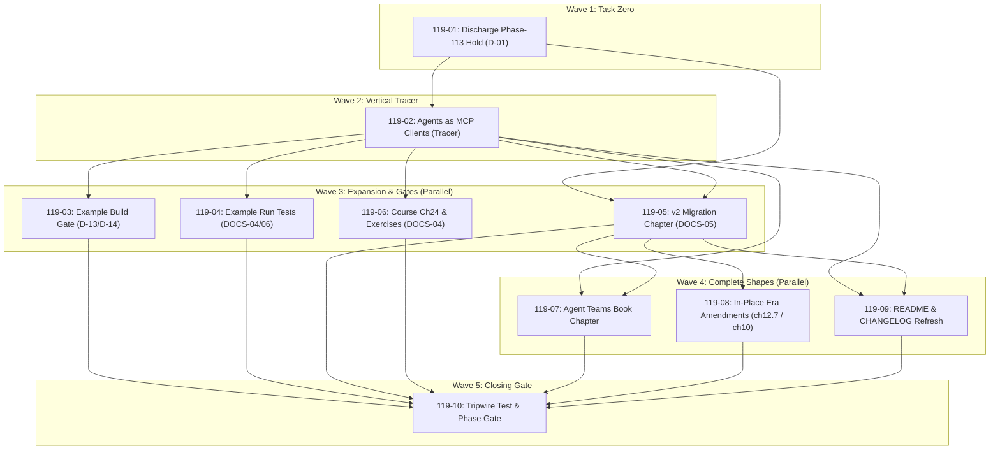

# Cross-AI Plan Review — Phase 119

## Codex Review

## Summary

The plans are unusually well-researched and broadly achieve DOCS-04/05/06, with strong source grounding, negative controls, and careful treatment of the one-way Phase-113 discharge. However, I would not execute them unchanged. There are two material dependency errors, an unbounded child-process harness that can hang CI indefinitely, and one verification command that runs long-lived examples despite claiming to “build only.” Several course-book claims also contradict the checked-in configuration. Overall risk is MEDIUM, falling to LOW after those corrections.

## Strengths

- The Phase-113 discharge is grounded in the actual binding procedure. The source explicitly requires both arms before upgrading the verdict and flipping requirements ([113-SPEC-RECHECK.md:367](/Users/guy/Development/mcp/sdk/rust-mcp-sdk/.planning/phases/113-stateless-http-multi-round-trip-elicitation/113-SPEC-RECHECK.md:367), [113-SPEC-RECHECK.md:398](/Users/guy/Development/mcp/sdk/rust-mcp-sdk/.planning/phases/113-stateless-http-multi-round-trip-elicitation/113-SPEC-RECHECK.md:398), [113-SPEC-RECHECK.md:449](/Users/guy/Development/mcp/sdk/rust-mcp-sdk/.planning/phases/113-stateless-http-multi-round-trip-elicitation/113-SPEC-RECHECK.md:449)). Plan 119-01 reruns both arms, checks PR #2678, stops on blob drift, and preserves the separate TASK-01..06 hold. That is the right safety model.

- The eleven-checkbox scope is precise. The current ledger contains exactly the eight held HTTP requirements and three held CLNT requirements named by the plan ([REQUIREMENTS.md:36](/Users/guy/Development/mcp/sdk/rust-mcp-sdk/.planning/REQUIREMENTS.md:36), [REQUIREMENTS.md:911](/Users/guy/Development/mcp/sdk/rust-mcp-sdk/.planning/REQUIREMENTS.md:911)); TASK-01..06 are separately held ([REQUIREMENTS.md:105](/Users/guy/Development/mcp/sdk/rust-mcp-sdk/.planning/REQUIREMENTS.md:105)). The plan’s regex selects the intended eleven.

- The authorized HTTP-08 edits are real and correctly bounded. The governing record authorizes the citation correction, second-arm satisfaction note, and `resources.subscribe` clarification while explicitly forbidding an HTTP-07 wording change ([113-SPEC-RECHECK.md:552](/Users/guy/Development/mcp/sdk/rust-mcp-sdk/.planning/phases/113-stateless-http-multi-round-trip-elicitation/113-SPEC-RECHECK.md:552)).

- The example-gate repair addresses a genuine false green. The current Makefile suppresses diagnostics and treats compilation failure as “skipped” ([Makefile:255](/Users/guy/Development/mcp/sdk/rust-mcp-sdk/Makefile:255)). It is also genuinely part of the normal quality gate through `test-all` ([Makefile:490](/Users/guy/Development/mcp/sdk/rust-mcp-sdk/Makefile:490), [Makefile:802](/Users/guy/Development/mcp/sdk/rust-mcp-sdk/Makefile:802)). Baseline-first plus two negative controls is a sound approach.

- The plan correctly distinguishes build verification from behavioral verification. Existing process support already fails on missing binaries, checks staleness, and reaps socket children through `Drop` ([example_process.rs:62](/Users/guy/Development/mcp/sdk/rust-mcp-sdk/tests/common/example_process.rs:62), [example_process.rs:84](/Users/guy/Development/mcp/sdk/rust-mcp-sdk/tests/common/example_process.rs:84), [example_process.rs:114](/Users/guy/Development/mcp/sdk/rust-mcp-sdk/tests/common/example_process.rs:114)).

- The Tasks documentation is aligned with shipped code while preserving the upstream hold. The extension key and provisionality are explicit in source ([capabilities.rs:300](/Users/guy/Development/mcp/sdk/rust-mcp-sdk/src/types/capabilities.rs:300), [capabilities.rs:337](/Users/guy/Development/mcp/sdk/rust-mcp-sdk/src/types/capabilities.rs:337)); `tasks/list` retirement and its security rationale are documented in code ([tasks.rs:579](/Users/guy/Development/mcp/sdk/rust-mcp-sdk/src/types/tasks.rs:579)); and the complete per-era method sets include the often-missed `tasks/result` retirement ([tools.rs:159](/Users/guy/Development/mcp/sdk/rust-mcp-sdk/src/types/tools.rs:159)).

- D-16’s transport correction targets a real contradiction. The book currently describes statelessness as a construction-time configuration and states `Last-Event-Id` support without an era qualifier ([ch10-transports.md:184](/Users/guy/Development/mcp/sdk/rust-mcp-sdk/pmcp-book/src/ch10-transports.md:184), [ch10-transports.md:257](/Users/guy/Development/mcp/sdk/rust-mcp-sdk/pmcp-book/src/ch10-transports.md:257), [ch10-transports.md:572](/Users/guy/Development/mcp/sdk/rust-mcp-sdk/pmcp-book/src/ch10-transports.md:572)). The fenced-code digest is a good minimal-touch enforcement mechanism.

- The migration chapter uses the correct client API and corrected no-auto-probe anchors. The explicit selection API and prohibition are at [src/client/mod.rs:5146](/Users/guy/Development/mcp/sdk/rust-mcp-sdk/src/client/mod.rs:5146) and [src/client/mod.rs:5190](/Users/guy/Development/mcp/sdk/rust-mcp-sdk/src/client/mod.rs:5190).

- The disclosure tripwire design is strong: derive from the ledger, require a nonempty selection, avoid `include_str!`, and test both “citation removed” and “new marked entry” cases. The excluded-tree guard has a real in-tree precedent ([v2_conformance_pin.rs:94](/Users/guy/Development/mcp/sdk/rust-mcp-sdk/tests/v2_conformance_pin.rs:94)), and both source trees are excluded from packages ([Cargo.toml:31](/Users/guy/Development/mcp/sdk/rust-mcp-sdk/Cargo.toml:31), [Cargo.toml:82](/Users/guy/Development/mcp/sdk/rust-mcp-sdk/Cargo.toml:82)).

## Concerns

- **HIGH — The new run-to-completion helper has no timeout.** Plan 119-02 specifies a plain `Command::output()` call ([119-02-PLAN.md:127](/Users/guy/Development/mcp/sdk/rust-mcp-sdk/.planning/phases/119-documentation-three-shapes-v2-migration/119-02-PLAN.md:127)). Plans 119-02 and 119-04 then use it for five subprocess runs, including both socket clients ([119-04-PLAN.md:187](/Users/guy/Development/mcp/sdk/rust-mcp-sdk/.planning/phases/119-documentation-three-shapes-v2-migration/119-04-PLAN.md:187)). A regression that deadlocks or waits forever will hang the integration suite indefinitely. The existing socket harness deliberately bounds readiness and teardown ([example_process.rs:226](/Users/guy/Development/mcp/sdk/rust-mcp-sdk/tests/common/example_process.rs:226)); the new helper loses that property.

- **HIGH — Plan 119-08 uses `cargo run` for long-lived server/agent examples while claiming “build only.”** Its acceptance criterion invokes `cargo run --example s50_v2_tasks_server` and `cargo run --example s51_v2_tasks_agent` ([119-08-PLAN.md:163](/Users/guy/Development/mcp/sdk/rust-mcp-sdk/.planning/phases/119-documentation-three-shapes-v2-migration/119-08-PLAN.md:163)). `cargo run` does not stop after building; a server example can block indefinitely. The plan’s closing verification correctly uses `cargo build`, so the acceptance criterion is internally inconsistent.

- **MEDIUM — Plan 119-06 has a missing dependency on 119-04.** It depends only on 119-02, yet instructs the executor to read `tests/docs04_examples_run.rs` “as written by plans 119-02 and 119-04” and make exercise predicates match the additional banners ([119-06-PLAN.md:164](/Users/guy/Development/mcp/sdk/rust-mcp-sdk/.planning/phases/119-documentation-three-shapes-v2-migration/119-06-PLAN.md:164)). Plans 119-04 and 119-06 are both Wave 3, so they may execute concurrently. The required two additional test legs may not exist when 119-06 runs.

- **MEDIUM — Plan 119-09 also consumes Wave-3 output without depending on it.** It depends on 119-02 and 119-05, but its example-command cross-check reads both run-test files “as written by plans 119-02 and 119-04” ([119-09-PLAN.md:151](/Users/guy/Development/mcp/sdk/rust-mcp-sdk/.planning/phases/119-documentation-three-shapes-v2-migration/119-09-PLAN.md:151)). Although the build commands independently verify most invocations, the stated character-for-character test consistency cannot be guaranteed without a 119-04 dependency.

- **MEDIUM — Plan 119-04 claims freshness through 119-03 without depending on it.** The plan says the repaired `test-examples` gate is the path guaranteeing fresh binaries, but depends only on 119-02 ([119-04-PLAN.md:6](/Users/guy/Development/mcp/sdk/rust-mcp-sdk/.planning/phases/119-documentation-three-shapes-v2-migration/119-04-PLAN.md:6)). Its direct verify commands build the relevant binaries, so the task itself can pass safely, but its quality-gate reasoning is false under Wave-3 parallel execution.

- **MEDIUM — The staleness guard remains materially weak for two of three DOCS-04 legs.** It only checks root `examples/<name>.rs` and root `src/` ([example_process.rs:156](/Users/guy/Development/mcp/sdk/rust-mcp-sdk/tests/common/example_process.rs:156)). Changes under `crates/pmcp-agent/src/` or `crates/pmcp-team-servers/src/` are invisible. Merely documenting this limitation does not satisfy the plan’s stronger claim that tests prove the cited non-root examples against current source. The explicit build-before-test commands mitigate direct execution, but isolated or reordered test runs remain vulnerable.

- **LOW — The course-book configuration is repeatedly described incorrectly.** Plans 119-02 and 119-06 state that `pmcp-course/book.toml` has no `create-missing` key ([119-02-PLAN.md:236](/Users/guy/Development/mcp/sdk/rust-mcp-sdk/.planning/phases/119-documentation-three-shapes-v2-migration/119-02-PLAN.md:236), [119-06-PLAN.md:227](/Users/guy/Development/mcp/sdk/rust-mcp-sdk/.planning/phases/119-documentation-three-shapes-v2-migration/119-06-PLAN.md:227)). It explicitly sets `create-missing = true` ([pmcp-course/book.toml:9](/Users/guy/Development/mcp/sdk/rust-mcp-sdk/pmcp-course/book.toml:9)). The behavioral conclusion is still correct—a missing file will not fail the build—but the evidence and validation record would be factually wrong.

- **LOW — `wave_0_complete: true` is semantically premature.** Plan 119-02 sets it while explicitly leaving three Wave-0 requirements unimplemented, including both additional run-test files and the tripwire ([119-02-PLAN.md:302](/Users/guy/Development/mcp/sdk/rust-mcp-sdk/.planning/phases/119-documentation-three-shapes-v2-migration/119-02-PLAN.md:302), [119-02-PLAN.md:323](/Users/guy/Development/mcp/sdk/rust-mcp-sdk/.planning/phases/119-documentation-three-shapes-v2-migration/119-02-PLAN.md:323)). That makes the flag misleading unless “Wave 0” is redefined to mean only framework/tooling availability.

- **LOW — The plans do not encode the repository’s mandatory PMAT-proxy write workflow.** They repeatedly instruct executors to use generic `Edit`/`Write`, while the repository instructions require all code changes through the PMAT quality-gate proxy. This is process noncompliance even though the closing `make quality-gate` is thorough.

## Suggestions

1. Change `run_example_to_completion` to a bounded API, for example:

   ```rust
   run_example_to_completion(rel_path, args, timeout) -> Output
   ```

   Spawn with piped streams, drain them safely, kill and reap on timeout, and include captured partial output in the failure. Give each leg an explicit budget.

2. Replace both Plan 119-08 acceptance commands with:

   ```bash
   cargo build --example s50_v2_tasks_server
   cargo build --example s51_v2_tasks_agent
   ```

3. Fix dependencies:

   - `119-04` should depend on `119-03` if its quality-gate/freshness argument is retained.
   - `119-06` should depend on `119-04`.
   - `119-09` should depend on `119-04`.
   - Consider the same dependency for `119-07` if its “canonical invocation adopted in 119-04” language remains normative.

4. Generalize staleness checking now rather than documenting the weakness. Pass the owning manifest/source roots into the helper, or derive package/example paths through `cargo metadata`.

5. Correct every course-book statement to: “`pmcp-course/book.toml` explicitly sets `create-missing = true`.” Preserve the explicit `test -f` check; that part is still necessary.

6. Move the one-way approval in 119-01 to after Task 1 has captured live arm-1/arm-2 evidence but before Tasks 2–3 mutate the ledgers. That makes the checkpoint an informed authorization over the current run rather than an advance authorization contingent on future measurements.

7. Keep `wave_0_complete` false until all items labeled Wave 0 are present, or rename the field/section to `framework_ready`.

8. Add the required PMAT quality-proxy and contract-compliance steps explicitly to every plan that writes Rust, shell, or Makefile content.

## Risk Assessment

**Overall risk: MEDIUM.**

The documentation structure, source grounding, Phase-113 discharge, sentinel/tripwire design, and final phase gate are strong. The plans should achieve DOCS-04/05/06 once executed. The main blockers are operational rather than conceptual: unbounded subprocesses can hang CI, one acceptance criterion will run blocking examples, and same-wave consumers lack declared dependencies. Those are straightforward to fix, after which the plan set would be LOW risk.

---

## Gemini Review

# Cross-AI Plan Review: Phase 119 — Documentation (Three Shapes + v2 Migration)

**Repository:** `/Users/guy/Development/mcp/sdk/rust-mcp-sdk`  
**Review Target:** Plans [`119-01-PLAN.md`](file:///Users/guy/Development/mcp/sdk/rust-mcp-sdk/.planning/phases/119-documentation-three-shapes-v2-migration/119-01-PLAN.md) through [`119-10-PLAN.md`](file:///Users/guy/Development/mcp/sdk/rust-mcp-sdk/.planning/phases/119-documentation-three-shapes-v2-migration/119-10-PLAN.md) across Waves 1–5  
**Requirements Evaluated:** `DOCS-04`, `DOCS-05`, `DOCS-06` (plus Phase-113 hold discharge `D-01` flipping `HTTP-01..08`, `CLNT-01/02/05`)  
**Verdict:** **APPROVED (HIGH CONFIDENCE)** — The plan package is complete, rigorously anchored to measured codebase realities, and enforces Toyota Way quality gates with executable negative controls and automated tripwires.

---

## 1. Executive Summary & Core Strengths

Phase 119 executes a comprehensive documentation overhaul following the SDK's **Three-Shapes Rule** (`pmcp-book` + runnable examples + `pmcp-course`/`README`), leading with the `cargo pmcp` workflow, while simultaneously establishing a strict example compilation gate, writing automated example run tests, and discharging the Phase-113 upstream schema hold.

### Key Architectural Strengths

1. **Tracer-First Execution ([`119-02-PLAN.md`](file:///Users/guy/Development/mcp/sdk/rust-mcp-sdk/.planning/phases/119-documentation-three-shapes-v2-migration/119-02-PLAN.md)):** Establishes a thin vertical slice of the entire three-shapes pipeline (helper → test binary → book chapter → nav insertion & re-parenting → README section → `mdbook build`) before any parallel expansion plans execute.
2. **Defensive Gate Baselining ([`119-03-PLAN.md`](file:///Users/guy/Development/mcp/sdk/rust-mcp-sdk/.planning/phases/119-documentation-three-shapes-v2-migration/119-03-PLAN.md)):** Strictly baselines pre-existing build failures (such as `examples/26-server-tester`'s 8 errors) in [`deferred-items.md`](file:///Users/guy/Development/mcp/sdk/rust-mcp-sdk/.planning/phases/119-documentation-three-shapes-v2-migration/deferred-items.md) **before** replacing the lenient `Makefile` `test-examples` target with a strict exit-1 runner (`scripts/run-example-builds.sh`).
3. **Execution-Based Proofs ([`119-04-PLAN.md`](file:///Users/guy/Development/mcp/sdk/rust-mcp-sdk/.planning/phases/119-documentation-three-shapes-v2-migration/119-04-PLAN.md)):** Rejects build-only checks for the six gated [`D-15`](file:///Users/guy/Development/mcp/sdk/rust-mcp-sdk/.planning/phases/119-documentation-three-shapes-v2-migration/119-CONTEXT.md#L182) examples. Implements real subprocess execution and port lifecycle assertions (`tests/docs04_examples_run.rs` and `tests/docs06_v2_examples_run.rs`).
4. **Anti-Rot Dynamic Tripwires ([`119-10-PLAN.md`](file:///Users/guy/Development/mcp/sdk/rust-mcp-sdk/.planning/phases/119-documentation-three-shapes-v2-migration/119-10-PLAN.md)):** Enforces disclosure synchronization between [`.planning/WINDOWS.md`](file:///Users/guy/Development/mcp/sdk/rust-mcp-sdk/.planning/WINDOWS.md) and the migration guide by dynamically deriving the expected entry set from a `[CONSUMER-OBSERVABLE]` sentinel (safely bypassing the frozen `KINDS` enum and whitelisted JSON projection of `gsd-tools windows`).
5. **Rigorous Invariant Verification:** Uses automated negative controls (verifying `mdbook build` fails on missing files, `make test-examples` fails on syntax errors, and the disclosure tripwire fails on missing citations) and fenced-code SHA-256 digests in [`pmcp-book/src/ch10-transports.md`](file:///Users/guy/Development/mcp/sdk/rust-mcp-sdk/pmcp-book/src/ch10-transports.md) to guarantee zero unintentional code-block regressions.

---

## 2. Requirements & Scope Traceability Matrix

| Requirement / Decision | Plan(s) | Delivered Artifacts & Mechanisms | Status |
|---|---|---|---|
| **Task Zero (`D-01`)** | [`119-01`](file:///Users/guy/Development/mcp/sdk/rust-mcp-sdk/.planning/phases/119-documentation-three-shapes-v2-migration/119-01-PLAN.md) | Re-runs Schema Arm 1 & Conformance Arm 2; upgrades [`113-SPEC-RECHECK.md`](file:///Users/guy/Development/mcp/sdk/rust-mcp-sdk/.planning/phases/113-stateless-http-multi-round-trip-elicitation/113-SPEC-RECHECK.md) verdict to `PUBLISHED-CONFIRMED`; flips 11 `HTTP/CLNT` requirements in [`.planning/REQUIREMENTS.md`](file:///Users/guy/Development/mcp/sdk/rust-mcp-sdk/.planning/REQUIREMENTS.md); applies 3 authorized text corrections. | Complete & Guarded |
| **DOCS-04 (Book)** | [`119-02`](file:///Users/guy/Development/mcp/sdk/rust-mcp-sdk/.planning/phases/119-documentation-three-shapes-v2-migration/119-02-PLAN.md), [`119-07`](file:///Users/guy/Development/mcp/sdk/rust-mcp-sdk/.planning/phases/119-documentation-three-shapes-v2-migration/119-07-PLAN.md) | `ch12-15-agents-as-mcp-clients.md`, `ch12-16-agent-teams.md`, and re-parents [`ch17-04-sampling-hosting.md`](file:///Users/guy/Development/mcp/sdk/rust-mcp-sdk/pmcp-book/src/ch17-04-sampling-hosting.md) under 12.15 in [`pmcp-book/src/SUMMARY.md`](file:///Users/guy/Development/mcp/sdk/rust-mcp-sdk/pmcp-book/src/SUMMARY.md). | Complete |
| **DOCS-04 (Course)** | [`119-06`](file:///Users/guy/Development/mcp/sdk/rust-mcp-sdk/.planning/phases/119-documentation-three-shapes-v2-migration/119-06-PLAN.md) | `pmcp-course/src/part8-advanced/ch24-agents-and-teams.md` (~440 LOC) + `ch24-exercises.md` (~220 LOC) matching Chapter 23 depth. | Complete |
| **DOCS-04 (README)** | [`119-02`](file:///Users/guy/Development/mcp/sdk/rust-mcp-sdk/.planning/phases/119-documentation-three-shapes-v2-migration/119-02-PLAN.md), [`119-09`](file:///Users/guy/Development/mcp/sdk/rust-mcp-sdk/.planning/phases/119-documentation-three-shapes-v2-migration/119-09-PLAN.md) | Adds `## Agents & Teams` section leading with `cargo pmcp agent new/dev` and `team dev`; extends `## Examples` block. | Complete |
| **DOCS-05 (Migration Guide)** | [`119-05`](file:///Users/guy/Development/mcp/sdk/rust-mcp-sdk/.planning/phases/119-documentation-three-shapes-v2-migration/119-05-PLAN.md) | `pmcp-book/src/ch12-17-migrating-to-mcp-2026-07-28.md` organized by role (Server / Client / Agent); covers Lambda and `PMCP_REQUEST_STATE_KEY` / `_PREVIOUS`; links [`docs/v1-sunset-policy.md`](file:///Users/guy/Development/mcp/sdk/rust-mcp-sdk/docs/v1-sunset-policy.md); consolidates behavior changes (Windows 12, 13, 19, 20, 23). | Complete |
| **DOCS-05 (Tasks Delta)** | [`119-08`](file:///Users/guy/Development/mcp/sdk/rust-mcp-sdk/.planning/phases/119-documentation-three-shapes-v2-migration/119-08-PLAN.md) | Additive `## Era delta (v1 vs v2)` in [`pmcp-book/src/ch12-7-tasks.md`](file:///Users/guy/Development/mcp/sdk/rust-mcp-sdk/pmcp-book/src/ch12-7-tasks.md) with security rationale for `tasks/list` removal and explicit upstream `draft/` provisionality callout. | Complete |
| **DOCS-05 (Transports)** | [`119-08`](file:///Users/guy/Development/mcp/sdk/rust-mcp-sdk/.planning/phases/119-documentation-three-shapes-v2-migration/119-08-PLAN.md) | In-place era callouts in `ch10-transports.md` & `ch10-03-streamable-http.md`; SHA-256 fenced code digest assertion ensures zero code block edits. | Complete |
| **DOCS-06 (Examples Harness)** | [`119-03`](file:///Users/guy/Development/mcp/sdk/rust-mcp-sdk/.planning/phases/119-documentation-three-shapes-v2-migration/119-03-PLAN.md), [`119-04`](file:///Users/guy/Development/mcp/sdk/rust-mcp-sdk/.planning/phases/119-documentation-three-shapes-v2-migration/119-04-PLAN.md) | Strict `make test-examples` across all workspace crates; `tests/docs06_v2_examples_run.rs` executes `s47_v2_stateless_mrtr` (port 8161) driven by `s48` and `s53` peer binaries. | Complete |
| **Disclosure Tripwire (`D-03`)** | [`119-05`](file:///Users/guy/Development/mcp/sdk/rust-mcp-sdk/.planning/phases/119-documentation-three-shapes-v2-migration/119-05-PLAN.md), [`119-10`](file:///Users/guy/Development/mcp/sdk/rust-mcp-sdk/.planning/phases/119-documentation-three-shapes-v2-migration/119-10-PLAN.md) | `[CONSUMER-OBSERVABLE]` sentinel prefixed to descriptions in `WINDOWS.md`; `tests/windows_disclosure_tripwire.rs` asserts dynamic derivation and excluded-tree guard. | Complete |

---

## 3. Wave Structure & Dependency Graph Analysis

The 10 plans are distributed across 5 sequential waves:



### Concurrency & Isolation Audit
- **Wave 3 Parallel Execution:** Plans 119-03, 119-04, 119-05, and 119-06 touch strictly disjoint file sets:
  - 119-03: `Makefile`, `scripts/run-example-builds.sh`, `deferred-items.md`
  - 119-04: `tests/docs04_examples_run.rs`, `tests/docs06_v2_examples_run.rs`
  - 119-05: `.planning/WINDOWS.md`, `pmcp-book/src/ch12-17-migrating-to-mcp-2026-07-28.md`, `pmcp-book/src/SUMMARY.md`
  - 119-06: `pmcp-course/src/part8-advanced/ch24-*`, `pmcp-course/src/SUMMARY.md`
- **Wave 4 Parallel Execution:** Plans 119-07, 119-08, and 119-09 touch disjoint file sets:
  - 119-07: `pmcp-book/src/ch12-16-agent-teams.md`, `pmcp-book/src/SUMMARY.md`
  - 119-08: `pmcp-book/src/ch12-7-tasks.md`, `pmcp-book/src/ch10-transports.md`, `pmcp-book/src/ch10-03-streamable-http.md`
  - 119-09: `README.md`, `CHANGELOG.md`
- **Zero Race Conditions:** No two plans in the same wave touch the same file or depend on uncommitted state from peers in the same wave.

---

## 4. Deep-Dive Evaluation of Critical Subsystems

### 4.1. Task Zero & Upstream Schema Corroboration ([`119-01`](file:///Users/guy/Development/mcp/sdk/rust-mcp-sdk/.planning/phases/119-documentation-three-shapes-v2-migration/119-01-PLAN.md))
- **Gate Integrity:** Properly isolates the Schema Arm 1 checks (`schema/2026-07-28` directory presence, SHA-1 blob identity on `main` against [`PROVENANCE.md`](file:///Users/guy/Development/mcp/sdk/rust-mcp-sdk/schema/vendored/core-2026-07-28/PROVENANCE.md), error code `-32020..-32022` constants, HTTP-400 mappings, payload interfaces) and re-runs Conformance Arm 2 (`tests/v2_conformance_pin.rs`).
- **Strict Boundary Preservation:** Explicitly enforces that `TASK-01..06` remain `[~]` (due to upstream `modelcontextprotocol/ext-tasks` remaining `draft/` only) and forbids altering `HTTP-07`'s measured wording.

### 4.2. Example Build & Run Gate Architecture ([`119-03`](file:///Users/guy/Development/mcp/sdk/rust-mcp-sdk/.planning/phases/119-documentation-three-shapes-v2-migration/119-03-PLAN.md), [`119-04`](file:///Users/guy/Development/mcp/sdk/rust-mcp-sdk/.planning/phases/119-documentation-three-shapes-v2-migration/119-04-PLAN.md))
- **Fixing the Swallow Defect:** Replaces the old `Makefile:255` loop (`2>/dev/null` + `skipped`) with `scripts/run-example-builds.sh`, surfacing compiler errors and preserving exit codes.
- **Widened Scope:** Extends coverage from `examples/*.rs` to include `crates/pmcp-agent/examples/` and `crates/pmcp-team-servers/examples/`.
- **Subprocess Harness Discipline:** 
  - Uses `run_example_to_completion` with captured stdout for self-contained examples (`s49`, `s50`, `doc_review_team`).
  - Uses `spawn_example` + `wait_until_listening` + `ChildGuard` drop reap + `wait_until_released` for socket legs (`s47` on port 8161 driven by `s48` and `s53`).
  - Incorporates `assert_binary_is_not_stale` to eliminate target cache desynchronization.

### 4.3. Navigation & Preprocessor Quirks ([`119-02`](file:///Users/guy/Development/mcp/sdk/rust-mcp-sdk/.planning/phases/119-documentation-three-shapes-v2-migration/119-02-PLAN.md), [`119-06`](file:///Users/guy/Development/mcp/sdk/rust-mcp-sdk/.planning/phases/119-documentation-three-shapes-v2-migration/119-06-PLAN.md))
- **Asymmetric Build Failures:** Handles `pmcp-book` (`create-missing = false` → build fails on missing file) vs `pmcp-course` (no `create-missing` key → silently renders blank page) by enforcing explicit `test -f` assertions for course chapters.
- **Preprocessor Side-Effect Guard:** Flags assumption `A-02`: `mdbook-exercises` overwrites `pmcp-course/src/theme/exercises.css` and `.js` upon build; requires `git diff --quiet -- pmcp-course/src/theme/` and rollback before commit.

### 4.4. Security & Cryptographic Guidance ([`119-05`](file:///Users/guy/Development/mcp/sdk/rust-mcp-sdk/.planning/phases/119-documentation-three-shapes-v2-migration/119-05-PLAN.md))
- **AEAD Key Deployment:** Documents `PMCP_REQUEST_STATE_KEY` and `PMCP_REQUEST_STATE_KEY_PREVIOUS` in the server track, explaining multi-instance load balancer coherence and rotation semantics.
- **Zero Copy-Paste Weak Keys:** Prohibits printing static example keys in documentation, mandating CSPRNG generation commands (`openssl rand -base64 32`).

---

## 5. Verification & Threat Mitigation Review

### 5.1. Negative Controls Audit
Every critical gate in the plan includes an explicit negative control step:
1. `mdbook build` structural gate: Deliberately appends a missing chapter target to `SUMMARY.md`, observes non-zero exit, then reverts (Plan 119-02 Task 2).
2. Strict `make test-examples`: Deliberately injects syntax errors into a root example and a crate example, observes exit code 1 with visible `rustc` diagnostic, then reverts (Plan 119-03 Task 3).
3. Disclosure tripwire: Deliberately deletes a citation from Chapter 12.17 (Control A) and marks an un-cited entry in `WINDOWS.md` (Control B), observing exit failure in both cases before reverting (Plan 119-10 Task 2).

### 5.2. Selector Pitfall Defenses
All plan `<verify>` and test execution steps explicitly forbid `cargo nextest run -E 'test(...)'` (which silently selects 0 tests and exits 0 on pattern miss) in favor of `binary(...)` filters with strict non-zero count assertions.

---

## 6. Minor Observations & Implementation Notes

During execution, the implementing agents should keep the following minor nuances in mind:

1. **`doc_review_team` Citation Consistency:** `crates/pmcp-team-servers/examples/doc_review_team.rs:24` header notes `--all-features`, but `Cargo.toml:161-163` only requires `--features runtime`. The plan correctly standardizes on `--features runtime` across tests, course, and book without mutating the example source file (conforming to `D-12`).
2. **`Client` Auto-Probe Lock Line Cites:** CONTEXT.md originally cited `src/client/mod.rs:871-878` (sampling capability sync). The plan correctly cites the real D-08 lock comments at [`src/client/mod.rs:1101`](file:///Users/guy/Development/mcp/sdk/rust-mcp-sdk/src/client/mod.rs#L1101) and [`:5153`](file:///Users/guy/Development/mcp/sdk/rust-mcp-sdk/src/client/mod.rs#L5153).
3. **Crate Version Reference:** `Cargo.toml` is currently `version = "2.18.0"`. `README.md` and `CHANGELOG.md` edits in Plan 119-09 correctly reflect `2.18.0` as published and `2.19.0` as in-flight unreleased.

---

## 7. Review Conclusion & Recommendation

The implementation plan for Phase 119 is **exceptionally thorough, structurally sound, and fully compliant with project standards and user decisions**. 

Execution can proceed starting with **Wave 1 ([`119-01-PLAN.md`](file:///Users/guy/Development/mcp/sdk/rust-mcp-sdk/.planning/phases/119-documentation-three-shapes-v2-migration/119-01-PLAN.md))**.

---

## Consensus Summary

The two reviewers diverged more than they agreed, so this summary is not a vote count.
Codex ran source-grounded and produced `file:line` evidence; Gemini returned an
`APPROVED (HIGH CONFIDENCE)` verdict that largely restates the plans' own claims and
asserts two things that are false against the checked-in tree (detailed under Divergent
Views). Every finding below was **independently re-verified against source** during this
review; the verification result is recorded per item, and severities are this review's,
not the reviewers' where they differ.

This is the third recorded instance of the same pattern on this project (Phases 116, 118,
now 119): a checker/reviewer that does not read source approves a plan set carrying real
defects. Weight the source-reading lane accordingly.

### Agreed Strengths

Both reviewers independently credited these, and each holds up under checking:

- **The Phase-113 discharge (119-01) is correctly gated.** Both arms must run before the
  verdict upgrade; `TASK-01..06` stay held under a different trigger; `HTTP-07` wording is
  explicitly frozen. Verified: the eleven `[~]` requirements the plan names are exactly the
  ones present at `.planning/REQUIREMENTS.md:36-58` and `:911-915`.
- **The example-gate repair (119-03) targets a genuine false green.** Verified at
  `Makefile:255-267`: the loop pipes `rustc` stderr to `/dev/null` and reports a build
  failure as a yellow "skipped", never setting a non-zero exit. It is load-bearing —
  `quality-gate` → `test-all` (`Makefile:490`) → `test-examples`, so the strictness change
  is felt on every gate run. Plan 119-03's `<reversibility rating="costly">` is well-judged.
- **Baseline-before-tighten ordering (D-14 before D-13).** 119-03 commits the measured
  baseline in its own commit, verified by `git log --oneline -1` excluding `Makefile`
  (`119-03-PLAN.md:142`), so the first red cannot be misattributed to this phase.
- **The disclosure tripwire (119-10) is derived, not enumerated.** It forbids a
  `const IDS: [u32; 5]`, forbids `include_str!`, and requires a non-empty selection.
  Verified: `.planning/` (`Cargo.toml:82`) and `pmcp-book/` (`Cargo.toml:31`) are both in
  the package `exclude` array, so the plan's "apply the guard shape twice" instruction is
  correct, and four test files are already excluded on the same precedent.
- **The nextest selector trap is encoded, not repeated.** Plans use `binary(...)` and
  explicitly forbid `test(/.../)`, and require a non-zero test count (`119-04-PLAN.md:372`,
  `119-01-PLAN.md:250-266`). This is the exact defect that bit Phase 114 seven times.
- **Negative controls throughout** — the `mdbook build` structural gate, the strict
  example gate, and the tripwire each have a deliberate-break/observe/revert step.

### Agreed Concerns

Ordered by this review's severity after re-verification.

- **HIGH — 119-06 consumes 119-04's output but runs in the same wave (VERIFIED, real race).**
  `119-06-PLAN.md:170` tells the executor to read `tests/docs04_examples_run.rs` "as written
  by plans 119-02 and 119-04", and its acceptance criteria at `:212-213` require the
  Exercise 2/3 pass predicates to name the same banners that test asserts for
  `s50_standalone_vs_sampled` and `doc_review_team`. Per the phase manifest
  (`119-01-PLAN.md`), `doc_review_team_runs_to_completion` is created by **119-04**. Both
  plans declare `wave: 3` and 119-06 declares `depends_on: ["119-02"]` only — so nothing
  orders them. Codex rated this MEDIUM; it is HIGH, because unlike the other dependency
  gaps below there is no wave barrier to save it. **Fix: add `119-04` to 119-06's
  `depends_on`, or move 119-06 to wave 4.**

- **HIGH — `run_example_to_completion` is specified with no timeout (VERIFIED).**
  `119-02-PLAN.md:127-131` specifies `Command::output()`, which blocks until the child
  exits. Five legs across 119-02 and 119-04 use it, including socket-driving clients. A
  deadlocked or non-terminating example hangs the integration suite indefinitely rather
  than failing. The existing harness deliberately bounds its socket paths
  (`tests/common/example_process.rs:226`); the new helper drops that property.
  **Fix: give it an explicit per-leg timeout, kill and reap on expiry, and surface captured
  partial output in the failure message.**

- **HIGH — 119-08's acceptance criterion contradicts itself (VERIFIED).**
  `119-08-PLAN.md:163` reads: "`cargo run --example s50_v2_tasks_server` and
  `cargo run --example s51_v2_tasks_agent` both BUILD without a feature flag (build only;
  do not require a full run)". `cargo run` builds *and runs*; `examples/s50_v2_tasks_server.rs`
  is a server. The plan's own closing verification correctly uses `cargo build`.
  **Fix: change both to `cargo build --example ...`.**

- **MEDIUM — a false statement the executor is instructed to "confirm" (VERIFIED, and worse
  than reported).** `119-02-PLAN.md:236` and `119-06-PLAN.md:227` both direct the executor
  to "confirm it carries NO `create-missing` key" in `pmcp-course/book.toml`. The file
  explicitly sets `create-missing = true` at `pmcp-course/book.toml:11`.
  **Neither reviewer carried this to its consequence:** `create-missing = true` does not
  "silently render a blank page" as `119-02-PLAN.md:253-255` claims — mdbook **creates the
  missing file inside `pmcp-course/src/`**. So 119-02 Task 2's negative control, which
  appends a throwaway missing target to the course `SUMMARY.md` and builds, will leave a
  stray untracked `.md` behind. Its cleanup covers only `pmcp-course/src/theme/` and the two
  `SUMMARY.md` files, and its `<automated>` verify is `git diff --quiet`, which **cannot see
  untracked files**. The leak is silent.
  **Fix: correct both statements to `create-missing = true`; make the course control assert
  the created file's path and delete it; add `git status --porcelain pmcp-course/src` (or
  `--porcelain --untracked-files=all`) to the verify.**

- **LOW (metadata, not a live race) — three further `depends_on` gaps.** Codex rated these
  MEDIUM; re-verification downgrades them, because the wave barrier already orders them:
  119-09 (`:152`) and 119-07 (`:224`) both consume 119-04 output but are **wave 4**, and
  119-04 is wave 3. Same for 119-04's freshness argument referencing 119-03 (both wave 3,
  but 119-04's own verify builds the binaries it needs). Still worth fixing so the
  `depends_on` graph is honest and survives any future re-waving.

- **LOW — the staleness guard is weaker than its name suggests, but the plan says so.**
  Verified at `tests/common/example_process.rs:156-167`: `assert_binary_is_not_stale`
  considers only root `examples/<name>.rs` and root `src/`, so edits under
  `crates/pmcp-agent/src/` or `crates/pmcp-team-servers/src/` are invisible. Codex flagged
  this as an unmet claim; in fairness `119-02-PLAN.md:131-137` already instructs the
  executor to document the limitation rather than inherit it silently. Generalizing it
  (via `cargo metadata`) is a genuine improvement, not a correction.

- **LOW — `wave_0_complete: true` is set while Wave-0 items remain open**
  (`119-02-PLAN.md:302,323`). Either keep it false until the run-test files and tripwire
  exist, or rename the field to something like `framework_ready`.

- **LOW — CLAUDE.md's PMAT quality-proxy write workflow is not encoded in the plans.**
  Raised only by Codex. Real against the letter of the project standard; the closing
  `make quality-gate` is thorough, so treat as process hygiene rather than a blocker.

### Divergent Views

The reviewers did not disagree about a judgement call — one of them was checkably wrong
twice, and both errors point the same way (toward under-detecting risk).

- **`pmcp-course/book.toml`: RESOLVED IN CODEX'S FAVOUR.** Gemini §4.3 states the course
  book has "no `create-missing` key"; Codex states it sets `create-missing = true`.
  Verified directly: `pmcp-course/book.toml:11` is `create-missing = true`. Gemini
  reproduced the plans' own error instead of catching it — which is the failure mode that
  makes an approving review from a non-source-reading lane unsafe to rely on. (For contrast,
  `pmcp-book/book.toml:14` is `create-missing = false  # Prevent accidental file creation`,
  so the book/course asymmetry the plans rely on is real; only its mechanism is misstated.)

- **"Zero Race Conditions": REFUTED.** Gemini §3 asserts "No two plans in the same wave
  touch the same file or depend on uncommitted state from peers in the same wave." The
  first half is true — wave-3 and wave-4 file sets are disjoint, as Gemini enumerates. The
  second half is false: 119-06 depends on 119-04's uncommitted test content within wave 3
  (see the HIGH finding above). Gemini checked file overlap and reported it as if it were
  content dependency.

- **Overall verdict.** Gemini: `APPROVED (HIGH CONFIDENCE)`, proceed with Wave 1. Codex:
  `MEDIUM`, "I would not execute them unchanged". This review sides with Codex. The plan
  set is strong — genuinely well-researched, with real negative controls and a correctly
  gated one-way requirement flip — but three HIGH items should be fixed before execution,
  and two of them (the wave-3 race and the `cargo run` server invocation) will surface as a
  hang or a mismatch during execution rather than as a clean failure.

### Recommended Action

Fix before executing Wave 1 — all are small, local edits to plan text:

1. `119-06-PLAN.md` — add `119-04` to `depends_on` (or move to wave 4). *(blocking)*
2. `119-08-PLAN.md:163` — `cargo run` → `cargo build`. *(blocking)*
3. `119-02-PLAN.md:127-131` — give `run_example_to_completion` a bounded timeout. *(blocking)*
4. `119-02-PLAN.md:236,253-255` and `119-06-PLAN.md:227` — correct the `create-missing`
   statement; add stray-file cleanup and an untracked-file check to the course negative
   control.
5. `119-04`, `119-07`, `119-09` — complete the `depends_on` graphs.
6. `119-02-PLAN.md` — resolve the `wave_0_complete` semantics.
