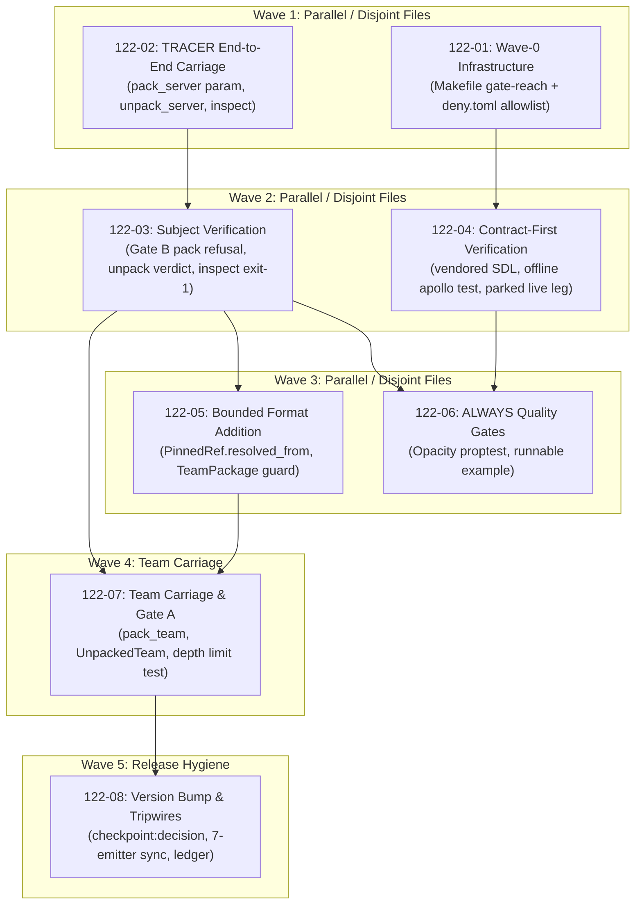

# Cross-AI Plan Review — Phase 122

## Codex Review

## Summary

The plans are unusually thorough, evidence-driven, and largely aligned with the six success criteria. The tracer-first sequencing, explicit gate-reach work, opaque-byte boundary, dual-end subject comparison, and team one-level resolution guard are strong. However, I would not execute the plans unchanged. Four material issues remain: the attestation media type is server-specific but later reused for teams; the promised “no writes before subject validation” mechanism is not actually designed against the current write-first OCI API; the parked live test may be only a contract-shaped stub rather than an executable remote verification leg; and the plans omit the repository-mandated provable-contract YAML workflow. There are also smaller issues around fuzz requirements, the empty-allowlist guard, and version propagation.

## Strengths

- The gate-reach diagnosis is correct and the proposed named-binary guard follows a proven mechanism. The existing `test-cargo-pmcp` runs only `cargo test -p cargo-pmcp --lib` ([Makefile](/Users/guy/Development/mcp/sdk/rust-mcp-sdk/Makefile:283)), while `test-all` currently has no cargo-pmcp integration-test target ([Makefile](/Users/guy/Development/mcp/sdk/rust-mcp-sdk/Makefile:805)). The proposed extractor pattern already distinguishes never-run, truncated, zero-pass, and valid runs in `test-openapi-server` ([Makefile](/Users/guy/Development/mcp/sdk/rust-mcp-sdk/Makefile:503)).

- Media-type-keyed unpacking and duplicate rejection are real existing mechanisms. `index_layers` rejects duplicate media types rather than using last-wins behavior ([unpack.rs](/Users/guy/Development/mcp/sdk/rust-mcp-sdk/crates/pmcp-package/src/oci/unpack.rs:141)), and optional config/spec reads already use media-type lookup ([unpack.rs](/Users/guy/Development/mcp/sdk/rust-mcp-sdk/crates/pmcp-package/src/oci/unpack.rs:380)). The plans correctly build on this rather than introducing positional reads.

- The opaque-byte design matches the existing verbatim-layer pattern. `write_named_file_layer` writes raw bytes and attaches descriptor annotations ([pack.rs](/Users/guy/Development/mcp/sdk/rust-mcp-sdk/crates/pmcp-package/src/oci/pack.rs:163)); `read_named_file_layer` verifies and returns raw bytes without interpreting them ([unpack.rs](/Users/guy/Development/mcp/sdk/rust-mcp-sdk/crates/pmcp-package/src/oci/unpack.rs:209)). Generalizing that helper is appropriate.

- The layer-versus-index annotation distinction is technically sound. Layer descriptor annotations are included before manifest canonicalization ([pack.rs](/Users/guy/Development/mcp/sdk/rust-mcp-sdk/crates/pmcp-package/src/oci/pack.rs:158)), while index annotations are added only after the manifest is written. The plans correctly preserve subject and issuer tamper evidence by placing them on the layer descriptor.

- The proposed soft subject verdict is cleanly separated from integrity verification. Existing blob reads fail closed through digest verification, while `PackageError::DigestMismatch` represents corrupt content ([error.rs](/Users/guy/Development/mcp/sdk/rust-mcp-sdk/crates/pmcp-package/src/error.rs:43)). Keeping a valid-but-wrong subject as inspectable data is coherent and does not require changing `digest::verify`.

- The `PinnedRef` addition follows an established compatibility pattern. `PinnedRef` currently has four required fields ([reference.rs](/Users/guy/Development/mcp/sdk/rust-mcp-sdk/crates/pmcp-package/src/reference.rs:44)); adding `#[serde(default, skip_serializing_if = "Option::is_none")]` can preserve existing canonical fixtures while allowing `Some(range)` to participate in identity.

- The team guard correctly identifies all four direct reference surfaces: entry point, member agents, built-in servers, and finalizers are separate fields on `TeamPackage` ([team.rs](/Users/guy/Development/mcp/sdk/rust-mcp-sdk/crates/pmcp-package/src/package/team.rs:74)). Reusing the `WorkflowManifest::pinned_components` error idiom ([workflow.rs](/Users/guy/Development/mcp/sdk/rust-mcp-sdk/crates/pmcp-package/src/package/workflow.rs:87)) is preferable to a separate guard design.

- The need for `UnpackedTeam` is real. `unpack_team` currently returns only a bare `TeamPackage` ([unpack.rs](/Users/guy/Development/mcp/sdk/rust-mcp-sdk/crates/pmcp-package/src/oci/unpack.rs:447)), so there is otherwise nowhere to expose carried bytes and the subject verdict.

- The no-crypto check correctly targets the resolved dependency graph. `pmcp-package` is workspace-excluded, and the existing standalone gate already requires `--manifest-path` ([Makefile](/Users/guy/Development/mcp/sdk/rust-mcp-sdk/Makefile:1103)). Reusing cargo-deny is materially stronger than inspecting only direct dependencies.

## Concerns

- **HIGH — The team media-type contract is unresolved.** Plan 122-02 introduces `MT_SERVER_ATTESTATION = application/vnd.pmcp.mcp-server.attestation.v1`, but plan 122-07 carries the same mechanism into `TeamPackage`. Existing package media types are deliberately kind-specific: server, agent, team, and workflow each have distinct namespaces ([media_types.rs](/Users/guy/Development/mcp/sdk/rust-mcp-sdk/crates/pmcp-package/src/oci/media_types.rs:91)). A team carrying an `mcp-server` attestation layer is semantically inconsistent and creates a future wire-compatibility problem. The plans need to choose either a kind-neutral `application/vnd.pmcp.attestation.v1` or separate server/team media types before the tracer freezes the spelling.

- **HIGH — Plan 122-03 promises a pre-write check without specifying a feasible implementation.** Every descriptor currently needed to assemble the unattested manifest is produced by a writing operation: binary layers call `write_blob` ([pack.rs](/Users/guy/Development/mcp/sdk/rust-mcp-sdk/crates/pmcp-package/src/oci/pack.rs:185)), typed layers call `write_blob` inside `pack_server` ([pack.rs](/Users/guy/Development/mcp/sdk/rust-mcp-sdk/crates/pmcp-package/src/oci/pack.rs:392)), and `finalize_pack` writes the empty config blob ([pack.rs](/Users/guy/Development/mcp/sdk/rust-mcp-sdk/crates/pmcp-package/src/oci/pack.rs:499)). The plan simultaneously requires a rejected destination to remain unchanged and permits weakening that invariant if writes prove necessary. That conflicts with its must-have truth. A concrete pure descriptor-construction or staging-layout design is required before execution.

- **HIGH — The parked “live leg” is not guaranteed to be an actual live verification test.** Plan 122-04 allows much of the backend expectation to exist as rustdoc and does not clearly require sending an authenticated GraphQL request and decoding a real response once both gates are enabled. Reusing `PMCP_API_URL` only supplies an endpoint, not authentication. Current pmcp.run configuration/authentication uses additional Cognito and GraphQL configuration ([auth.rs](/Users/guy/Development/mcp/sdk/rust-mcp-sdk/cargo-pmcp/src/deployment/targets/pmcp_run/auth.rs:377)). If the test contains no executable request path, unparking still requires writing the client operation, contradicting SC5.

- **HIGH — The mandatory provable-contract-first workflow is missing.** Repository instructions require updating `../provable-contracts/contracts/<crate>/` and running `pmat comply check` before and after implementation ([AGENTS.md](/Users/guy/Development/mcp/sdk/rust-mcp-sdk/AGENTS.md:319)). None of the eight plans owns the relevant YAML or a pre/post compliance check. The GraphQL SDL is a separate platform contract and does not satisfy this repository rule.

- **HIGH — The fuzz requirement is not satisfied as written.** Plan 122-06 asserts that proptest substitutes for fuzzing, but repository instructions list fuzz testing and property testing as separate mandatory feature deliverables. The plan should either add/extend a real fuzz target and gate it appropriately, or obtain an explicit phase-level exception. Merely explaining why the fuzz workspace is inconvenient does not change the requirement.

- **MEDIUM — The empty-allowlist guard is under-specified and easy to implement incorrectly.** The plan says `no-crypto-check` must reject an empty `allow` list, but its suggested shell shape only checks for an `allow = [` line. That also matches `allow = []`. Existing purity checks only guard file presence and compare matching lines ([Makefile](/Users/guy/Development/mcp/sdk/rust-mcp-sdk/Makefile:1087)); they do not solve non-empty TOML-array validation.

- **MEDIUM — Plan 122-06’s filesystem assertion cannot prove “no writes outside the layout.”** Enumerating the layout directory after unpack can prove its contents are expected, but cannot detect a path-traversal write somewhere outside that directory. The current source is safe because annotation values are only returned as data ([unpack.rs](/Users/guy/Development/mcp/sdk/rust-mcp-sdk/crates/pmcp-package/src/oci/unpack.rs:105)); the proposed test mechanism does not independently prove the broader assertion.

- **MEDIUM — Version propagation is not fully enumerated before the checkpoint.** Plan 122-08 bumps `cargo-pmcp` itself in addition to `pmcp-package`, but its file and tripwire inventory is centered on `pmcp-package`. `cargo-pmcp` is currently `0.22.0` ([cargo-pmcp/Cargo.toml](/Users/guy/Development/mcp/sdk/rust-mcp-sdk/cargo-pmcp/Cargo.toml:3)). The plan says to discover any resulting cargo-pmcp pins during implementation; that should be a measured `rg`/metadata inventory before the decision, not reactive work after it.

- **MEDIUM — Plan 122-05’s claimed literal count is stale.** The current repository has eight `PinnedRef` construction sites, including two in `unpack.rs`, one in `workflow.rs`, four tests in `reference.rs`, and one in `pmcp-team-servers`. The plan describes a different count. Compilation will expose omissions, but the documentation and acceptance count should be corrected.

- **MEDIUM — Team carriage duplicates substantial server logic despite the “one mechanism” claim.** `pack_single_layer` currently serializes and writes in one operation ([pack.rs](/Users/guy/Development/mcp/sdk/rust-mcp-sdk/crates/pmcp-package/src/oci/pack.rs:452)), while `unpack_single_layer` enforces exactly one layer ([unpack.rs](/Users/guy/Development/mcp/sdk/rust-mcp-sdk/crates/pmcp-package/src/oci/unpack.rs:412)). Plan 122-07 proposes a bespoke team unpack path and independent unattested-digest reconstruction. Shared primitives for “manifest without attestation,” annotation parsing, verdict construction, and inspect rendering should be explicit to prevent server/team drift.

- **LOW — The plans are substantially over-specified for execution.** Several tasks require multiple deliberate source regressions, temporary renames, temporary dependency additions, and full quality gates. These are useful for critical mechanisms, but the total set is expensive and increases the chance of dirty-worktree mistakes. The strongest negative controls should remain; repetitive ones can be consolidated.

## Suggestions

- Resolve the wire vocabulary before 122-02. Prefer either:

  - `MT_ATTESTATION = application/vnd.pmcp.attestation.v1` shared across server and team, or
  - `MT_SERVER_ATTESTATION` and `MT_TEAM_ATTESTATION` with a shared annotation vocabulary.

  Add cross-kind tests ensuring kind detection remains driven by artifact type and package layer, not the attestation media type.

- Add a Wave-1 design task for pure manifest planning. Introduce a side-effect-free structure such as `PlannedBlob { media_type, bytes, annotations }`, derive descriptors in memory from bytes, validate the subject against the planned unattested manifest, and only then commit blobs/index to `OciLayout`. Use the same planner for server and team. This makes the “no writes on rejection” criterion implementable rather than aspirational.

- Strengthen 122-04 so the ignored test already:

  - obtains credentials through the existing pmcp.run auth seam,
  - sends `VERIFY_ATTESTATION_QUERY`,
  - supplies a fixture payload and locally derived subject,
  - decodes and asserts the proposed response fields.

  Default execution must remain ignored/offline, but enabled execution should be a real request.

- Add a plan task for the required provable-contract YAML and two `pmat comply check` executions. Make 122-02 or 122-04 depend on it so implementation remains genuinely contract-first.

- Either add a real fuzz target for arbitrary descriptor annotations/attestation bytes or add an explicit blocking decision approving a proptest-only exception. Do not silently reinterpret the repository’s fuzz and property requirements as equivalent.

- Parse `deny.toml` structurally for the fail-closed check, or use an `awk` state machine that confirms at least one `{ name = ... }` entry inside `[bans].allow`. Include a self-test for `allow = []`.

- Replace the filesystem claim with a sandbox-parent snapshot: place the layout inside a dedicated temporary parent, snapshot the entire parent recursively, unpack adversarial annotations, and assert only expected layout paths changed. Also retain source-level review that no annotation enters a filesystem API.

- Extract shared helpers before 122-07:

  - `manifest_without_attestation`
  - `attestation_verdict`
  - `read_attestation_layer`
  - common inspect rendering and mismatch detection

  Then server/team paths differ only in their typed package layer and resolution guard.

- Run a complete emitter inventory before the 122-08 checkpoint and put the result in the decision context. Include both `pmcp-package` and `cargo-pmcp` version consumers and generated-template constants.

- Reduce negative controls to one per distinct mechanism: named-test reach, non-empty allowlist, raw-byte opacity, subject re-derivation, and scaffold-version drift. The remaining tests can establish behavior without deliberately mutating working source.

## Risk Assessment

**Overall risk: HIGH until the four high-severity issues are resolved.**

The core architecture is sound and the plans plausibly achieve all six success criteria, but the unresolved team media type would freeze an inconsistent wire contract, the pre-write subject gate currently lacks an implementable design against the write-first API, the parked live leg may not actually be executable, and mandatory contract/fuzz obligations are absent. Once those are corrected, the implementation risk drops to medium: most remaining work extends patterns already present and well tested in the repository.

---

## Gemini Review

> [reviewed-without-source-citations] This reviewer declared source-grounded evidence but cited no file:line source evidence, so it reviewed the pasted plan text only — down-weight its verdict in the Consensus Summary.

# Cross-AI Plan Review: Phase 122 — Attestation Carriage

**Review Target:** Phase 122 Implementation Plans ([`122-01-PLAN.md`](file:///Users/guy/Development/mcp/sdk/rust-mcp-sdk/.planning/phases/122-attestation-carriage-contract-first-parked-on-the-pmcp-run-b/122-01-PLAN.md) through [`122-08-PLAN.md`](file:///Users/guy/Development/mcp/sdk/rust-mcp-sdk/.planning/phases/122-attestation-carriage-contract-first-parked-on-the-pmcp-run-b/122-08-PLAN.md))  
**Target Milestone:** v2.6 AI-Package Portability  
**Requirement Addressed:** [PKGX-01](file:///Users/guy/Development/mcp/sdk/rust-mcp-sdk/.planning/REQUIREMENTS.md#L30) (contract-first attestation carriage & offline verification, parked live leg)  
**Overall Readiness Verdict:** **APPROVED (Exemplary Plan Quality)**

---

## 1. Executive Summary

Phase 122 establishes attestation carriage across `pmcp-package` and `cargo-pmcp` for both server and team packages while preserving the critical **no-crypto boundary** (scoping Decision 1). The phase is structured around a tracer-first strategy across 5 waves and 8 plans.

The planning demonstrates exceptional rigor:
- **Zero-assumption infrastructure:** It discovered and measured a critical gate blind spot ([`122-RESEARCH.md` Pitfall 1](file:///Users/guy/Development/mcp/sdk/rust-mcp-sdk/.planning/phases/122-attestation-carriage-contract-first-parked-on-the-pmcp-run-b/122-RESEARCH.md#L297)), where `cargo-pmcp/tests/*` integration binaries were omitted from all CI gates, and solved it in Wave 0 before touching production code.
- **Architectural discipline:** It enforces opaque layer carriage (no deserialization/parsing of payload bytes), distinct OCI manifest digest semantics (two-digest fact), and soft unpack verdicts (data vs integrity failure).
- **Format integrity:** It implements Cargo-style range resolution preservation ([`PinnedRef.resolved_from`](file:///Users/guy/Development/mcp/sdk/rust-mcp-sdk/.planning/phases/122-attestation-carriage-contract-first-parked-on-the-pmcp-run-b/122-05-PLAN.md#L92-L96)) with zero golden-fixture disruption via `skip_serializing_if`.
- **Ecosystem synchronization:** It coordinates the version bump across all 7 in-repo emitters in a single atomic commit guarded by tripwires and human ratification.

---

## 2. Requirements & Success Criteria Traceability

| Success Criterion | Requirement | Plan & Task Coverage | Verification & Gate Proof | Status |
|---|---|---|---|:---:|
| **SC1**: Vendored contract (`contracts/pmcp-run/attestation-v1.graphql`), offline blocking `apollo_compiler` test, default test gate reach | [PKGX-01](file:///Users/guy/Development/mcp/sdk/rust-mcp-sdk/.planning/REQUIREMENTS.md#L30), [D-07](file:///Users/guy/Development/mcp/sdk/rust-mcp-sdk/.planning/phases/122-attestation-carriage-contract-first-parked-on-the-pmcp-run-b/122-CONTEXT.md#L87-L97), [D-11](file:///Users/guy/Development/mcp/sdk/rust-mcp-sdk/.planning/phases/122-attestation-carriage-contract-first-parked-on-the-pmcp-run-b/122-CONTEXT.md#L99-L109) | [`122-01` Task 1](file:///Users/guy/Development/mcp/sdk/rust-mcp-sdk/.planning/phases/122-attestation-carriage-contract-first-parked-on-the-pmcp-run-b/122-01-PLAN.md#L70-L106), [`122-04` Tasks 1-2](file:///Users/guy/Development/mcp/sdk/rust-mcp-sdk/.planning/phases/122-attestation-carriage-contract-first-parked-on-the-pmcp-run-b/122-04-PLAN.md#L78-L162) | `make test-cargo-pmcp-integration` with `REQUIRED_TEST_BINARIES` + `scripts/named-test-binary-count.awk` | **Covered** |
| **SC2**: Opaque layer carriage under `application/vnd.pmcp.mcp-server.attestation.v1`, round-trips for server & team; `pack_agent`/`pack_workflow` do not expose param | [PKGX-01](file:///Users/guy/Development/mcp/sdk/rust-mcp-sdk/.planning/REQUIREMENTS.md#L30), [D-01](file:///Users/guy/Development/mcp/sdk/rust-mcp-sdk/.planning/phases/122-attestation-carriage-contract-first-parked-on-the-pmcp-run-b/122-CONTEXT.md#L21-L40), [D-05](file:///Users/guy/Development/mcp/sdk/rust-mcp-sdk/.planning/phases/122-attestation-carriage-contract-first-parked-on-the-pmcp-run-b/122-CONTEXT.md#L55-L64), [D-08](file:///Users/guy/Development/mcp/sdk/rust-mcp-sdk/.planning/phases/122-attestation-carriage-contract-first-parked-on-the-pmcp-run-b/122-CONTEXT.md#L68-L81) | [`122-02` Tasks 1-2](file:///Users/guy/Development/mcp/sdk/rust-mcp-sdk/.planning/phases/122-attestation-carriage-contract-first-parked-on-the-pmcp-run-b/122-02-PLAN.md#L77-L174), [`122-06` Task 1](file:///Users/guy/Development/mcp/sdk/rust-mcp-sdk/.planning/phases/122-attestation-carriage-contract-first-parked-on-the-pmcp-run-b/122-06-PLAN.md#L67-L114), [`122-07` Task 1](file:///Users/guy/Development/mcp/sdk/rust-mcp-sdk/.planning/phases/122-attestation-carriage-contract-first-parked-on-the-pmcp-run-b/122-07-PLAN.md#L78-L122) | `crates/pmcp-package/tests/roundtrip.rs`, `crates/pmcp-package/tests/attestation_opacity.rs` (proptest) | **Covered** |
| **SC3**: `cargo pmcp package inspect` renders presence, subject, issuer; exits non-zero on mismatch; offline fixture-driven | [PKGX-01](file:///Users/guy/Development/mcp/sdk/rust-mcp-sdk/.planning/REQUIREMENTS.md#L30), [D-06](file:///Users/guy/Development/mcp/sdk/rust-mcp-sdk/.planning/phases/122-attestation-carriage-contract-first-parked-on-the-pmcp-run-b/122-CONTEXT.md#L66-L70) | [`122-02` Task 1](file:///Users/guy/Development/mcp/sdk/rust-mcp-sdk/.planning/phases/122-attestation-carriage-contract-first-parked-on-the-pmcp-run-b/122-02-PLAN.md#L113-L116), [`122-03` Task 3](file:///Users/guy/Development/mcp/sdk/rust-mcp-sdk/.planning/phases/122-attestation-carriage-contract-first-parked-on-the-pmcp-run-b/122-03-PLAN.md#L168-L211), [`122-07` Task 3](file:///Users/guy/Development/mcp/sdk/rust-mcp-sdk/.planning/phases/122-attestation-carriage-contract-first-parked-on-the-pmcp-run-b/122-07-PLAN.md#L174-L213) | `cargo-pmcp/tests/package_inspect.rs` (asserts output + exit status on normal & quiet runs) | **Covered** |
| **SC4**: Machine-checked no-crypto boundary in `pmcp-package` | [D-12](file:///Users/guy/Development/mcp/sdk/rust-mcp-sdk/.planning/phases/122-attestation-carriage-contract-first-parked-on-the-pmcp-run-b/122-CONTEXT.md#L111-L127), [D-13](file:///Users/guy/Development/mcp/sdk/rust-mcp-sdk/.planning/phases/122-attestation-carriage-contract-first-parked-on-the-pmcp-run-b/122-CONTEXT.md#L129-L141) | [`122-01` Task 2](file:///Users/guy/Development/mcp/sdk/rust-mcp-sdk/.planning/phases/122-attestation-carriage-contract-first-parked-on-the-pmcp-run-b/122-01-PLAN.md#L108-L160) | `make no-crypto-check` (`cargo-deny check bans` with generated allowlist, fail-closed guards) | **Covered** |
| **SC5**: Parked live verification leg behind `#[ignore]` + env double gate | [PKGX-01](file:///Users/guy/Development/mcp/sdk/rust-mcp-sdk/.planning/REQUIREMENTS.md#L30), [D-11](file:///Users/guy/Development/mcp/sdk/rust-mcp-sdk/.planning/phases/122-attestation-carriage-contract-first-parked-on-the-pmcp-run-b/122-CONTEXT.md#L99-L109) | [`122-04` Task 2](file:///Users/guy/Development/mcp/sdk/rust-mcp-sdk/.planning/phases/122-attestation-carriage-contract-first-parked-on-the-pmcp-run-b/122-04-PLAN.md#L140-L146) | `cargo test -p cargo-pmcp --test package_attestation_contract -- --ignored` skips loudly | **Covered** |
| **SC6**: Attestation implies resolved (`ComponentRef::Range` pack-time refusal); `PinnedRef.resolved_from`; one-level depth limit | [PKGX-01](file:///Users/guy/Development/mcp/sdk/rust-mcp-sdk/.planning/REQUIREMENTS.md#L30), [D-09](file:///Users/guy/Development/mcp/sdk/rust-mcp-sdk/.planning/phases/122-attestation-carriage-contract-first-parked-on-the-pmcp-run-b/122-CONTEXT.md#L73-L85), [D-10](file:///Users/guy/Development/mcp/sdk/rust-mcp-sdk/.planning/phases/122-attestation-carriage-contract-first-parked-on-the-pmcp-run-b/122-CONTEXT.md#L87-L99) | [`122-05` Tasks 1-2](file:///Users/guy/Development/mcp/sdk/rust-mcp-sdk/.planning/phases/122-attestation-carriage-contract-first-parked-on-the-pmcp-run-b/122-05-PLAN.md#L71-L173), [`122-07` Task 2](file:///Users/guy/Development/mcp/sdk/rust-mcp-sdk/.planning/phases/122-attestation-carriage-contract-first-parked-on-the-pmcp-run-b/122-07-PLAN.md#L124-L172) | `crates/pmcp-package/tests/negative.rs` (refusal tests + depth limit test) | **Covered** |

---

## 3. Architecture & Design Assessment

### 3.1 OCI Layer Carriage & Tamper Evidence ([D-01](file:///Users/guy/Development/mcp/sdk/rust-mcp-sdk/.planning/phases/122-attestation-carriage-contract-first-parked-on-the-pmcp-run-b/122-CONTEXT.md#L21-L40), [D-04](file:///Users/guy/Development/mcp/sdk/rust-mcp-sdk/.planning/phases/122-attestation-carriage-contract-first-parked-on-the-pmcp-run-b/122-CONTEXT.md#L42-L46), [D-05](file:///Users/guy/Development/mcp/sdk/rust-mcp-sdk/.planning/phases/122-attestation-carriage-contract-first-parked-on-the-pmcp-run-b/122-CONTEXT.md#L48-L57))
The plan places metadata (`subject`, `issuer`, `payload-type`) strictly inside **layer descriptor annotations** (which feed into the canonical manifest digest calculated by `canonicalize`) rather than `ImageIndex` manifest annotations (which do not feed the manifest digest). This prevents silent metadata swapping while keeping payload bytes completely opaque.

### 3.2 Offline Verification Semantics ([D-02](file:///Users/guy/Development/mcp/sdk/rust-mcp-sdk/.planning/phases/122-attestation-carriage-contract-first-parked-on-the-pmcp-run-b/122-CONTEXT.md#L42-L47), [D-03](file:///Users/guy/Development/mcp/sdk/rust-mcp-sdk/.planning/phases/122-attestation-carriage-contract-first-parked-on-the-pmcp-run-b/122-CONTEXT.md#L49-L60), [D-06](file:///Users/guy/Development/mcp/sdk/rust-mcp-sdk/.planning/phases/122-attestation-carriage-contract-first-parked-on-the-pmcp-run-b/122-CONTEXT.md#L66-L70))
The plans clearly distinguish between:
1. **Byte integrity failure (`digest::verify`):** Fails closed inside `unpack_*` (corrupt bytes).
2. **Subject mismatch (attestation claim mismatch):** Surfaced as **data** in `UnpackedServer`/`UnpackedTeam` to allow full diagnostic inspection, while `cargo pmcp package inspect` renders the diagnostic and exits non-zero (even under `--quiet`).
3. **Pack-time refusal:** `pack_server` and `pack_team` perform dry canonicalization to compute the unattested manifest digest and refuse invalid subjects before writing any blobs.

### 3.3 Scope & Granularity ([D-08](file:///Users/guy/Development/mcp/sdk/rust-mcp-sdk/.planning/phases/122-attestation-carriage-contract-first-parked-on-the-pmcp-run-b/122-CONTEXT.md#L68-L81), [D-09](file:///Users/guy/Development/mcp/sdk/rust-mcp-sdk/.planning/phases/122-attestation-carriage-contract-first-parked-on-the-pmcp-run-b/122-CONTEXT.md#L73-L85))
The rule *"an agent is a team-of-one in its essence"* is consistently applied: attestation carriage is exposed only on `pack_server` and `pack_team`. `pack_agent` and `pack_workflow` pass `None` through the shared internal `pack_single_layer` helper. The single-layer strictness (rejecting unexpected extra layers for agents/workflows) is preserved.

### 3.4 Cognitive Complexity & PMAT Ceilings
`validate_pack_preconditions` in [`crates/pmcp-package/src/oci/pack.rs`](file:///Users/guy/Development/mcp/sdk/rust-mcp-sdk/crates/pmcp-package/src/oci/pack.rs#L203-L243) was previously extracted to stay under PMAT's cognitive complexity ceiling of 25. Plans [`122-03`](file:///Users/guy/Development/mcp/sdk/rust-mcp-sdk/.planning/phases/122-attestation-carriage-contract-first-parked-on-the-pmcp-run-b/122-03-PLAN.md#L97-L98) and [`122-07`](file:///Users/guy/Development/mcp/sdk/rust-mcp-sdk/.planning/phases/122-attestation-carriage-contract-first-parked-on-the-pmcp-run-b/122-07-PLAN.md#L145-L150) explicitly extract Gate A and Gate B as named free functions rather than expanding existing functions inline.

---

## 4. Wave Sequencing & Dependency Analysis

### Dependency Audit
- **Wave 1 (`122-01` & `122-02`):** Completely disjoint file sets. `122-01` operates on build/deny tooling and existing contract docs; `122-02` implements the core tracer slice.
- **Wave 2 (`122-03` & `122-04`):** `122-03` depends on `122-02` (builds verification on top of tracer carriage); `122-04` depends on `122-01` (appends to the integration test gate). File sets are completely disjoint.
- **Wave 3 (`122-05` & `122-06`):** `122-05` works on `reference.rs` / `team.rs`; `122-06` adds standalone proptests and examples. Disjoint and safe to execute in parallel.
- **Wave 4 (`122-07`):** Integrates Gate A from `122-05` and verification from `122-03` into team packing.
- **Wave 5 (`122-08`):** Includes a mandatory blocking human decision checkpoint (`autonomous: false`) before executing the atomic version bump across all 7 emitters.

---

## 5. Plan-by-Plan Quality Highlights

### Plan 122-01 (Wave 0 Infrastructure & Gate Reach)
- **Strength:** Directly eliminates the silent test omission in `cargo-pmcp/tests/*` by adapting the existing, battle-tested `REQUIRED_TEST_BINARIES` + `named-test-binary-count.awk` pattern from `pmcp-openapi-server`.
- **Security:** Implements a strict `deny.toml` allowlist for `pmcp-package` (resolved graph: 89 crates with dev-deps). Employs fail-closed guards (`test -f` config check and non-empty `allow` check) to eliminate cargo-deny 0.18.3 empty-config bypass vulnerabilities.

### Plan 122-02 (TRACER: OCI Layer Carriage)
- **Strength:** Tests the entire thin slice (pack $\to$ layout $\to$ unpack $\to$ inspect) with raw, non-JSON bytes in Task 1 before expanding.
- **Precision:** Pins the "two-digest fact" ([D-01](file:///Users/guy/Development/mcp/sdk/rust-mcp-sdk/.planning/phases/122-attestation-carriage-contract-first-parked-on-the-pmcp-run-b/122-CONTEXT.md#L21-L40)) as an explicit test, ensuring future developers do not mistakenly "fix" digest divergence by modifying canonical hashing.

### Plan 122-03 (Offline Verification & Verdict Propagation)
- **Strength:** Implements pre-pack dry canonicalization to ensure rejected packages write zero blobs and zero index entries to disk.
- **Error Boundaries:** Adds a dedicated `PackageError` variant carrying digests only, strictly honoring the privacy rule that error variants must never leak payload or config values.

### Plan 122-04 (Contract-First SDL & Parked Live Leg)
- **Strength:** Vendors [`contracts/pmcp-run/attestation-v1.graphql`](file:///Users/guy/Development/mcp/sdk/rust-mcp-sdk/contracts/pmcp-run/attestation-v1.graphql) with explicit "SDK-PROPOSED / UNRATIFIED" header disclaimers, avoiding artificial provenance claims while scoping strictly to `verifyAttestation` ([D-11](file:///Users/guy/Development/mcp/sdk/rust-mcp-sdk/.planning/phases/122-attestation-carriage-contract-first-parked-on-the-pmcp-run-b/122-CONTEXT.md#L99-L109)).
- **Compatibility:** Reuses the existing `PMCP_API_URL` environment variable for the live test gate, preventing endpoint variable proliferation.

### Plan 122-05 (Bounded Format Addition: `resolved_from`)
- **Strength:** Adopts Cargo's range-plus-resolution model for [`PinnedRef`](file:///Users/guy/Development/mcp/sdk/rust-mcp-sdk/crates/pmcp-package/src/reference.rs#L47-L54). Uses `#[serde(default, skip_serializing_if = "Option::is_none")]` so all checked-in golden fixtures and pinned digest constants remain 100% stable.
- **Clarity:** Explicitly documents the `None` ambiguity (direct pin vs pre-0.2 package) and establishes the contract that skew-reporting consumers (Phase 123) must treat `None` as "unreportable" rather than "no skew".

### Plan 122-06 (ALWAYS Requirements: Proptest & Runnable Example)
- **Strength:** Replaces single-fixture opacity verification with a generative `proptest` testing arbitrary byte arrays, embedded NULs, and adversarial annotation paths (directory traversal strings, non-ASCII).
- **Tooling:** Provides [`crates/pmcp-package/examples/attestation_carriage.rs`](file:///Users/guy/Development/mcp/sdk/rust-mcp-sdk/crates/pmcp-package/examples/attestation_carriage.rs) and chains it into `make pmcp-package-gate` so the example is actively executed rather than merely compiled.

### Plan 122-07 (Team Carriage & One-Level Depth Limit)
- **Strength:** Properly generalizes `unpack_team` to return `Result<UnpackedTeam>` and implements Gate A (refusing unpinned components when attested).
- **Realism:** Includes an explicit test constructing an attested team pointing to a pinned agent that internally holds an unresolved `Range` connector, verifying that the one-level depth limit behaves predictably and visibly.

### Plan 122-08 (Version Synchronization & Ledger Hygiene)
- **Strength:** Identifies the silent scaffold drift hazard in [`cargo-pmcp/src/templates/agent.rs`](file:///Users/guy/Development/mcp/sdk/rust-mcp-sdk/cargo-pmcp/src/templates/agent.rs#L55-L95) (`PMCP_PACKAGE_VERSION_REQ`) and synchronizes all 7 version emitters together.
- **Safety:** Preserves `pmcp-openapi-server`'s path-only dev-dependency rule (Phase 121 CR-01) to protect the downstream release pipeline.

---

## 6. Risk Analysis & Threat Mitigation

The plans incorporate comprehensive STRIDE threat mitigations and falsifiability controls across all tasks:

| STRIDE Category | Threat Addressed | Verification / Mitigation Control |
|---|---|---|
| **Spoofing** | Attestation attached to wrong package or swapped metadata | Double-ended subject verification (dry canonicalization at pack; re-derivation at unpack); layer descriptor annotations live inside the canonical digest. |
| **Tampering** | Duplicate `MT_SERVER_ATTESTATION` layers injected into OCI layout | `index_layers` duplicate-media-type rejection enforced; negative control in Plan `122-02` Task 2 verifies rejection. |
| **Repudiation** | Attestation over unpinned ranges implying resolved behavior | Gate A pack-time refusal with explicit error naming component and `component_type`. |
| **Elevation of Privilege** | Transitive crypto/signing dependencies entering `pmcp-package` | `make no-crypto-check` runs `cargo-deny` with an exhaustive allowlist; negative control verified with `ed25519-dalek`. |
| **Information Disclosure** | Secret config values or raw payload bytes leaking into error logs | `PackageError` variants restricted to digest strings and component identifiers. |

---

## 7. Actionable Recommendations for Execution

1. **Update Phase Validation Scaffold ([`122-VALIDATION.md`](file:///Users/guy/Development/mcp/sdk/rust-mcp-sdk/.planning/phases/122-attestation-carriage-contract-first-parked-on-the-pmcp-run-b/122-VALIDATION.md#L41-L45)):**  
   The `Per-Task Verification Map` in `122-VALIDATION.md` is currently at `status: draft` with placeholder rows `(filled by planner)`. During execution of Wave 1, populate this table with the task verify commands from each plan to achieve `nyquist_compliant: true`.

2. **Validate PMAT Complexity Locally during Pack Gates:**  
   Plans `122-03` and `122-07` extract Gate A and Gate B as named free functions to stay under the cognitive complexity limit ($\le 25$). When implementing `validate_pack_preconditions`, run `pmat analyze complexity` locally (or ensure CI checks pass) before opening PRs.

3. **Monitor `cargo-deny` Dev-Dependency Output:**  
   The allowlist in [`crates/pmcp-package/deny.toml`](file:///Users/guy/Development/mcp/sdk/rust-mcp-sdk/crates/pmcp-package/deny.toml) is configured with `[graph] exclude-dev = false` (89 crates). As specified in Plan `122-01`, generate this file directly via `cargo metadata` rather than hand-transcribing, ensuring exact parity with cargo-deny 0.18.3.

---

## 8. Conclusion & Sign-Off

The implementation plan for Phase 122 is **exceptionally thorough, structurally sound, and ready for immediate execution**.

- **Completeness:** 100% of Success Criteria (SC1–SC6) and requirement [PKGX-01](file:///Users/guy/Development/mcp/sdk/rust-mcp-sdk/.planning/REQUIREMENTS.md#L30) are mapped to executable tasks.
- **Safety:** Negative controls, falsifiability proofs, and fail-closed gates are specified for every critical path.
- **Wave Structure:** Fully parallelized where safe, with clear tracer-first prioritization.

**Recommendation:** Proceed to execution starting with Wave 1 ([`122-01-PLAN.md`](file:///Users/guy/Development/mcp/sdk/rust-mcp-sdk/.planning/phases/122-attestation-carriage-contract-first-parked-on-the-pmcp-run-b/122-01-PLAN.md) and [`122-02-PLAN.md`](file:///Users/guy/Development/mcp/sdk/rust-mcp-sdk/.planning/phases/122-attestation-carriage-contract-first-parked-on-the-pmcp-run-b/122-02-PLAN.md)).

---

## Consensus Summary

**Weighting note.** The two reviewers are not equally weighted here. Codex reviewed the
source and cited concrete `file:line` evidence throughout. Gemini's output carries the
`[reviewed-without-source-citations]` marker: every link it emits points at a `.planning/`
plan or `122-CONTEXT.md` decision, never at a source file, so it reviewed the plan text
only and restated the plans' own claims back as findings. Its `APPROVED (Exemplary)` /
"ready for immediate execution" verdict is therefore **not** counted at full consensus
weight. With only one grounded reviewer, "2+ reviewers agree" is not available as a
filter, so each of Codex's high-severity findings was independently re-verified against
source while writing this summary; the verdicts below are that verification, not a vote.

### Agreed Strengths

Both reviewers independently credit the same four things, and the first three check out
against source:

- **The gate-reach diagnosis is correct and load-bearing.** `test-cargo-pmcp` runs
  `cargo test -p cargo-pmcp --lib` (`Makefile:286`) — `--lib` only — so every binary in
  `cargo-pmcp/tests/` is reached by no gate. 122-01 is right to fix this in Wave 0 before
  122-04 puts a blocking contract test there. **Verified.**
- **`pmcp-package-gate` has no nonzero-test-count assertion.** `Makefile:1113` is a bare
  `cargo test --manifest-path`, unlike the guarded `test-openapi-server` at
  `Makefile:498-502`. 122-06's addition is a real hole being closed. **Verified.**
- **The opaque-carriage design matches existing mechanism.** Media-type-keyed lookup with
  duplicate rejection (`unpack.rs:141`) and raw-byte named-file layers
  (`pack.rs:163` / `unpack.rs:209`) already exist; the plans extend them rather than
  inventing a parallel path. **Verified.**
- **Layer-descriptor vs index annotations.** Both note that subject/issuer on the *layer*
  descriptor fall inside the canonical manifest digest while index annotations do not —
  the right choice for tamper evidence.

### Agreed Concerns

Only one concern was raised by both reviewers, and only Codex raised it as a defect
(Gemini surfaced it as a neutral observation in §5/§7):

- **HIGH — the attestation media type is server-namespaced but reused for teams.**
  122-02 defines `MT_SERVER_ATTESTATION = "application/vnd.pmcp.mcp-server.attestation.v1"`
  (122-02-PLAN.md:93, 252) and 122-07 consumes that same constant for `TeamPackage`
  (122-07-PLAN.md:267). Every other vendor media type in the crate is kind-specific —
  `MT_AGENT_CONFIG`, `MT_TEAM_CONFIG`, `MT_WORKFLOW_MANIFEST`, `MT_SERVER_*`
  (`media_types.rs:92-96`). A team package would therefore carry a layer whose media type
  says `mcp-server`. **Verified — and this is the one finding that must be resolved before
  122-02 executes**, because the tracer freezes the spelling on disk and the plans
  deliberately omitted a format suffix precisely so the media type would not have to churn.
  Choose `application/vnd.pmcp.attestation.v1` (kind-neutral) or a distinct
  `MT_TEAM_ATTESTATION` now.

### Divergent Views

The two reviewers reach **opposite verdicts on the same phase** — Codex says HIGH risk /
do not execute unchanged, Gemini says approved / execute immediately. Every point of
divergence was adjudicated against source:

- **Pack-time refusal "before the first `write_blob`" (122-03).** Gemini asserts (§3.2) the
  design already performs "dry canonicalization ... before writing any blobs". Codex calls
  it infeasible against a write-first API. **Both are partly wrong.** In `pack_server`
  every descriptor is produced by a `layout.write_blob(...)` call (`pack.rs:392-413`), so
  as written the plan's invariant does not hold — Codex's gap is real. But it is not
  infeasible: `write_blob` (`layout.rs:76-85`) is pure `ManifestDigest::from_bytes` +
  `fs::write` + pure `Descriptor::new`, so a `describe_blob()` sibling is a three-line
  extraction. 122-03 lists only "a manifest-assembly helper extracted from `finalize_pack`"
  in its artifacts (122-03-PLAN.md:255) and never names the blob-descriptor half.
  **Verdict: real gap, but MEDIUM not HIGH — add the pure-descriptor extraction to 122-03's
  artifact list; Codex's heavier `PlannedBlob` planner is not required.**
- **The parked live leg (122-04, SC5).** Codex is right. 122-04 Task 2's acceptance
  criterion reads "The live-leg test **body or rustdoc** names the operation, its
  arguments, its response shape, the verified identity, and the authentication
  requirement" — rustdoc alone satisfies it. SC5 promises unparking is "removing a gate,
  not writing a new test", which a rustdoc-only leg does not deliver. The auth gap is also
  real: the double gate is `PMCP_ATTESTATION_LIVE_TEST` + `PMCP_API_URL`, and
  `PMCP_API_URL` supplies an endpoint but no credential. **Verdict: HIGH confirmed — tighten
  the acceptance criterion to require an executable request path.**
- **The provable-contract YAML requirement.** Codex flags as HIGH that no plan owns a
  `../provable-contracts/contracts/<crate>/` YAML per the repo's Contract-First rule.
  **Verdict: overstated — downgrade to LOW.** That sibling repo contains only a `README.md`
  and a `.git/` — there is no `contracts/` directory at all. The repo's live, enforced
  contract mechanism is the in-repo `contracts/` tree (`comply-bindings-check`,
  `Makefile:1270-1276`, resolving `contracts/team-servers/binding.yaml`), and `make comply`
  treats `pmat comply check` output as informational (`Makefile:1296`, `|| echo`). Phase 122
  already follows the live convention by vendoring `contracts/pmcp-run/attestation-v1.graphql`
  next to the existing `capture-v1.graphql`. Codex cited the instruction without checking
  whether it maps to a running gate.
- **The fuzz requirement.** Codex flags HIGH that 122-06 substitutes proptest for fuzzing.
  **Verdict: overstated — downgrade to LOW.** `test-fuzz` (`Makefile:538-548`) pipes every
  target through `timeout 30s ... || echo`, so failures are swallowed, and `cargo fuzz`
  needs nightly — the ALWAYS-fuzz gate enforces nothing on stable today. Additionally
  `fuzz/` belongs to the root crate while `pmcp-package` is workspace-excluded, so there is
  no natural home for such a target. The plan's proptest choice is an honest call; it needs
  a recorded exception, not a new fuzz target.
- **Plan over-specification.** Codex flags the volume of deliberate-regression negative
  controls as LOW-severity cost; Gemini treats the same controls as the plans' chief
  virtue. This is a genuine judgement call with no source answer — worth a decision, not a
  fix.

### Items Neither Reviewer Raised

- 122-07 changes `unpack_team` from `Result<TeamPackage>` (`unpack.rs:448`) to
  `Result<UnpackedTeam>`, which breaks the live consumer at
  `cargo-pmcp/src/commands/package/inspect.rs:113` and the re-export at
  `lib.rs:70`. The plan *does* own this (122-07-PLAN.md:267 names the signature change and
  "its three updated call sites"), so it is handled — noted here only because a
  return-type break on a published crate is the kind of thing that should be visible in the
  phase's consensus record rather than only inside one plan.
- Gemini's §2 traceability table marks all six success criteria "Covered" by reading the
  plans' own claims. Given SC5's acceptance-criterion gap confirmed above, that table
  overstates coverage for SC5 and should not be used as sign-off evidence.

### Recommended Actions Before Execution

1. **Blocking, before 122-02:** settle the attestation media-type spelling (kind-neutral,
   or server/team split). It is frozen by the tracer.
2. **Blocking, before 122-04:** change Task 2's acceptance from "body or rustdoc" to
   requiring an executable request path, and name how the call authenticates.
3. **Before 122-03:** add the pure blob-descriptor extraction to the artifact list so the
   "unchanged destination on refusal" criterion is implementable.
4. **Non-blocking:** record an explicit exception for the proptest-instead-of-fuzz choice;
   run the 122-08 emitter inventory before the checkpoint rather than during it.
